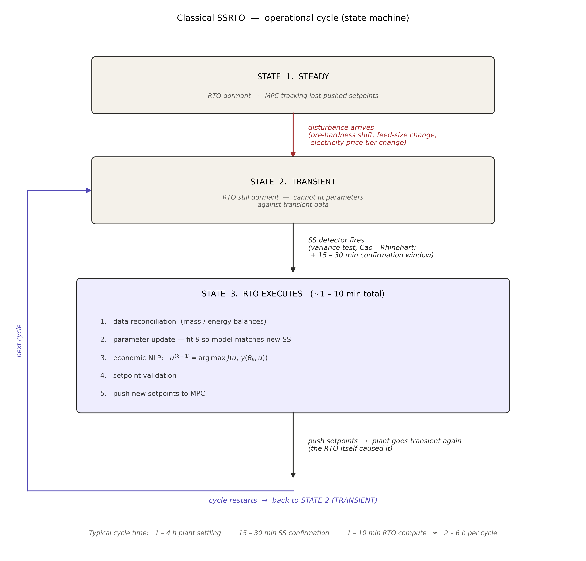

# Literature Review : Improved Control of SAG Mill Grinding Circuit Based on Disturbance Observer-Assisted Model Predictive Control with Two-Layer Set-Point Optimisations

> _A literature review for the proposed PhD project on Economic Model Predictive Control (EMPC) of a semi-autogenous (SAG) grinding mill._
>
> _Citations link directly to the PDF in [`papers/`](../papers/). On GitHub, clicking a link opens the paper inline in the browser._

---

## 1. Introduction

The aim of this document is threefold: to establish the theoretical foundation for a multilayer EMPC/DRTO architecture on a SAG circuit; to synthesise the empirical literature on the three building blocks the proposed controller needs (a control-oriented dynamic model, a disturbance estimator stack, and an economic upper-layer optimiser); and to make the gap explicit that justifies the proposed work.

**Scope.** The review covers:

- (i) reduced-order dynamic models of SAG mills suitable for embedding in a non-linear MPC, with the Hulbert–Le Roux 5-state model and population balance models (PBM) treated as the initial choices and physics-informed neural networks (PINN) treated as extension;
- (ii) disturbance-handling schemes : non-linear disturbance observers (NDOB), augmented Kalman filters (EKF/UKF), and moving-horizon estimators (MHE);
- (iii) the spectrum of supervisory optimisation approaches running from classical steady-state real-time optimisation (SSRTO) through ROPA and dynamic RTO (DRTO) to EMPC.

**Structure.** Section 2 lays out the theoretical framework and core definitions. Section 3 covers the body of the review and synthesises the empirical literature in three thematic sub-sections aligned with the proposed controller's three theoretical components: dynamic models (3.1), disturbance observers and estimators (3.2), and EMPC with its RTO ancestry (3.3). Section 4 names the research gap.

---

## 2. Theoretical Framework

_This section is a short placeholder for the initial version of the theoretical part. It gives placeholder pointers to the four theoretical building blocks of the proposed controller (dynamic models, disturbance observer, state estimators, and EMPC), and lists a small glossary of key terms. Later versions may expand it if required._

**Dynamic-model placeholder.** This thesis carries two mechanistic prediction models (§3.1): the Hulbert–Le Roux 5-state reduced-order model (a small mass-balance model in rocks / solids / fines plus water and balls, suited to online MPC prediction), and a larger population balance model (PBM), which exposes the full particle-size distribution. This placeholder will be expanded later if the dynamic-model side of the methodology requires more theoretical deeper background here.

**Disturbance-observer placeholder.** A non-linear DO at the regulatory layer estimates the lumped fast disturbance $\hat d$ (primarily input-side feed-water and feed-rate variations) and feeds it forward to the regulatory MPC. The DO design follows the NDOB pattern established for grinding circuits by [Chen, Yang, Li & Li (2009)](../papers/do/do-based-main-paper1.pdf) and [Yang, Li, Chen & Li (2010)](../papers/do/do-based-main-paper2.pdf). This placeholder will be expanded if the disturbance-handling theory needs more upfront deeper background here.

**State-estimator placeholder.** At the EMPC layer, an augmented EKF/UKF (or MHE) tracks the latent mill states and the slowly-drifting parameters such as ore hardness ($\hat\phi_f$ in the Hulbert model). The EKF reference is [Le Roux et al. (2017)](../papers/lexRoux_papers/ekf_observer.pdf); MHE is a slower but bounded-error alternative for the same role. This placeholder will be expanded if the estimator-side theory needs more upfront deeper background here.

**EMPC placeholder.** The EMPC stage cost is intentionally left open in this thesis and will be explored across a family of variants ranging from mill-internal (energy, throughput, PSE) to plant-wide (downstream flotation revenue, grade-recovery trade-offs). The two precedent studies that anchor the design space ([Le Roux & Craig, 2019](../papers/lexRoux_papers/plant-wide-control-framework-for-a-grinding-mill-circuit.pdf); [Bouchard / Thivierge, 2023](../papers/empc/02_Comparing%20economic%20model%20predictive%20control%20to%20basic%20and%20advanced%20regulatory%20control%20on%20a%20simulated%20high-pressure%20grinding%20rolls,%20ball%20mill,%20and%20flotation%20circuit.pdf)) both pull information from downstream plant sections into the comminution-side optimisation. This placeholder will be expanded if the EMPC theory needs more upfront scaffolding here.

**Key terms used throughout this thesis.**

- **MPC (Model Predictive Control).** A receding-horizon controller that, at each sample, solves a finite-horizon optimisation of a _tracking_ cost $J = \sum_k \|y_k - y^*\|_Q^2 + \|\Delta u_k\|_R^2$ subject to a model and constraints, applies the first move, and re-optimises. The lower (regulatory) layer of the architecture above.
- **EMPC (Economic MPC).** Same receding-horizon machinery, but with a _direct economic_ stage cost $\ell(x_k, u_k)$, replacing the tracking penalty ([Ellis et al., 2014, tutorial review](../papers/empc/03_tutorial-review-EMPC.pdf)). The upper (supervisory) layer.
- **DO (Disturbance Observer).** An auxiliary observer that estimates a lumped disturbance signal $\hat d$ entering the plant and supplies it as feed-forward compensation to the controller ([Chen et al., 2016, DOB survey](../papers/do/do_based_method_survey.pdf)).
- **EKF / UKF / MHE.** State estimators used to recover the latent mill states and slow-drift parameters. EKF ([Le Roux et al., 2017](../papers/lexRoux_papers/ekf_observer.pdf)) is the textbook choice for the Hulbert mill; MHE is a constrained alternative with bounded-error guarantees.
- **RTO / DRTO / EMPC.** The supervisory-optimisation continuum. _SSRTO_ refits a steady-state model to plant data and solves a static economic NLP every few hours ([Darby et al., 2011](../papers/RTO_practice/rto_overview_assessment.pdf)); _DRTO_ generates dynamic trajectories; _EMPC_ embeds the economics directly inside a fast receding-horizon problem ([Faulwasser & Pannocchia, 2018](../papers/empc/toward-a-unifying-framework-blending-real-time-optimization-and-economic-model-predictive-control.pdf)).
- **PSD (Particle Size Distribution).** The full distribution of particle sizes in the mill product, typically resolved across multiple size classes. Classical PBM tracks PSD as a state vector; the Hulbert–Le Roux model does not.
- **PSE (Product particle Size Estimate).** A single quantile of the PSD: the fraction of cyclone-overflow product passing a specified mesh size (e.g., % passing 75 µm). It is the single quality variable carried by the Hulbert–Le Roux model ([Le Roux et al., 2013](../papers/lexRoux_papers/Hilbert-Lerouh-model-paper.pdf)) and the dominant quality output used in published SAG-mill MPC studies.

---

## 3. Empirical Research

### 3.1 Dynamic Models for the SAG Grinding Circuit

A MPC controller for SAG mill is only as good as the model behind it. The three group of models discussed in the review: (i) classical population balance models (PBM); (ii) the Hulbert–Le Roux reduced-order model; and (iii) emerging physics-informed neural networks (PINN).

Classical PBM tracks the size distribution inside the mill via a selection function and a breakage distribution. The practical weaknesses for _online control_ are well known: the parameter set is large, identification needs a lab + plant programme and generally pushed practitioners toward reduced-order surrogates ([Le Roux & Craig, 2013, cumulative-rates reduction](../papers/lexRoux_papers/03_cumulamative_rates_model.pdf)).

The Hulbert–Le Roux model ([Le Roux et al., 2013](../papers/lexRoux_papers/Hilbert-Lerouh-model-paper.pdf); [Le Roux & Steyn, 2022, validation](../papers/lexRoux_papers/validation-of-lerough-hilbert-model.pdf)) is a control-oriented reduced-order model for SAG mill control. It collapses the size structure to three operationally meaningful lumps (_rocks_, _solids_, _fines_) and adds water and ball hold-ups, giving a 5-state mill plus a 3-state sump. The five mill states are:

| State  | Symbol   | Meaning (single-stage SAG case)        |
| ------ | -------- | -------------------------------------- |
| Rocks  | $X_{mr}$ | Ore too coarse to discharge ( > 22 mm) |
| Solids | $X_{ms}$ | Ore that can discharge ($\le$ 22 mm)   |
| Fines  | $X_{mf}$ | Ore below product spec ($\le$ 75 µm)   |
| Water  | $X_{mw}$ | Slurry water hold-up                   |
| Balls  | $X_{mb}$ | Steel ball charge                      |

The model has several practical strengths for control. It is identifiable from a single plant survey, supports non-linear MPC at industrial sample rates ([Coetzee, Craig & Kerrigan, 2010](../papers/lexRoux_papers/00_Robust_Nonlinear_Model_Predictive_Control_of_a_Run-of-Mine_Ore_Milling_Circuit.pdf); [Le Roux, Olivier, Naidoo, Padhi & Craig, 2016](../papers/lexRoux_papers/04_leRoux-2016.pdf)), accepts a clean EKF observer ([Le Roux et al., 2017](../papers/lexRoux_papers/ekf_observer.pdf)), tolerates hybrid mode-switching for start-up versus near-overload regimes ([Botha, Le Roux & Craig, 2018](../papers/lexRoux_papers/hybrid_nonlinear_mpc_reloux.pdf)), and has been deployed inside an industrial digital twin ([Quintanilla et al., 2025](../papers/lexRoux_papers/digitial_twin_reloux_model.pdf)).

Physics-informed neural networks (PINN) can be the emerging third option. A PINN embeds the governing ODE/DAE residual into the network's loss function, delivering a fast, differentiable model that satisfies the physics and fits data simultaneously. Other related machine-learning models for mill control include the [LSTM-MPC hybrid](../papers/ml/13_LSTM-MPC-hybrid.pdf) and the [SAG-mill gene-expression-programming power model](../papers/ml/14_sag_mill_gene_expression_programming.pdf)

**Synthesis.** The two families are not in symmetric competition. Classical PBM is better suited to whole-plant control because it resolves the full PSD; the Hulbert–Le Roux model is preferred for online MPC use because its small state keeps the computation simple and efficient.

**Hulbert–Le Roux + larger PBM as the candidate prediction models (this thesis).** Build the integrated EMPC + DO + EKF/UKF/MHE controller and exercise it against two prediction models:

- the Hulbert–Le Roux 5-state model, the smallest model that supports the EKF/UKF / MPC stack and the right granularity for grinding-circuit-only economic decisions where PSE is the single quality variable; and
- a higher-fidelity classical PBM (3–9 size classes; [Le Roux & Craig, 2013, cumulative-rates reduction](../papers/lexRoux_papers/03_cumulamative_rates_model.pdf)), which exposes the _full_ particle-size distribution rather than a single quantile.

The PBM matters because the SAG mill's product is also the input to the downstream circuits (ball mill, hydrocyclone classification, flotation, and, for Au, cyanidation/leaching). Each of those circuits' kinetics is _shape-sensitive_: flotation rate constants are size-dependent (too-coarse particles do not liberate; too-fine particles do not float), leaching extraction kinetics depend on accessible mineral surface area, and tailings grade (valuable mineral leaving the plant unrecovered) is set by which size fractions fail to be recovered. The economic loss in tailings is therefore a function of PSD _shape_, not of a single fraction-passing-spec quantile. To choose a SAG-mill operating trajectory that is economically optimal for the _whole concentrator_ (not just the mill in isolation), the controller has to see a PSD-resolving signal, which is exactly what the larger PBM provides and what Hulbert's single PSE quantile structurally cannot.

### 3.2 Disturbance Observers and State Estimators

Every output-feedback controller needs to handle disturbances. For a SAG circuit the disturbances are well characterised: (a) ore hardness drift on hour-to-shift timescales (the largest source of model–plant mismatch on every published mill controller); (b) feed-size variability, usually correlated with hardness; (c) feed-moisture and dilution-water swings acting on rheology; (d) liner-wear and ball-charge drift over weeks to months; and (e) sensor faults. These act on different physical channels and on different timescales, so the literature splits the work across two roles:

- A fast disturbance observer (DO) at the regulatory MPC layer to feed-forward-cancel input-side disturbances before they reach the optimisation loop.
- A slow-moving estimator (EKF/UKF or MHE) at the EMPC layer to track the drifting ore-hardness parameter ($\phi_f$ in Hulbert, $K_1^E$ in PBM) and recover the latent mill states.

**Lower-layer DO.** The non-linear disturbance observer (NDOB) was originally designed for robotic manipulators. The first deployments on grinding circuits ([Chen, Yang, Li & Li, 2009](../papers/do/do-based-main-paper1.pdf); [Yang, Li, Chen & Li, 2010](../papers/do/do-based-main-paper2.pdf), on a ball mill) established that DO + MPC outperforms plain MPC on disturbance rejection without sacrificing nominal tracking. Both designs use a standard integer-order Q-filter $Q(s) = 1/(\lambda s + 1)$ tuned to a small time constant $\lambda$, so the DO's pass-band sits at the regulatory-MPC timescale (10–30 s) where input-side feed-rate and feed-water variations live. A more recent ball-mill MPC-DO study ([Chen, Yang, Zhong & Zhai, 2021](../papers/do/recent_Process%20Control%20of%20Ball%20Mill%20Based%20on%20MPC%E2%80%90DO.pdf)) extends the architecture with constraint handling, and the [event-triggered DO-MPC formulation](../papers/do/do-event-triggered-mpc.pdf) addresses computational cost on slow dynamics. Across all of these deployments two practical advantages dominate: $\hat d$ is operator-readable (it can be plotted as "ore-hardness offset"), and it provides a feed-forward channel that bypasses the MPC's optimisation. The disadvantage is that DO addresses input-side ("matched") disturbances natively; ore-hardness disturbances ultimately act on _breakage rates_, which are technically unmatched.

**Upper-layer EKF / UKF / MHE.** State estimation on the Hulbert model has its canonical reference in [Le Roux, Steinboeck, Kugi & Craig (2017)](../papers/lexRoux_papers/ekf_observer.pdf): an extended Kalman filter built on the 5-state Hulbert ODEs, augmented with one or more integrating disturbance states. This augmented-EKF approach is generally well-suited to the EMPC layer: the disturbance estimate is carried inside the prediction model, so it propagates over the horizon without a separate forecasting step.

For _EMPC_ specifically, MHE with bounded-error guarantees is the textbook estimator ([Ellis et al., 2014, tutorial review](../papers/empc/03_tutorial-review-EMPC.pdf)) because the strict-dissipativity-based EMPC stability proofs require the estimator's error to be bounded. Neither EKF nor UKF provides this guarantee; both are Gaussian, mean-squared-error estimators. MHE is a constrained optimisation that imposes hard bounds on disturbances, noise, and physical states directly, making it the natural choice when the disturbance description is constraint-oriented (bounded ore-hardness excursions, physical parameter limits) and producing the bounded estimation error the EMPC stability theory requires.

No published mill paper deploys MHE on the Hulbert model, which is one of the cleanest methodological openings the proposed thesis can occupy. Although MHE is computationally expensive, the EMPC layer runs on industrial-grade hardware at a slow sample rate (10–30 min), so the compute cost is acceptable, making MHE a viable non-linear estimator alternative to the augmented EKF/UKF at the upper layer for tracking slow ore-hardness drift and the latent mill states.

**Synthesis.** The literature converges on a two-time-scale composite: a fast DO at the regulatory layer for operator-readable feed-forward cancellation of input-side disturbances, and a slow EKF/UKF (or MHE) at the EMPC layer carrying the latent mill states plus an integrating $\hat\phi_f$ state that absorbs ore-hardness drift directly. The thesis-relevant gap is that no published SAG-mill _EMPC_ has yet brought DO + augmented EKF/UKF/MHE + economic stage cost together inside one closed-loop study.

### 3.3 Economic MPC and Its RTO Ancestry

The supervisory-optimisation question, _"how does the controller decide what the economically best operating point is?"_, has been answered three different ways in the published literature: classical steady-state RTO (SSRTO), dynamic RTO (DRTO), and economic MPC (EMPC), plus the closely-related ROPA that sits between SSRTO and DRTO. An honest review must cover all of them, because the proposed thesis adopts EMPC on the back of the structural limitations of SSRTO and on a SAG-mill operating reality that suits EMPC's strengths exceptionally well: the mill spends most of its life _not_ at the economic optimum, drifting between mildly-suboptimal stable points as ore properties change.

**The verdict in one paragraph.** SSRTO is structurally a bad choice for SAG-class plants that rarely settle. It sits idle through most of the operating window and pushes setpoints that are already stale by the time they arrive. DRTO and EMPC are _theoretically equivalent_: they integrate the same economic cost over the same dynamic horizon, just on different sides of a layer boundary, so they deliver comparable economic performance. DRTO, however, is computationally expensive (a large dynamic NLP at the upper layer running on top of a separate tracking MPC) and stays inside the classical RTO framework. ROPA delivers slightly less economic performance than DRTO or EMPC but recovers most of the benefit at a fraction of the implementation effort, by keeping the classical RTO architecture (steady-state NLP above tracking MPC) and feeding it with parameters from a continuously-running dynamic estimator. [Matias, Le Roux & Jäschke (2022)'s experimental-rig comparison](../papers/RTO_practice/steady-state-rto-using-transient-info-rig.pdf) is the cleanest research paper for this hierarchy: ROPA reaches ~38 % profit improvement over a fixed-input baseline, matching DRTO; SSRTO only reaches ~20 %. The practical pecking order is therefore EMPC ≈ DRTO > ROPA » SSRTO, with ROPA the appropriate compromise for plants where an RTO-shaped pipeline must be preserved, and EMPC the appropriate choice when the engineer is willing to commit to a single collapsed layer (which this thesis does).

Sections 3.3.1–3.3.5 lay out the architectures in detail; §3.3.6 walks through the empirical record on grinding circuits.

#### 3.3.1 Classical SSRTO — what it is and how the cycle works

Classical SSRTO ([Darby, Nikolaou, Jones & Nicholson, 2011](../papers/RTO_practice/rto_overview_assessment.pdf); [Sosa-Blanco, Hodouin, Bazin, Lara-Valenzuela & Salazar, 1999](../papers/multi-layer-mpc/integrated_RTO_MPC.pdf)) places a _separate_ top-level optimiser above the MPC. The optimiser refits a _steady-state_ mechanistic model to plant measurements taken at operational steady state, then solves a static economic NLP for the next set of MPC setpoints. The MPC below it tracks those setpoints with a tracking-style cost. The two layers communicate only through setpoints and were historically designed by different teams, an architectural commitment Marlin & Hrymak called the separation principle: economics is slow and steady-state; control is fast and dynamic.

The cycle, in detail, is a state machine that spends most of its time _waiting_ (Figure 3.3.1):

> <small>**Figure 3.3.1** — The SSRTO operational cycle. Three states: STEADY (RTO dormant, MPC tracking the last-pushed setpoints), TRANSIENT (RTO still dormant — parameter estimation cannot run against non-steady-state data), and RTO EXECUTES (~1–10 min: data reconciliation → parameter update → economic NLP → setpoint validation → push to MPC). A disturbance arrival triggers the STEADY → TRANSIENT transition (red arrow); the SS detector firing — typically a Cao–Rhinehart variance test with a 15–30 min confirmation window — triggers TRANSIENT → RTO EXECUTES. Pushing setpoints itself causes a new transient (the cycle restarts). Total cycle time is dominated by plant settling, not by computation.</small>

A typical cycle is plant settling 1–4 h + SS detection confirmation 15–30 min + reconciliation/estimation/NLP 1–10 min ≈ 2–6 h per cycle. Between cycles, the plant runs on past optimum and parameters and disturbances are all drifting in the meantime.

**The bottleneck is information, not computation.** Solving the model's steady-state equations $f(x, u, \theta) = 0$ for any $u$ is cheap and can be done at any time. The reason SSRTO sits idle during transients is the parameter-fitting step: fitting $\theta$ by matching a transient measurement against a steady-state model output absorbs the plant's transient dynamics into a parameter that is supposed to describe steady-state behaviour, so the resulting $\theta$ is wrong. Until the plant settles, the parameter pipeline is contaminated, and running the economic NLP more often does not help; it just produces wrong setpoints faster.

The architecture has decades of industrial validation. Refineries, polymerisation plants and many continuous chemical processes still run SSRTO every shift. So the architecture is not broken; it works _when its assumptions hold_.

#### 3.3.2 Why SSRTO is not good fit for a SAG mill — four structural weaknesses

For a SAG mill specifically, four well-documented weaknesses bite hard:

1. Steady-state-waiting. SSRTO refuses to act during transients. On a SAG mill driven by ore-hardness drift on hour-to-shift timescales, by liner wear on weeks-to-months, and by feed-size variability on minutes-to-hours, the plant is _never_ at strict operational steady state for long enough. The SS detector fires rarely, and when it does, the data is already stale by the time the NLP finishes.
2. Inter-layer model inconsistency. The static RTO and the dynamic MPC use different models. Setpoints handed off across this seam carry a model mismatch that becomes a systematic bias in the closed loop ([Ellis, 2014](../papers/empc/03_tutorial-review-EMPC.pdf)).
3. No transient-economics capture. Classical SSRTO cannot exploit any economic dynamics that move faster than its cycle, because its objective is steady-state by construction. Any economic signal that varies on timescales shorter than the SSRTO cycle is structurally invisible to the optimisation.
4. Slow recovery from disturbances. The 2–6 h cycle is far slower than the timescale on which the economic loss accumulates. By the time SSRTO repushes setpoints, the disturbance landscape has already moved on.

#### 3.3.3 ROPA — partial fix that decouples parameter estimation from optimisation

A first refinement, ROPA (Real-time Optimisation using Plant Adjustment / Process Analysis), breaks SSRTO's central coupling: the assumption that parameter estimation and economic optimisation must happen at the same time. ROPA replaces the SS-detection-gated parameter step with a _dynamic state estimator_ (typically EKF or UKF) running continuously on transient data ([Matias et al., 2022](../papers/RTO_practice/steady-state-rto-using-transient-info-rig.pdf)). The economic NLP itself is still steady-state; what changes is that the parameters fed into it are always fresh, even when the plant is not at operational SS. The Matias et al. rig comparison reports ROPA matches DRTO at ~38 % profit improvement vs. fixed-input baseline; SSRTO only gets ~20 %.

ROPA's appeal is its conservatism: it slots above an existing MPC layer without redesigning lower-level controllers. For mineral-processing plants with decent steady-state grinding-circuit models from existing engineering work, it's the lowest-risk modernisation. Its limitation: the economic optimisation still uses a steady-state model, so it cannot include transient information _in the cost itself_. Only DRTO and EMPC can do that.

#### 3.3.4 DRTO — dynamic optimisation as the upper layer

DRTO (Dynamic RTO) ([Matias et al., 2022](../papers/RTO_practice/steady-state-rto-using-transient-info-rig.pdf)) replaces the static economic NLP with a _dynamic_ optimisation over a long horizon, generating a full economic _trajectory_ rather than a single setpoint:

$$
\min_{\{u(t)\}_{t=k}^{k+H_d}}\; \int_{k}^{k+H_d} \ell(x(t), u(t))\, dt
\quad \text{s.t.}\quad \dot x = f(x, u, \theta_k),\;\; g(x, u) \le 0 .
$$

The two-layer hierarchy is preserved: DRTO at the top emits trajectories $\{u^*(t), x^*(t)\}_{t=k}^{k+H_d}$, and a regulatory MPC tracks them. But the upper layer now integrates economics. The cycle time of the upper layer drops from hours (SSRTO) to minutes (every horizon update). DRTO is therefore the natural answer when economic dynamics matter on shift-or-faster timescales but the plant team wants to keep two visibly separated layers.

DRTO and EMPC are theoretically equivalent: they use the same dynamic economic cost, model, and constraints over the same horizon. The difference is architectural: DRTO retains a dedicated upper layer that emits a trajectory for a separate tracking MPC, whereas EMPC (§3.3.5) collapses both layers into one receding-horizon problem. Their economic performance is therefore comparable, and the choice between them is driven by implementation considerations.

#### 3.3.5 EMPC/DRTO - Cost Function

Economic MPC ([Ellis et al., 2014](../papers/empc/03_tutorial-review-EMPC.pdf); Faulwasser, Grüne & Müller, 2018; [Faulwasser & Pannocchia, 2018](../papers/empc/toward-a-unifying-framework-blending-real-time-optimization-and-economic-model-predictive-control.pdf)) takes the DRTO logic to its limit: drop the dedicated upper layer and embed the economic objective directly inside the regulatory MPC's stage cost.

**The specific form of the cost function is left open in this thesis.** EMPC's structure is general (any economic stage cost that depends on the predicted state and input is admissible), and the right choice for a SAG circuit depends on what the _wider plant_ looks like (Cu vs Au; SAG only vs SAG–ball-mill; flotation; cyanidation in series; tailings handling) and on what plant data are actually available (on-line PSD analyser? on-line concentrate grade? real-time electricity price?). The proposed work will _explore_ a family of cost-function options across the proposed milestones, and the chosen cost may be revised as plant access and partner-data quality become clearer in later milestones.

Two precedent studies anchor the design space, and both share an architectural feature worth highlighting: their cost functions go beyond mill-internal economics and pull information from _other parts of the plant_ into the comminution-side optimisation:

- [Le Roux & Craig (2019) — _Plant-Wide Control Framework for a Grinding Mill Circuit_](../papers/lexRoux_papers/plant-wide-control-framework-for-a-grinding-mill-circuit.pdf) argues that the mill's economic objective must be inherited from the larger plant's economics (concentrate value, smelter penalties, downstream reagent costs, electricity tariff) rather than tuned locally on the mill in isolation. The mill is one block in a concentrator, and operating it for _its own_ optimum is generally worse for plant economics than operating it for the _plant's_ optimum.
- [Bouchard, Sbarbaro & Desbiens (2023) / Thivierge et al. (2023)](../papers/empc/02_Comparing%20economic%20model%20predictive%20control%20to%20basic%20and%20advanced%20regulatory%20control%20on%20a%20simulated%20high-pressure%20grinding%20rolls,%20ball%20mill,%20and%20flotation%20circuit.pdf) make this concrete on an HPGR + ball-mill + flotation simulator: although their controller acts on the upstream HPGR / ball-mill, the cost function is revenue from the flotation concentrate (concentrate mass-flow × grade × metal price) minus HPGR specific energy. The cost is therefore explicitly coupled to a _downstream_ variable.

Following both precedents, the proposed work will explore cost-function variants that include information from other parts of the plant (for instance, a flotation-recovery proxy or a downstream-grade-discount term) rather than restricting the EMPC's view to mill-internal variables alone. The dynamic-model split (§3.1) supports this directly: the Hulbert–Le Roux model carries enough state for a mill-internal cost (PSE-based), while the larger PBM exposes the full PSD that any downstream-aware cost (flotation kinetics, cyanidation kinetics, tailings-grade pricing) structurally requires.

**A practical caveat from the literature**: purely economic EMPC is theoretically clean but practically fragile. Thivierge et al. (2023, §7.3) tried it without regularisation and the controller bang-banged across constraint corners. The fix is move-rate regularisation $\Delta u^\top \Psi \Delta u$ that stabilises the optimisation without restoring tracking semantics; the constraints define the operating envelope and the optimiser is free to roam inside it. This is the dominant pattern in modern EMPC implementations.

A second practical lever is prediction-horizon length: the [Ellis, Durand & Christofides (2014) tutorial review](../papers/empc/03_tutorial-review-EMPC.pdf) notes that EMPC stability and closed-loop performance cannot in general be guaranteed unless a sufficiently long prediction horizon is used (alongside the standard controllability and turnpike conditions). Long horizons let the optimiser look further into the future and find smoother, more economical input trajectories; short horizons force near-sighted decisions that can become aggressive or unstable. Horizon length is therefore part of the EMPC design problem alongside regularisation, and the proposed work will tune it explicitly during the controller build.

#### 3.3.6 EMPC on grinding circuits — the empirical record

The empirical case for EMPC on grinding circuits has been built piecewise over the last decade.

[Le Roux & Craig (2019) — _Plant-Wide Control Framework for a Grinding Mill Circuit_](../papers/lexRoux_papers/plant-wide-control-framework-for-a-grinding-mill-circuit.pdf) defined the regulatory–supervisory–optimisation hierarchy that the proposed thesis implements, and argued that the mill's economic weights should be inherited from the larger plant's economics rather than tuned locally.

[Bouchard, Sbarbaro & Desbiens (2023) / Thivierge, Bouchard & Desbiens (2023)](../papers/empc/02_Comparing%20economic%20model%20predictive%20control%20to%20basic%20and%20advanced%20regulatory%20control%20on%20a%20simulated%20high-pressure%20grinding%20rolls,%20ball%20mill,%20and%20flotation%20circuit.pdf) The most directly relevant paper for this thesis compares EMPC against basic regulatory control (BRC) and advanced regulatory control (ARC) on a _simulated_ HPGR–ball mill–flotation circuit with a population-balance plant model (no plant data). Relative to ARC, BRC consumes up to ~8.8 % more specific energy and generates up to ~4.0 % lower profits. Relative to ARC, EMPC (with a hybrid cost that explicitly penalises specific energy) reduces total specific energy consumption by ~2.6 % at the cost of up to ~3.9 % lower profits. The comparison uses _steady-state_ values only and the ARC baseline is well-tuned at those steady states; but that tuning is non-trivial: ARC requires dedicated override-constraint tuning at each operating point, and the authors note it proved difficult to tune because ore-hardness disturbances introduce non-linear effects (their §8, point 4). Transient performance is explicitly deferred to future work (§7.3). Under more realistic disturbance sequences, ore-hardness drift, feed-size variability, and the constraint-corner switching, the EMPC-vs-ARC gap is expected to widen, since EMPC's distinguishing strength is its ability to track the moving economic optimum during transients while ARC can only respond once the plant has re-settled. Chaining the two pairwise comparisons gives the more realistic baseline for industrial plants where decentralised PI / BRC is the typical starting point: BRC vs EMPC adds the two specific-energy gaps (BRC sits ~8.8 % above ARC, ARC sits ~2.6 % above EMPC), giving a BRC-vs-EMPC specific-energy difference of more than 10 %.

[Numbi & Xia (2016)](../papers/empc/Numba_Xia_2016.pdf) demonstrate EMPC on a HPGR / VSI crushing plant under time-of-use electricity tariffs, reporting a daily energy saving of ~15 % (physical kWh) via off-peak load shifting. This is the energy dimension of the case in isolation.

[Jia et al. (2020)](../papers/empc/04_AIChE%20Journal%20-%202020%20-%20Jia%20-%20Multi%E2%80%90stage%20economic%20model%20predictive%20control%20for%20a%20gold%20cyanidation%20leaching%20process%20under.pdf) demonstrate multi-stage EMPC for a gold cyanidation leaching train under disturbances. This is the canonical EMPC reference for downstream Au processing if the SAG controller is later extended into a whole-plant scope.

**Synthesis.** The literature does _not_ yet contain a single paper that combines (i) the Hulbert–Le Roux dynamic model, (ii) the composite augmented-EKF/UKF-plus-DO observer stack, and (iii) an explicit specific-energy EMPC cost on a SAG circuit with industrial-scale validation. That is the gap.

---

## 4. Research Gap

Sections 3.1–3.3 trace a literature in which the components of an EMPC for a SAG circuit have all been published, but never assembled into a single closed-loop study and never exercised under the conditions an industrial SAG mill actually experiences. This thesis identifies that absence as three connected gaps: the architectural composite has not been built, EMPC's behaviour under realistic SAG-mill operating conditions has not been measured, the cost-function scope that the plant-wide literature points toward has not been carried into a SAG-mill EMPC.

**What the literature already provides.** Each of the three thematic strands in §3 has matured to the point where its individual contribution is settled:

- **Dynamic models (§3.1).** Two complementary traditions cover the modelling space: the Hulbert–Le Roux 5-state reduced-order model (small enough to support an online EKF/UKF + MPC stack, and the dominant choice for SAG-mill MPC prediction), and classical population balance models which resolve the full PSD and serve as the simulator backbone in Thivierge et al. (2023).

- **Disturbance observers and estimators (§3.2).** Each piece has been published (the NDOB pattern for ball mills (Chen et al. 2009; Yang et al. 2010), the augmented EKF on the Hulbert model (Le Roux et al. 2017), and residual-based mismatch diagnosis (Mittermaier et al. 2025)), and the literature converges on a two-time-scale composite as the natural architecture. But no published SAG-mill paper combines a fast operator-readable DO with a slow augmented EKF/UKF (or MHE) inside a closed-loop EMPC study.

- **Economic MPC/DRTO (§3.3).** Le Roux & Craig (2019) and Bouchard / Thivierge (2023) together establish that EMPC's distinguishable economic value comes from a cost function that pulls information from downstream circuits into the comminution-side optimisation. The Thivierge et al. cost function on a simulated HPGR–ball-mill–flotation circuit is the closest precedent: revenue from flotation concentrate minus HPGR specific energy, evaluated only at steady-state operating points after the simulator had re-settled from step disturbances.

**The gaps:** These themes leave three connected problems open:

1. **Architectural integration on a SAG circuit.** No published study integrates a regulatory-layer DO, an upper-layer augmented EKF/UKF (or MHE), and an economic stage cost into a single closed-loop SAG-mill controller, whether the economic objective is collapsed into the regulatory MPC's stage cost (EMPC, §3.3.5) or generated as a dynamic trajectory by a separate upper layer that a tracking MPC then follows (DRTO, §3.3.4). The two estimator choices address complementary timescales but have evolved independently: the DO + MPC cancels fast input-side disturbances at the regulatory clock, while the augmented-KF / MHE strand absorbs slow parameter drift at the upper-layer (economic) clock. On a SAG mill these timescales coexist, so a controller built around either layer alone leaks performance through the timescale it does not handle. MHE in particular has never been deployed on a grinding-mill EMPC or DRTO, even though it is the textbook estimator under EMPC stability theory. This thesis will therefore explore the available architectural options for a SAG-mill economic controller, including both EMPC and DRTO, and benchmark them against each other in a single comparison study.

2. **Realistic SAG-mill operating conditions in evaluation.** Industrial SAG mills settle at _operational steady state_ often, but the underlying conditions never do: ore hardness drifts on hour-to-shift timescales and liner wear changes the mill geometry over weeks to months, so the plant moves between mildly suboptimal operating points rather than running at economic optimums. Published studies on grinding circuits, such as Thivierge et al. (2023), report performance under tightly controlled conditions: step disturbances applied at fixed operating points, with metrics sampled after the simulator re-settles. How a SAG-mill EMPC behaves under disturbance sequences that resemble actual plant operation, rather than at fixed steady states with tight constraints, is therefore an open empirical question.The size of the economic opportunity that EMPC could capture by tracking the moving optimum during transients, rather than letting the plant settle at an operationally stable but sub-optimal states, has not been quantified on a SAG mill. This quantification is the prerequisite for any fair head-to-head comparison of EMPC against SSRTO, ROPA, or DRTO.

3. **Cost-function scope on a SAG circuit.** The plant-wide framework of Le Roux & Craig (2019) and the flotation-revenue cost of Bouchard / Thivierge (2023) both argue that the mill's economic objective should pull from downstream plant signals rather than be tuned mill-internally; but neither has been instantiated as the cost function of a closed-loop on a single-stage SAG mill. A complementary direction is to ask whether the cost function can be made _modular_: instead of a full downstream profit calculation, the EMPC/DRTO stage cost would take PSE or PSD specs derived offline from the downstream circuits as its interface, and optimise only energy, throughput, and spec adherence. Re-tuning per ore body or downstream topology then becomes a swap of the spec interface. This thesis will explore a wider family of cost-function options.

**How this thesis closes them.** The proposed work addresses Gaps 1–3 directly. An integrated multi-layer DRTO+MPC/EMPC + DO + augmented EKF/UKF (or MHE) is built for a single-stage SAG circuit, against two mechanistic prediction models in parallel: the Hulbert–Le Roux 5-state mill (sufficient for a mill-internal cost) and a larger PBM (which exposes the PSD that any downstream-aware cost requires). The cost function itself is left open and explored across a family of variants, from mill-internal (energy, throughput, PSE) to plant-wide costs that include a flotation-recovery proxy or a downstream-grade-discount term, following the Le Roux & Craig (2019) plant-wide framework and the Bouchard / Thivierge (2023) flotation-revenue precedent. The closed loop is benchmarked under disturbance sequences representative of real SAG-mill operation (ore-hardness drift, feed-size variability, constraint-corner episodes) rather than at steady state alone, addressing exactly the empirical gap left open by Thivierge et al. (2023, §7.3).

---

## References (with local PDF links)

PDFs marked with a link open inline on GitHub when clicked.

### Dynamic modelling — SAG / ball mills

- [Le Roux, J. D., Craig, I. K., Hulbert, D. G., Hinde, A. L. (2013). _Analysis and validation of a ROM ore grinding mill circuit model for process control._ Minerals Engineering 43–44, 121–134.](../papers/lexRoux_papers/Hilbert-Lerouh-model-paper.pdf)
- [Le Roux, J. D., Steyn, C. W. (2022). _Validation of a dynamic non-linear grinding circuit model for process control._ Minerals Engineering 187.](../papers/lexRoux_papers/validation-of-lerough-hilbert-model.pdf)
- [Le Roux, J. D., Craig, I. K. (2013). _Reducing the number of size classes in a cumulative rates model for grinding-mill control._](../papers/lexRoux_papers/03_cumulamative_rates_model.pdf)
- [Coetzee, L. C., Craig, I. K., Kerrigan, E. C. (2010). _Robust nonlinear MPC of a run-of-mine ore milling circuit._ IEEE TCST 18(1).](../papers/professors_old_papers/00_UniversityOfP/00_Robust_Nonlinear_Model_Predictive_Control_of_a_Run-of-Mine_Ore_Milling_Circuit.pdf)
- [Le Roux, J. D., Olivier, L. E., Naidoo, M. A., Padhi, R., Craig, I. K. (2016). _Throughput and product quality control for a grinding mill circuit using non-linear MPC._ J. Process Control 42.](../papers/professors_old_papers/00_UniversityOfP/04_leRoux-2016.pdf)
- [Botha, S., Le Roux, J. D., Craig, I. K. (2018). _Hybrid non-linear MPC of a ROM ore grinding mill circuit._ Minerals Engineering 123.](../papers/lexRoux_papers/hybrid_nonlinear_mpc_reloux.pdf)
- [Quintanilla, P., Fernández, F., Mancilla, C., Rojas, M., Navia, D. (2025). _Digital twin with automatic disturbance detection for an expert-controlled SAG mill._ Minerals Engineering 220.](../papers/lexRoux_papers/digitial_twin_reloux_model.pdf)
- [Salazar, J. L. et al. _A dynamic model for a class of semi-autogenous mill systems._](../papers/professors_old_papers/01_A_Dynamic_Model_for_a_Class_of_Semi-Autogenous_Mil.pdf)

### Disturbance observers and state estimators

- [Le Roux, J. D., Steinboeck, A., Kugi, A., Craig, I. K. (2017). _An EKF observer to estimate semi-autogenous grinding mill hold-ups._ J. Process Control 51, 27–41.](../papers/lexRoux_papers/ekf_observer.pdf)
- [Chen, X.-S., Yang, J., Li, S.-H., Li, Q. (2009). _Disturbance observer based multi-variable control of ball mill grinding circuits._ J. Process Control 19(7).](../papers/do/do-based-main-paper1.pdf)
- [Yang, J., Li, S.-H., Chen, X.-S., Li, Q. (2010). _Disturbance rejection of ball mill grinding circuits using DOB and MPC._ Powder Technology 198.](../papers/do/do-based-main-paper2.pdf)
- [Chen, X.-S., Yang, J., Zhong, Z., Zhai, J. (2021). _Process Control of Ball Mill Based on MPC-DO._](../papers/do/recent_Process%20Control%20of%20Ball%20Mill%20Based%20on%20MPC%E2%80%90DO.pdf)
- [Chen, W.-H., Yang, J., Guo, L., Li, S. (2016). _Disturbance-observer-based control and related methods — an overview._ IEEE TIE.](../papers/do/do_based_method_survey.pdf)
- [_Event-triggered DO-MPC._](../papers/do/do-event-triggered-mpc.pdf)
- [Mittermaier, H. K., Le Roux, J. D., Craig, I. K. (2025). _Model-plant mismatch diagnosis using plant-model ratios for a grinding mill circuit under MPC._ Minerals Engineering 227.](../papers/professors_old_papers/Model-plant%20mismatch%20diagnosis%20usin.pdf)
- [Pannocchia, G., Gabiccini, M., Artoni, A. (2015). _Offset-free MPC explained: novelties, subtleties, and applications._ IFAC PapersOnLine 48-23.](../papers/offset-free-empc/offset-free-empc-tutorial.pdf)
- [Pannocchia, G. (2018). _An economic MPC formulation with offset-free asymptotic performance._ IFAC PapersOnLine 51-18.](../papers/offset-free-empc/offset-free-empc.pdf)

### EMPC, RTO, multilayer architectures

- [Ellis, M. (2014). _A tutorial review of economic model predictive control methods._ J. Process Control 24.](../papers/empc/03_tutorial-review-EMPC.pdf)
- [Faulwasser, T., Pannocchia, G. (2018). _Toward a Unifying Framework Blending Real-Time Optimization and Economic Model Predictive Control._ Ind. Eng. Chem. Res.](../papers/empc/toward-a-unifying-framework-blending-real-time-optimization-and-economic-model-predictive-control.pdf)
- [Bouchard, J., Sbarbaro, D., Desbiens, A. (2023) / Thivierge, A., Bouchard, J., Desbiens, A. (2023). _Comparing EMPC to basic and advanced regulatory control on a simulated HPGR–ball mill–flotation circuit._ J. Process Control 122.](../papers/empc/02_Comparing%20economic%20model%20predictive%20control%20to%20basic%20and%20advanced%20regulatory%20control%20on%20a%20simulated%20high-pressure%20grinding%20rolls,%20ball%20mill,%20and%20flotation%20circuit.pdf)
- [Le Roux, J. D., Craig, I. K. (2019). _Plant-Wide Control Framework for a Grinding Mill Circuit._ I&EC Research 58.](../papers/lexRoux_papers/plant-wide-control-framework-for-a-grinding-mill-circuit.pdf)
- [Sosa-Blanco, C., Hodouin, D., Bazin, C., Lara-Valenzuela, C., Salazar, J. (2000). _Economic Optimisation of a Flotation Plant Through Grinding Circuit Tuning._ Minerals Engineering 13(10–11).](../papers/multi-layer-mpc/economic_op_of_rto.pdf)
- [Sosa-Blanco et al. (1999). _Integrated simulation of grinding and flotation, application to a lead–silver ore._ Minerals Engineering 12(8).](../papers/multi-layer-mpc/integrated_RTO_MPC.pdf)
- [Darby, M. L., Nikolaou, M., Jones, J., Nicholson, D. (2011). _RTO: An overview and assessment of current practice._ J. Process Control 21.](../papers/RTO_practice/rto_overview_assessment.pdf)
- [_Main paper: RTO._](../papers/multi-layer-mpc/main_paper_RTO.pdf)
- [_Steady-state RTO using transient measurements._](../papers/RTO_practice/Steady-state%20real-time%20optimization%20using%20transient%20measurements.pdf)
- [_Steady-state RTO using transient information rig._](../papers/RTO_practice/steady-state-rto-using-transient-info-rig.pdf)
- [_Modifier-adaptation RTO methods and applications._](../papers/RTO_practice/modifer_apt_rto_methods_applications.pdf)
- [_Real-time optimisation of uncertain process systems via modifier adaptation and Gaussian processes._](../papers/RTO_practice/Real-Time_optimization_of_Uncertain_Process_Systems_via_Modifier_Adaptation_and_Gaussian_Processes.pdf)
- [_Real-time optimisation of a pulp mill._](../papers/RTO_practice/real-time-optimization-pulp-mill.pdf)
- [Jia, Y. et al. (2020). _Multi-stage economic MPC for a gold cyanidation leaching process under disturbances._ AIChE Journal.](../papers/professors_old_papers/04_AIChE%20Journal%20-%202020%20-%20Jia%20-%20Multi%E2%80%90stage%20economic%20model%20predictive%20control%20for%20a%20gold%20cyanidation%20leaching%20process%20under.pdf)
- [_Dynamic real-time optimisation to mitigate critical-state effects._](../papers/professors_old_papers/Dynamic%20real-time%20optimization%20to%20mitigate%20critical%20state%20effects%20in.pdf)
- [Numbi, B. P., Xia, X. (2016). _Optimal energy control of a crushing process based on vertical shaft impactor._ Applied Energy 162.](../papers/empc/Numba_Xia_2016.pdf)

### Industrial validation and machine-learning surrogates

- [_Industrial DEM-MPC development paper._](../papers/industry_test/industry_dem_mpc_development.pdf)
- [_LSTM-MPC hybrid for SAG / ball mill._](../papers/professors_old_papers/13_LSTM-MPC-hybrid.pdf)
- [_MPC using physics-informed NN for SAG mills._](../papers/professors_old_papers/12_MPC-Using-Physics-Informed-NN.pdf)
- [_SAG mill power prediction using gene expression programming._](../papers/professors_old_papers/14_sag_mill_gene_expression_programming.pdf)
