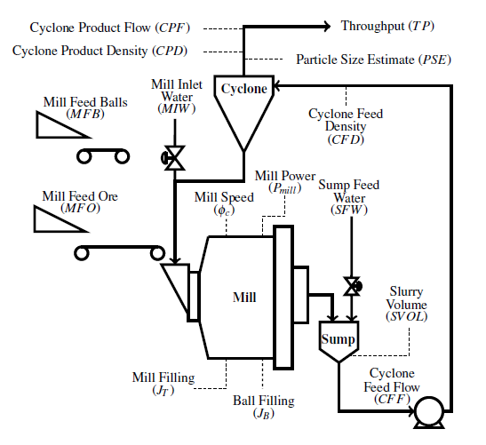
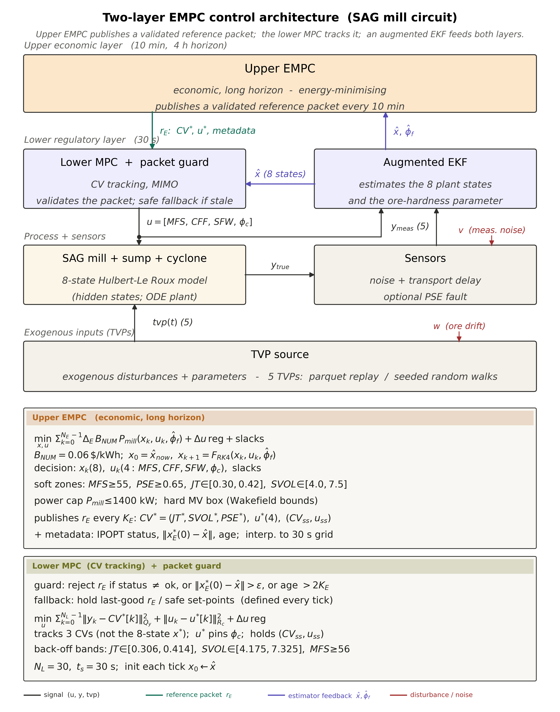

<!--
  Milestone 1 candidacy report.
  This file is written to live in the repository's `docs/` directory, alongside
  `literature_review.md` and `milling_circuit_control_implementations.md`, so that the
  relative figure paths (`diagrams/…`, `images/…`) resolve when rendered on GitHub or exported.
  Items wrapped in [SQUARE BRACKETS] are placeholders to be completed before submission.
-->

```{=latex}
\begin{titlepage}
\centering
\vspace*{1.2cm}
{\LARGE\bfseries PhD MILESTONE 1 REPORT\par}
\vspace{2.4cm}
% --- institutional logo (file lives at docs/diagrams/curtin_logo.png) ---
\IfFileExists{diagrams/curtin_logo.png}{\includegraphics[width=7cm]{diagrams/curtin_logo.png}}{{\large\itshape [\,Curtin logo: save as docs/diagrams/curtin\_logo.png\,]}}\par
\vspace{2.4cm}
{\Large\bfseries Economic Model Predictive Control of a Semi-Autogenous Grinding Mill Circuit: A Modular Energy-Minimising Cost Function 
\par}
\vspace{2.4cm}
{\large\bfseries Batbold Sangi\par}
\vspace{0.25cm}
{\large\bfseries (23897641)\par}
\vfill
{\large\bfseries Faculty of Science and Engineering\par}
\vspace{0.2cm}
{\large\bfseries WA School of Mines: Minerals, Energy and Chemical Engineering\par}
\vspace{1.3cm}
{\small Thesis Chair: Prof George Barakos \\[0.12cm] Principal Supervisor: Prof Agus Saptoro \\[0.12cm] Co-Supervisor: Prof Laurence Dyer \\[0.12cm] Co-Supervisor: Prof Moses Tade \\[0.35cm] August 2026\par}
\vspace{0.6cm}
\end{titlepage}
```

```{=latex}
\tableofcontents
\thispagestyle{empty}
\newpage
```

## 1. Abstract

Semi-autogenous grinding (SAG) is the most energy-intensive stage of mineral comminution, and the comminution circuit dominates both a concentrator's electricity bill and the greenhouse emissions that come with it. The control objective is therefore economic: grind the ore to the size the downstream circuits require at the lowest possible energy per tonne, while respecting throughput demand and product-quality limits. Classical two-layer steady-state real-time optimisation (SSRTO) sitting above a tracking model predictive controller (MPC) is poorly matched to this duty because a SAG circuit, driven by ore-hardness drift and feed-size variability on hour-to-shift timescales, rarely holds the strict steady state that SSRTO's parameter-estimation step requires; the optimiser sits idle and pushes stale set-points. Economic MPC (EMPC) collapses optimisation and regulation into a single receding-horizon problem and can track a moving economic optimum during transients, which is precisely when a SAG mill spends most of its operating life.

This research develops and benchmarks an EMPC framework for a SAG circuit. It uses two prediction models: the Hulbert-Le Roux reduced-order model for fast online solves, and a cumulative-rates population balance model (PBM) for cases that need the full product size distribution. A fast disturbance observer (DO) runs at the regulatory clock, and an augmented extended Kalman filter (EKF) tracks the slow drift in ore hardness at the economic clock. Two contributions are central. The first is a modular, energy-minimising cost function. The online controller minimises mill energy alone; the downstream economics do not enter it directly, but are worked out offline and reduced to one specification, a particle-size floor the controller must hold. Re-tuning for a new ore body or a different downstream plant then means swapping that specification, not redesigning the controller. The second is a comparison of the supervisory architectures (SSRTO, ROPA, and single- and two-layer EMPC) against a conventional PI / tracking-MPC baseline. The test is not a fixed steady state but a plant-representative, transient-rich scenario. This matters because the preliminary results show the architectures behave almost the same at a single operating point, and only differ once the plant has to move between operating points.

Preliminary work has implemented all of these controllers in `do-mpc`/CasADi/IPOPT on a simulated eight-state circuit and exercised them under drifting disturbances, confirming that each behaves as theory predicts. These first tests are synthetic and largely confined to fixed set-points, and on them the supervisory architectures return broadly comparable results, so they neither license plant-level numbers nor separate the architectures from one another. The substance of the comparison therefore lies ahead: calibrating the mill model to historical plant data, building a realistic, plant-representative synthetic scenario rich in the transients and disturbances a SAG circuit actually experiences, and using it to measure the real differences between the architectures in an apple-to-apple comparison that varies only the supervisory layer.

```{=latex}
\newpage
```

## Nomenclature

**Manipulated variables (MV):** `MFS` mill feed solids / ore feed rate (t/h) · `CFF` cyclone feed flow · `SFW` sump feed water · `φc` mill speed (fraction of critical speed, 0.55-0.80).

**Controlled variables (CV):** `JT` total mill charge filling · `SVOL` sump slurry volume · `PSE` product size estimate (fraction < 75 µm) · `Pmill` mill power draw.

**Plant states (8):** mill `Xmw, Xms, Xmf, Xmr, Xmb` (water, solids, fines, rocks, balls); sump `Xsw, Xss, Xsf` (water, solids, fines).

**Disturbances / parameters:** `αr` feed rocks fraction · `φf` ore-hardness (power per tonne of fines) · `MIW` mill inlet water · `MFB` ball feed.

**Derived / economic:** `TP` throughput (≈ `MFS` at steady state) · `SEC = Pmill/MFS` specific energy consumption (kWh/t) · `A` net return per tonne (\$/t) · `B` electricity tariff (\$/kWh) · `NSR` net smelter return · `J_comm` commercial objective.

**Acronyms:** SAG semi-autogenous grinding · PBM population balance model · PSD particle-size distribution · (E)MPC (economic) model predictive control · RTO real-time optimisation · SSRTO steady-state RTO · ROPA RTO with persistent adaptation · DRTO dynamic RTO · EKF extended Kalman filter · DO/NDOB (nonlinear) disturbance observer · PINN physics-informed neural network · OCP optimal control problem · NLP nonlinear program.

```{=latex}
\newpage
```

## 2. Research Background

### 2.1 The SAG grinding circuit and its control problem

Comminution, crushing and grinding run-of-mine (ROM) ore to liberate the valuable mineral, is the single largest electricity consumer on a concentrator, and the SAG mill is the largest single draw within it. The control problem is multivariable and strongly coupled: a closed circuit (SAG mill → sump → hydrocyclone) is driven through a handful of manipulated variables (ore feed rate, cyclone feed flow, dilution water, mill speed) to hold a few controlled variables (mill charge, sump level, product particle size) inside an operating envelope, while ore properties drift underneath the controller. Because the economically meaningful quantity is energy per tonne of product at acceptable quality, the natural objective is not to track a set-point but to optimise the energy-throughput-quality trade-off directly. This motivates economic, rather than purely regulatory, control.

A controller is only as good as the model behind it, the estimator that feeds it state, and the supervisory layer that decides *where* to operate.

### 2.2 Control-oriented dynamic models

A control-oriented mill model must be predictive enough to capture the load, power, and product dynamics yet cheap enough to solve inside an online optimisation. Two mechanistic families span this trade-off, and both are used in this work: a reduced-order lumped model for fast economic MPC, and a size-resolved population balance model for the cases where the cost function must see the full product size distribution.

The **Hulbert-Le Roux reduced-order model** (Le Roux et al., 2013; Le Roux & Steyn, 2022) collapses the size structure to three operationally meaningful lumps - *rocks*, *solids*, *fines* - and adds water and ball hold-ups, giving a five-state mill (plus a three-state sump in the closed-circuit form). Its strengths make it the default for online control: it is identifiable from a single plant survey, supports non-linear MPC at industrial sample rates (Coetzee et al., 2010; Le Roux et al., 2016), admits a clean EKF observer (Le Roux et al., 2017), tolerates hybrid mode-switching between start-up and near-overload regimes (Botha et al., 2018), and has been embedded in an industrial digital twin (Quintanilla et al., 2025). Its drawbacks follow from the same lumping: the single quality output is the product particle-size estimate (PSE) - the fraction of cyclone-overflow product passing a specified limit (e.g. 75 µm) - so the model represents only one quantile of the size distribution and never its shape; and its empirical breakage and discharge functions are fitted to a particular circuit.

The **cumulative-rates population balance model** resolves the full PSD by tracking the ore mass in each of `n` geometrically-spaced size classes, giving a `2n+2`-state circuit (`n` mill classes plus mill water, `n` sump classes plus sump water). Its defining feature is the cumulative-rates parametrisation of Hinde & Kalala (2009). A standard PBM describes breakage with two functions that are hard to measure - a specific breakage-rate function and a breakage-distribution function whose parameters are back-calculated from test data and are notoriously sensitive to measurement error, with large variances. The cumulative-rates form replaces both with a single cumulative breakage rate `K_i^E`, the rate at which material coarser than size `x_i` breaks below it, normalised by mill power so that it is largely insensitive to scale-up. Its decisive advantage is that `K_i^E` can be estimated directly from measured feed and product size distributions and the mill's specific energy input, with no back-calculation, which makes a PSD-resolving model both robustly identifiable and smooth enough to linearise or differentiate for control.

The two families are complementary rather than competing. The Hulbert-Le Roux model is preferred for online MPC because its small state keeps the optimisation cheap and offers the right granularity for grinding-circuit-only (PSE-based) economic decisions. The cumulative-rates PBM is needed when the cost function must see PSD shape if downstream flotation and leaching kinetics are size-dependent. So any genuinely plant-wide economic objective requires a PSD-resolving signal that a single PSE quantile cannot provide, and its reduced `n` = 5 or 9 form supplies that at a state count a controller can still afford.

### 2.3 Disturbance observers and state estimation

A SAG circuit's disturbances are well characterised and act on distinct timescales: ore-hardness drift (hour-to-shift, the dominant source of model-plant mismatch), feed-size variability (minutes-to-hours, usually correlated with hardness), feed-moisture and dilution-water swings (rheology), and liner-wear and ball-charge drift (weeks-to-months). The literature splits the estimation work across two roles. A fast non-linear disturbance observer (NDOB) at the regulatory MPC layer feed-forward-cancels input-side disturbances before they reach the optimisation loop; the first grinding-circuit deployments (Chen et al., 2009; Yang et al., 2010) established that pairing a DO with the MPC improves disturbance rejection while leaving nominal tracking intact, and that the estimate stays meaningful to operators, who can read it directly as an "ore-hardness offset". A slow estimator at the economic layer - an augmented EKF/UKF (Le Roux et al., 2017) - tracks the drifting hardness parameter and recovers the latent mill states; the augmented Kalman filter is the established choice for this role on grinding circuits, propagating the slow parameter drift through its process-noise model while staying a deterministic, real-time update. Here the augmented estimator tracks a single slow parameter, the ore-hardness `φf` (the power drawn per tonne of fines produced). A direction this work will explore is augmenting it with further slowly-varying disturbance states - the feed rocks fraction `αr` and other rheology-related parameters (feed-moisture and dilution-water effects) - to test whether jointly estimating them, rather than `φf` alone, sharpens the economic-layer model under the realistic, multi-disturbance scenario.

### 2.4 The supervisory-optimisation continuum: SSRTO → ROPA → DRTO → EMPC

The question *"how does the controller decide what the economically best operating point is?"* has four published answers. **Classical SSRTO** (Darby et al., 2011) puts a separate steady-state optimiser above the MPC. It fits a steady-state model to plant data collected while the plant is at steady state, then solves a static economic optimisation for the next set-points. Fitting the model to transient data corrupts it, so the optimiser has to wait for the plant to settle, and each cycle ends up taking hours. For a SAG mill this is a real problem. The plant rarely stays at steady state for long, so the optimiser runs seldom and works from stale data.

**ROPA** (real-time optimisation with persistent adaptation) breaks SSRTO's central coupling by running a continuous dynamic estimator for the model parameters, so the still-steady-state economic NLP always receives fresh parameters even during transients. **DRTO** replaces the static NLP with a dynamic optimisation over a long horizon, emitting an economic *trajectory* for a tracking MPC to follow. **EMPC** (Ellis et al., 2014; Faulwasser & Pannocchia, 2018) takes the DRTO logic to its limit: it drops the dedicated upper layer and embeds the economic objective directly in the regulatory MPC's stage cost. DRTO and EMPC are theoretically equivalent - same dynamic economic cost, model, and horizon - differing only in whether the layers are kept visibly separate. An experimental-rig comparison (Matias et al., 2022) reports ROPA matching DRTO at ~38 % profit improvement over a fixed-input baseline while SSRTO reaches only ~20 %, giving the practical ordering EMPC ≈ DRTO > ROPA $\gg$ SSRTO.

### 2.5 EMPC on grinding circuits - the empirical record

The components have been published piecewise. Bouchard, Sbarbaro & Desbiens / Thivierge et al. (2023) provide the closest precedent - EMPC against basic and advanced regulatory control on a simulated HPGR-ball-mill-flotation circuit, with a cost function of flotation-concentrate revenue minus HPGR specific energy - but evaluate only at steady-state operating points after the simulator re-settles, deferring transient performance to future work. Numbi & Xia (2016) demonstrate energy-cost EMPC on a crushing plant under time-of-use tariffs, and Jia et al. (2020) demonstrate multi-stage EMPC for downstream gold cyanidation. No single study combines the Hulbert-Le Roux model, a composite DO + augmented-EKF estimator stack, and an explicit specific-energy EMPC cost on a SAG circuit, evaluated under realistic operating conditions.

```{=latex}
\newpage
```

## 3. Research Gap and Problem Statement

The literature reviewed in Section 2 traces a body of work in which every component of an EMPC for a SAG circuit has been published, but never assembled into a single closed-loop study and never exercised under the conditions an industrial SAG mill actually experiences. Three connected gaps follow.

**Gap 1 - Architectural integration on a SAG circuit.** No published study integrates a regulatory-layer DO, an upper-layer augmented EKF/UKF, and an economic stage cost into a single closed-loop SAG-mill controller. The two estimator strands address complementary timescales but have evolved independently - DO + MPC cancels fast input-side disturbances at the regulatory clock, while the augmented-KF strand absorbs slow parameter drift at the economic clock - and on a SAG mill these timescales coexist, so a controller built around either layer alone leaks performance through the timescale it does not handle.

**Gap 2 - Realistic operating conditions in evaluation.** Industrial SAG mills settle at *operational* steady state often, but the underlying conditions never do: ore hardness drifts hour-to-shift and liner wear changes the mill geometry over weeks to months, so the plant moves between mildly suboptimal operating points rather than running at the economic optimum. Published grinding-circuit studies report performance under tightly controlled conditions - step disturbances at fixed operating points, with metrics sampled after re-settling. How a SAG-mill EMPC behaves under disturbance sequences that resemble actual plant operation, and how large the economic opportunity is that EMPC could capture by tracking the moving optimum during transients, has not been quantified. This quantification is the prerequisite for any fair head-to-head comparison of EMPC against SSRTO, ROPA, or DRTO.

**Gap 3 - Cost-function scope on a SAG circuit.** The plant-wide framework of Le Roux & Craig (2019) and the flotation-revenue cost of Bouchard / Thivierge (2023) both argue that the mill's economic objective should pull from downstream plant signals, and most grinding-circuit EMPC studies accordingly adopt a revenue- or profit-based stage cost. Two problems with that choice on a single-stage SAG mill have gone unaddressed. The first is a scale mismatch: a profit term such as `A(PSE)·TP − B·Pmill` prices the product through a per-tonne return `A(PSE)` that collapses recovery, grade, metal price, and downstream constraints into one number, all properties of the *plant* - set by the flotation and leaching state and the market conditions the mill controller neither measures nor manipulates. A mill-level EMPC carrying that term must reconstruct an online proxy for the entire downstream plant from its one quality signal, and because the proxy is blind to the recovery and grade actually realised downstream, the mill's local optimum can diverge from the true plant-wide optimum; the two problems are coupled through variables the mill does not own. The second is a trivial optimum: even with `A` known, revenue scales with throughput while energy is a small per-tonne penalty, so maximising the profit form simply drives mill speed `phi_c` and feed `MFS` to their limits, running the mill flat out against its throughput and overload constraints and a max-mode that needs no optimiser rather than locating a meaningful interior optimum.

A complementary and unexplored direction resolves both: make the cost function modular and mill-local. Taking the throughput demand (`TP`/`MFS`) and the product-quality floor (`PSE`) as given - set by plant-wide coordination that balances the circuit's units rather than running each flat out - turns the degenerate max-mode chase into a genuine minimisation over the freedom that remains. The stage cost is then composed from a small, extensible library of mill-owned terms: mill energy (`B·Pmill`), specific energy consumption (SEC, energy per tonne of feed ore), and penalties on mill-specific quantities such as residence time or, with a size-resolved PBM, the coarse tail of the product PSD - used singly or in combination, and weighted, as the downstream specification requires. Both targets reach the controller only through a thin, offline-derived specification interface with two variables: the throughput demand `MFS/TP` set by the feeders, crushers, and production plan; a downstream product-quality floor (`PSE`) and a frozen per-tonne return that summarise the recovery economics. The mill minimises energy per tonne within that interface and never tries to recover profit by chasing throughput itself. Because every ore-, plant-, and commodity-specific quantity lives in the interface rather than in the cost function, the same SAG-mill controller transfers to a new ore body, a different downstream circuit, or another commodity such as copper, gold, or other mineral ores, by re-deriving the interface offline. Neither the modular framing nor any of these mill-local objectives has yet been instantiated as the closed-loop cost function of a single-stage SAG mill.

These three gaps define the problem this thesis addresses: to build an integrated single-stage SAG-mill EMPC with a composite DO + augmented-estimator stack, to give it a modular energy-minimising cost function, and to benchmark it honestly against the full RTO/EMPC architecture spectrum under operating conditions representative of a real plant.

---

## 4. Aims and Objectives

The aim of this research is to develop and rigorously evaluate an economic model predictive control framework for a single-stage SAG grinding circuit that minimises specific energy consumption under realistic operating conditions, and to establish where it offers a genuine advantage over the established real-time-optimisation architectures. This aim is pursued through four objectives.

1. **Implement and validate the integrated control stack.** Build the single-stage SAG controller - on both the Hulbert-Le Roux reduced-order model and the cumulative-rates PBM, used in parallel according to the strengths and drawbacks of each (Section 2.2), with EKF / augmented-EKF estimation and a fast disturbance observer - in `do-mpc`/CasADi/IPOPT, and verify closed-loop regulation against the simulated plant. *(Substantially complete.)*

2. **Formulate a modular, energy-minimising EMPC cost function.** Derive and implement a stage cost in which the downstream plant economics enter only through an offline-derived particle-size specification (a one-sided PSE/PSD floor), so that the online controller minimises mill energy at the demanded throughput and quality. Demonstrate the modularity claim - that adapting to a new ore body or downstream topology is a swap of the specification interface, not a controller redesign (the interface is detailed in Section 6.2). Explore modular cost functions suited to both single- and multi-stage SAG circuits, where each mill's local objective couples to the next only through the specification interface. *(Primary contribution.)*

3. **Construct a realistic transient scenario and benchmark the architectures.** Build a plant-representative, transient-rich operating scenario (ore-hardness drift, feed-size variability, and operating-point changes that drive the plant between steady states), calibrated to historical plant data, and use it to compare SSRTO, ROPA, and single- and two-layer EMPC against a decentralised-PI / tracking-MPC baseline on specific energy consumption and constraint compliance. *(Primary contribution.)*

4. **Develop a PINN surrogate for online tractability.** Train a physics-informed neural-network surrogate (offline, on PBM-simulated data) and substitute it for the mechanistic prediction model inside the EMPC, to keep the online optimisation tractable as model fidelity and horizon length grow.

**Scope and priority.** Objectives 1-3 form the core of the candidature and are largely instantiated in the preliminary work; **Objectives 2 and 3 are the central novel contributions** (the modular cost function and the transient benchmark). Objective 4 (PINN) is optional: it is pursued only if online solves become too slow as the horizon and model detail grow. Otherwise the mechanistic model stays the default. This staging keeps the thesis deliverable even if Objective 4 yields negative or partial results.

---

```{=latex}
\newpage
```

## 5. Significance and Novelty

### 5.1 Theoretical contributions

This work would be the first to bring a regulatory-layer disturbance observer, an upper-layer augmented EKF, and an explicit specific-energy economic stage cost together inside a single closed-loop SAG-mill controller, closing the architectural gap that the component literature leaves open (Gap 1). The modular spec-interface cost function (Objective 2) is a novel framing of the plant-wide economic objective that separates the offline downstream-economics question from the online control problem, and the transient-scenario benchmark (Objective 3) provides the first quantification on a SAG mill of the economic opportunity EMPC captures during transients - the measurement that any honest EMPC-vs-RTO comparison requires.

### 5.2 Practical contributions

The outcome is a portable, energy-minimising SAG-mill controller whose economic objective can be retargeted to a different ore body or concentrator configuration by replacing an offline-derived specification rather than re-engineering the controller, lowering the barrier to industrial reuse. The transient-scenario study yields credible, plant-representative specific-energy-saving figures rather than figures from a benign synthetic test, giving practitioners a defensible basis for deciding between an RTO retrofit and a full EMPC. Because comminution dominates concentrator electricity use (grinding alone can draw up to roughly 80 % of a concentrator's energy), even single-digit-percent specific-energy reductions translate into material cost and emissions savings at industrial scale. By cutting grinding electricity demand and the associated greenhouse emissions, the project supports Western Australia's Net Zero by 2050 commitment and aligns with Curtin University's research direction in sustainable mineral processing.

---

## 6. Research Methodology

The methodology is organised in three parts: the process under study and its control problem (Section 6.1), the control architecture proposed for it (Section 6.2), and the forward work plan that delivers and evaluates the contributions phase by phase against the objectives of Section 4 (Section 6.3).

### 6.1 The single-stage SAG grinding mill circuit

The case study throughout is a single-stage grinding mill circuit closed by a hydrocyclone (Figure 1) - the configuration most commonly used for single-stage grinding and the standard testbed for grinding-circuit control (le Roux et al., 2013). Its three elements are a SAG mill, a sump, and a cyclone. A SAG mill is used for its low operating cost relative to conventional grinding, its capacity to process large tonnages of low-grade ore at reduced grinding-media consumption, and its ability to accept coarse run-of-mine feed that would otherwise require additional crushing.

Run-of-mine ore (`MFS`), steel balls (`MFB`), and inlet water (`MIW`) are fed to the mill, which is driven at a fraction of critical speed (`φc`). The mill grinds the charge and discharges slurry to the sump, where dilution water (`SFW`) sets the density before the cyclone feed pump delivers it at flow `CFF` to the cyclone; the cyclone returns coarse underflow to the mill and sends fine overflow out as product. The manipulated variables are therefore the ore feed rate `MFS`, the cyclone feed flow `CFF`, the sump dilution water `SFW`, and the mill speed `φc`; the controlled variables are the mill charge filling `JT`, the sump slurry volume `SVOL`, and the product particle-size estimate `PSE` (the fraction of overflow finer than a target mesh), with mill power `Pmill` monitored as a load and overload indicator. Throughput `TP` (the product mass rate, approximately `MFS` at steady state) and `PSE` are the circuit's economic outputs.

The circuit runs under disturbances on distinct timescales: ore-hardness drift (`φf`, hour-to-shift, the dominant source of model-plant mismatch), feed-size and feed-rocks-fraction variability (`αr`, minutes-to-hours), and slower liner wear and ball-charge drift. Because the economically meaningful quantity is energy per tonne of product at acceptable quality, the control objective is economic: grind to the required size at the demanded throughput for the least specific energy, while holding the mill inside its safe operating envelope.

```{=latex}
\begin{center}
```



```{=latex}
\end{center}
```

**Figure 1.** The single-stage SAG grinding mill circuit (after le Roux et al., 2013): SAG mill, sump, and cyclone, with the manipulated variables (`MFS`, `CFF`, `SFW`, `φc`), the controlled variables (`JT`, `SVOL`, `PSE`, `Pmill`), and the circuit outputs (throughput `TP`, cyclone-feed density `CFD`, cyclone product flow `CPF` and density `CPD`).

### 6.2 Control architecture

The controller follows the plant-wide-control hierarchy: a fast regulatory clock and a slower economic clock, shown in Figure 2 for the two-layer EMPC realisation. At the regulatory clock a fast non-linear disturbance observer cancels input-side disturbances and a lower MIMO MPC tracks references; at the economic clock an upper EMPC, over a long horizon and with all four MVs as decision variables, computes the economically-optimal operating policy. The upper layer does not drive the plant directly. It publishes a reference packet (the CV and MV trajectories `CV*`, `u*`), which a packet guard validates on solver status, initial-state residual, and age before the lower MPC tracks it, falling back to the last valid packet or a safe set-point when a solve is rejected. An augmented extended Kalman filter estimates the eight mill and sump states together with the slow ore-hardness parameter `φf` and feeds both layers.

The economic objective enters the upper EMPC as the modular, mill-local stage cost of Objective 2: the online cost minimises a composable mill-owned term (mill energy, specific energy consumption, or another term from the library of Section 3) subject to the offline-derived particle-size floor, with the downstream economics confined to the swappable specification interface. Two model families back the prediction step, used in parallel according to the strengths and drawbacks of each (Section 2.2): the Hulbert-Le Roux reduced-order model for fast online solves, and the cumulative-rates PBM when the cost must resolve the product size distribution.



**Figure 2.** The two-layer EMPC control architecture: the upper EMPC (economic, long horizon) publishes a validated reference packet (`CV*`, `u*`) through a packet guard to the lower CV-tracking MIMO MPC; an augmented EKF estimates the mill and sump states plus the ore-hardness parameter, and a disturbance/parameter (TVP) source drives the simulated plant.

### 6.3 Forward work plan

The remaining programme is organised into four phases mapped to the objectives of Section 4. Each phase states its method, deliverable, and success criterion.

**Phase A - Mill-model calibration and transient-scenario construction (Objectives 1 and 3).** *Method.* Obtain historical operating data for a SAG circuit under a data-sharing agreement (Section 8) and fit the Hulbert-Le Roux and cumulative-rates parameters to it, distinguishing identifiable parameters from those fixed by survey data and validating against held-out operating periods. From the same data, construct a plant-representative input sequence that combines ore-hardness drift and feed variability (calibrated in amplitude and timescale) with operating-point changes that drive the plant between steady states, where the supervisory architectures are expected to separate; characterise it by the fraction of runtime spent in transient versus operational steady state. *Deliverable.* A plant-calibrated mill model with a documented identifiability analysis, together with a reproducible transient scenario and its documented statistics. *Success criterion.* Open-loop prediction error within an agreed tolerance on validation data across the normal operating range, and a scenario that reproduces the disturbance amplitude and timescale statistics of the historical data with a quantified, non-trivial transient fraction.

**Phase B - Modular energy-minimising cost-function formulation (Objective 2).** *Method.* Formalise the specification interface: compile the downstream economics offline into a per-tonne return `A` and a one-sided PSE/PSD floor derived from downstream recovery and grade behaviour, and define the online stage cost as a composable, mill-local objective (energy, SEC, or other mill-owned terms) subject to that floor. Explore cost-function forms for both single- and multi-stage SAG circuits. Because each mill optimises its own energy through the interface, the same cost chains from one mill to the next, with each mill's product-size floor set by the following mill's feed requirement. *Deliverable.* A modular cost-function specification and its `do-mpc` implementation, with the offline-derivation procedure documented. *Success criterion (the modularity claim, made testable).* Running the same controller across at least two distinct specification interfaces (two ore bodies or two downstream topologies) requires changing only the offline-derived interface, with no change to controller code or structure, and produces the expected operating-point shift.

**Phase C - Architecture benchmark under the transient scenario (Objective 3).** *Method.* Run the full controller set - decentralised PI, tracking MPC, single- and two-layer EMPC, SSRTO, and ROPA - on the Phase A scenario, holding the estimator stack and disturbance/sensor model fixed so that only the supervisory architecture varies. Evaluate on specific energy, constraint compliance (PSE-floor violations), actuation smoothness, and the economic objective, with confidence intervals across scenario realisations. *Deliverable.* A benchmark quantifying the specific-energy gap between architectures under transients. *Success criterion (stated as an a-priori hypothesis).* Under transient-dominated operation the specific-energy and constraint-compliance gap between gated-idle SSRTO, continuously-adapting ROPA, and dynamic-horizon EMPC widens relative to what is observed at a single steady-state operating point; the magnitude is quantified with uncertainty.

**Phase D - PINN surrogate for online tractability (Objective 4).** *Method.* Train a physics-informed neural-network surrogate offline on PBM-simulated data, embedding the governing residual in the loss, and substitute it for the mechanistic prediction model inside the EMPC. Quantify the online speed-up and any accuracy or economic cost. *Deliverable.* A PINN surrogate and a tractability/accuracy assessment within the EMPC loop. *Success criterion.* The surrogate reduces online solve time materially while keeping closed-loop specific energy and constraint compliance within an agreed tolerance of the mechanistic-model controller.

---

```{=latex}
\newpage
```

## 7. Project Timeline

The candidature runs over three and a half years, from commencement on 1 March 2026 to thesis submission and defence in September 2029. The Gantt chart below resolves the phases of Section 6.3 to the month and places the three candidacy milestones: the candidacy report at month 6, the mid-candidacy review at month 18, and the pre-submission review at month 39, three months before the defence. The first six months, now complete, cover the preliminary implementation of the integrated control stack and the Objective 1 baseline reported here; the programme from Phase A onward is the forward plan.

```{=latex}
\begin{center}
\setlength{\tabcolsep}{3pt}
\renewcommand{\arraystretch}{1.3}
\footnotesize
\begin{tabular}{|p{4.6cm}|c|*{12}{c|}}
\hline
\textbf{Task} & \textbf{Year} & \textbf{Jan} & \textbf{Feb} & \textbf{Mar} & \textbf{Apr} & \textbf{May} & \textbf{Jun} & \textbf{Jul} & \textbf{Aug} & \textbf{Sep} & \textbf{Oct} & \textbf{Nov} & \textbf{Dec} \\
\hline\hline
Literature review & \multirow{4}{*}{\rotatebox[origin=c]{90}{\textbf{2026}}} &  &  & \cellcolor{ganttgreen} & \cellcolor{ganttgreen} & \cellcolor{ganttgreen} & \cellcolor{ganttgreen} & \cellcolor{ganttgreen} & \cellcolor{ganttgreen} &  &  &  &  \\
\cline{1-1}\cline{3-14}
Integrated control stack (preliminary) &  &  &  & \cellcolor{ganttgreen} & \cellcolor{ganttgreen} & \cellcolor{ganttgreen} & \cellcolor{ganttgreen} & \cellcolor{ganttgreen} & \cellcolor{ganttgreen} &  &  &  &  \\
\cline{1-1}\cline{3-14}
\textbf{Milestone 1: Candidacy (this report)} &  &  &  &  &  &  &  &  &  & $\blacklozenge$ &  &  &  \\
\cline{1-1}\cline{3-14}
Phase A: calibration + scenario (O1, O3) &  &  &  &  &  &  &  &  &  & \cellcolor{ganttgreen} & \cellcolor{ganttgreen} & \cellcolor{ganttgreen} & \cellcolor{ganttgreen} \\
\hline
Phase A: calibration + scenario (O1, O3) & \multirow{4}{*}{\rotatebox[origin=c]{90}{\textbf{2027}}} & \cellcolor{ganttgreen} & \cellcolor{ganttgreen} & \cellcolor{ganttgreen} & \cellcolor{ganttgreen} &  &  &  &  &  &  &  &  \\
\cline{1-1}\cline{3-14}
Phase B: modular cost function (O2) &  &  &  &  &  & \cellcolor{ganttgreen} & \cellcolor{ganttgreen} & \cellcolor{ganttgreen} & \cellcolor{ganttgreen} & \cellcolor{ganttgreen} &  &  &  \\
\cline{1-1}\cline{3-14}
\textbf{Milestone 2: Mid-Candidacy (Month 18)} &  &  &  &  &  &  &  &  &  & $\blacklozenge$ &  &  &  \\
\cline{1-1}\cline{3-14}
Phase C: architecture benchmark (O3) &  &  &  &  &  &  &  &  &  &  & \cellcolor{ganttgreen} & \cellcolor{ganttgreen} & \cellcolor{ganttgreen} \\
\hline
Phase C: architecture benchmark (O3) & \multirow{4}{*}{\rotatebox[origin=c]{90}{\textbf{2028}}} & \cellcolor{ganttgreen} & \cellcolor{ganttgreen} &  &  &  &  &  &  &  &  &  &  \\
\cline{1-1}\cline{3-14}
Phase D: PINN surrogate (O4) &  & \cellcolor{ganttgreen} & \cellcolor{ganttgreen} & \cellcolor{ganttgreen} & \cellcolor{ganttgreen} & \cellcolor{ganttgreen} & \cellcolor{ganttgreen} & \cellcolor{ganttgreen} & \cellcolor{ganttgreen} & \cellcolor{ganttgreen} & \cellcolor{ganttgreen} &  &  \\
\cline{1-1}\cline{3-14}
PINN-EMPC integration and tractability (O4) &  &  &  &  &  &  & \cellcolor{ganttgreen} & \cellcolor{ganttgreen} & \cellcolor{ganttgreen} & \cellcolor{ganttgreen} & \cellcolor{ganttgreen} & \cellcolor{ganttgreen} & \cellcolor{ganttgreen} \\
\cline{1-1}\cline{3-14}
Industrial implementation and interfacing &  &  &  &  &  &  &  &  &  & \cellcolor{ganttgreen} & \cellcolor{ganttgreen} & \cellcolor{ganttgreen} & \cellcolor{ganttgreen} \\
\hline
Industrial implementation and interfacing & \multirow{6}{*}{\rotatebox[origin=c]{90}{\textbf{2029}}} & \cellcolor{ganttgreen} & \cellcolor{ganttgreen} &  &  &  &  &  &  &  &  &  &  \\
\cline{1-1}\cline{3-14}
Industrial validation and integration &  &  & \cellcolor{ganttgreen} & \cellcolor{ganttgreen} & \cellcolor{ganttgreen} & \cellcolor{ganttgreen} & \cellcolor{ganttgreen} & \cellcolor{ganttgreen} &  &  &  &  &  \\
\cline{1-1}\cline{3-14}
Analysis, reporting and dissemination &  &  &  & \cellcolor{ganttgreen} & \cellcolor{ganttgreen} & \cellcolor{ganttgreen} & \cellcolor{ganttgreen} & \cellcolor{ganttgreen} & \cellcolor{ganttgreen} &  &  &  &  \\
\cline{1-1}\cline{3-14}
Thesis writing &  &  &  & \cellcolor{ganttgreen} & \cellcolor{ganttgreen} & \cellcolor{ganttgreen} & \cellcolor{ganttgreen} & \cellcolor{ganttgreen} & \cellcolor{ganttgreen} & \cellcolor{ganttgreen} &  &  &  \\
\cline{1-1}\cline{3-14}
\textbf{Milestone 3: Pre-Submission} &  &  &  &  &  &  & $\blacklozenge$ &  &  &  &  &  &  \\
\cline{1-1}\cline{3-14}
\textbf{Thesis submission and defence} &  &  &  &  &  &  &  &  &  & $\blacklozenge$ &  &  &  \\
\hline
\end{tabular}
\end{center}
```

---

```{=latex}
\newpage
```

## 8. Ethics, Permits and Clearances

This research does not involve human or animal participants, so formal ethics clearance is not required; the work is computational (simulation, control design, and data analysis). One non-trivial requirement does apply: the plant-calibration and transient-scenario phase (Phase A, Section 6.3) depend on historical operating data from an industrial SAG circuit, which will require a data-sharing agreement and, where applicable, a non-disclosure agreement with the providing operator. Confidential data will be handled, stored, and reported in accordance with the agreement terms and the Australian Code for the Responsible Conduct of Research. Until such data is secured, the methodology can be exercised on a synthetic plant that mimics the calibrated statistics.

---

## 9. Data Management

All code, simulation configurations, model parameters, and analysis notebooks are version-controlled and tracked in a GitHub repository, which already holds the controller implementations, the literature review, and the implementation walkthrough. Development and data analysis are carried out on a Curtin-managed laptop, with the codebase and the generated artefacts (simulation outputs, figures, trained model/estimator parameters) backed up to the Curtin OneDrive area. Any confidential industrial data will be held separately under access control per the data-sharing agreement, stored encrypted and decrypted only during data processing, and never committed to the repository. Research data will be retained for a minimum of seven years in compliance with the Australian Code for the Responsible Conduct of Research.

---

## 10. Resources and Budget

The work is primarily computational. The core toolchain is `do-mpc`/CasADi with the IPOPT NLP solver and MATLAB/Simulink for cross-validation, all available under Curtin licensing or as open-source software, on a workstation with adequate CPU (and GPU for the PINN phase); cloud compute is a contingency for the larger sweep and training runs. Indicative budget items follow the standard HDR categories.

| Item | Indicative cost | Source |
|---|---|---|
| Workstation / compute upgrade (CPU + GPU for PINN) | [amount] | HDR consumables |
| Cloud compute (contingency, sweeps + PINN training) | [amount] | HDR consumables |
| Software licences (MATLAB toolboxes; remainder open-source) | [amount] | Faculty / HDR || Thesis production (editing, binding) | [amount] | HDR consumables |
| **Total** | **[total]** | |

*[Populate amounts to match the Curtin HDR budget template and your funding sources.]*

---

```{=latex}
\newpage
```

## 11. Conclusion

Comminution dominates a concentrator's electricity bill, and a SAG circuit spends most of its life moving between operating points rather than holding the strict steady state that classical real-time optimisation assumes. This report has argued that the natural control objective is therefore economic and, at the SAG-mill level, reduces to minimising specific energy at the demanded throughput and quality. Preliminary work has implemented the full controller spectrum (tracking MPC, single- and two-layer EMPC, SSRTO, and ROPA) on a simulated Hulbert-Le Roux circuit and shown that they behave as theory predicts, while also exposing the study's central observation: at a single operating point the economic and RTO architectures are nearly indistinguishable, so any honest comparison must be run under plant-representative transients. The candidature's two core contributions follow directly: a modular, energy-minimising cost function that confines the downstream economics to a swappable offline interface, and a transient-rich benchmark that quantifies where the architectures genuinely diverge, supported by an integrated disturbance-observer plus augmented-EKF estimator stack. The remaining programme calibrates the model to plant data, constructs and characterises the transient scenario, and delivers the comparison, with the higher-risk PINN objective staged so the thesis remains complete regardless of its outcome. The end goal is a practical one: to implement the modular energy-minimising cost function in an EMPC/MPC controller that is validated and integrated against industrial data, so the work delivers a controller an operating concentrator can deploy and not only a simulation result.

---

## References

Botha, S., Le Roux, J. D., & Craig, I. K. (2018). Hybrid non-linear model predictive control of a run-of-mine ore grinding mill circuit. *Minerals Engineering*, 123.

Bouchard, J., Sbarbaro, D., & Desbiens, A. / Thivierge, A., Bouchard, J., & Desbiens, A. (2023). Comparing economic model predictive control to basic and advanced regulatory control on a simulated high-pressure grinding rolls, ball mill, and flotation circuit. *Journal of Process Control*, 122.

Chen, W.-H., Yang, J., Guo, L., & Li, S. (2016). Disturbance-observer-based control and related methods - an overview. *IEEE Transactions on Industrial Electronics*.

Chen, X.-S., Yang, J., Li, S.-H., & Li, Q. (2009). Disturbance observer based multi-variable control of ball mill grinding circuits. *Journal of Process Control*, 19(7).

Chen, X.-S., Yang, J., Zhong, Z., & Zhai, J. (2021). Process control of ball mill based on MPC-DO.

Coetzee, L. C., Craig, I. K., & Kerrigan, E. C. (2010). Robust nonlinear model predictive control of a run-of-mine ore milling circuit. *IEEE Transactions on Control Systems Technology*, 18(1).

Darby, M. L., Nikolaou, M., Jones, J., & Nicholson, D. (2011). RTO: An overview and assessment of current practice. *Journal of Process Control*, 21.

Ellis, M., Durand, H., & Christofides, P. D. (2014). A tutorial review of economic model predictive control methods. *Journal of Process Control*, 24.

Ellis, M., Liu, J., & Christofides, P. D. (2017). *Economic Model Predictive Control: Theory, Formulations and Chemical Process Applications*. Springer.

Faulwasser, T., & Pannocchia, G. (2018). Toward a unifying framework blending real-time optimization and economic model predictive control. *Industrial & Engineering Chemistry Research*.

Hinde, A. L., & Kalala, J. T. (2009). The application of a simplified approach to modelling tumbling mills, stirred media mills and HPGR's. *Minerals Engineering*, 22(7-8), 633-641.

Jia, Y., et al. (2020). Multi-stage economic model predictive control for a gold cyanidation leaching process under disturbances. *AIChE Journal*.

Le Roux, J. D., & Craig, I. K. (2013). Reducing the number of size classes in a cumulative rates model used for process control of a grinding mill circuit. *Powder Technology*, 246, 169-181.

Le Roux, J. D., & Craig, I. K. (2019). Plant-wide control framework for a grinding mill circuit. *Industrial & Engineering Chemistry Research*, 58.

Le Roux, J. D., Craig, I. K., Hulbert, D. G., & Hinde, A. L. (2013). Analysis and validation of a run-of-mine ore grinding mill circuit model for process control. *Minerals Engineering*, 43-44, 121-134.

Le Roux, J. D., Olivier, L. E., Naidoo, M. A., Padhi, R., & Craig, I. K. (2016). Throughput and product quality control for a grinding mill circuit using non-linear MPC. *Journal of Process Control*, 42.

Le Roux, J. D., Steinboeck, A., Kugi, A., & Craig, I. K. (2017). An EKF observer to estimate semi-autogenous grinding mill hold-ups. *Journal of Process Control*, 51, 27-41.

Le Roux, J. D., & Steyn, C. W. (2022). Validation of a dynamic non-linear grinding circuit model for process control. *Minerals Engineering*, 187.

Matias, J., Le Roux, J. D., & Jäschke, J. (2022). Steady-state real-time optimization using transient measurements (experimental rig comparison of SSRTO, ROPA, and DRTO).

Mittermaier, H. K., Le Roux, J. D., & Craig, I. K. (2025). Model-plant mismatch diagnosis using plant-model ratios for a grinding mill circuit under MPC. *Minerals Engineering*, 227.

Numbi, B. P., & Xia, X. (2016). Optimal energy control of a crushing process based on vertical shaft impactor. *Applied Energy*, 162.

Pannocchia, G. (2018). An economic MPC formulation with offset-free asymptotic performance. *IFAC-PapersOnLine*, 51(18).

Pannocchia, G., Gabiccini, M., & Artoni, A. (2015). Offset-free MPC explained: novelties, subtleties, and applications. *IFAC-PapersOnLine*, 48(23).

Quintanilla, P., Fernández, F., Mancilla, C., Rojas, M., & Navia, D. (2025). Digital twin with automatic disturbance detection for an expert-controlled SAG mill. *Minerals Engineering*, 220.

Sosa-Blanco, C., Hodouin, D., Bazin, C., Lara-Valenzuela, C., & Salazar, J. (2000). Economic optimisation of a flotation plant through grinding circuit tuning. *Minerals Engineering*, 13(10-11).

---