# Implementing and Comparing Advanced Control Systems for a SAG Milling Circuit

*A step‑by‑step walkthrough of the controllers implemented in this repository, with simulation evidence.*

---

## 0. Scope and plant

All controllers act on the same simulated plant: a **closed grinding‑mill circuit** (SAG mill → sump → hydrocyclone), modelled in `do-mpc` with eight nonlinear state holdups

| Group | States |
|-------|--------|
| Mill | `Xmw` (water), `Xms` (solids), `Xmf` (fines), `Xmr` (rocks), `Xmb` (balls) |
| Sump | `Xsw` (water), `Xss` (solids), `Xsf` (fines) |

The **manipulated variables (MV)** and **controlled variables (CV)** used throughout are

| MV | Meaning | CV | Meaning |
|----|---------|----|---------|
| `MFS` | mill feed solids (ore feed rate, t/h) | `JT` | total mill charge filling |
| `CFF` | cyclone feed flow | `SVOL` | sump slurry volume |
| `SFW` | sump feed water | `PSE` | product particle‑size estimate (fraction < 75 µm) |
| `φc` (code: `alpha_speed`) | mill speed as a **fraction of critical speed** (dimensionless, ~0.55–0.80); 2‑layer / RTO controllers only | `Pmill` | mill power draw (economic objective) |

Two derived quantities drive the economics:

- **TP** — throughput (product tonnes/h). At steady state TP ≈ `MFS` (mass conservation), so we use `MFS` as the throughput handle.
- **SEC = `Pmill` / `MFS`** — specific energy consumption (kWh/t). This is the throughput‑normalised efficiency metric used to compare controllers fairly.

Every controller uses an **Extended Kalman Filter (EKF)**‑based estimator and the same disturbance + sensor scenario (detailed just below), so the comparisons stay apples‑to‑apples — only the *control law* changes between sections. (An earlier **Moving‑Horizon Estimator (MHE)** was tried first and abandoned: its NLP fell into spurious local minima and the solver crashed mid‑run, so all packages use the EKF instead.) The *exact* estimator differs slightly by controller — a plain 8‑state EKF, an EKF plus a Form‑A **disturbance observer (DO)**, or an **augmented EKF** that additionally tracks the slow fines‑grinding parameter `φ̂f` — and each section states which it uses.

**The shared disturbance + sensor scenario:**
- **Drifting disturbances** — only `αr` (ore hardness) and `φf` (the fines‑grinding parameter, power per tonne of fines) wander as bounded random walks — `αr` within **±10 %** of its nominal 0.465 (range 0.42–0.51) and `φf` within **±5 %** of its nominal 29.6 (range 28.1–31.1). Each re‑randomises its drift **direction** (±) at a fixed interval — `αr` every **2.5 h**, `φf` every **1 h** — ramping at a constant rate between flips.
- **Constant inputs (no disturbance)** — `MIW` (mill inlet water, nominal 4.64) and `MFB` (ball feed, nominal 5.69) carry **no active disturbance**: their walk gradient is 0, so they stay fixed at nominal for the whole run.
- **Sensor noise** — white Gaussian noise (≈ 1 % of each channel's reference value) is added to the **five measured outputs `JT`, `Pmill`, `SVOL`, `CFD`, `PSE`**; the MVs are applied directly (known, not sensed).
- **Warm‑up** — the first **50 h** is noise‑ and disturbance‑free (TVPs pinned at nominal, sensors pass the true value through); the random walks and sensor noise switch on only at t ≥ 50 h.

The six sections below build up from the simplest baseline to the full economic two‑layer and real‑time‑optimization (RTO) controllers, ending with a parametric study over the operating envelope.

| § | Controller / study | Package | Diagram |
|---|--------------------|---------|---------|
| 1 | Decentralized 3×PI **vs** tracking MPC | `millingcircuit_mpc_do_a_ekf_const` | `mpc_milling_circuit.png` |
| 2 | Economic MPC (single layer) | `millingcircuit_empc_do_a_ekf_const` | `empc_milling_circuit.png` |
| 3 | Profit vs energy‑cost objective + PSE region | `…_empc_do_a_ekf_const` / `…_empc_ekf_cost_pmill` | — |
| 4 | Two‑layer EMPC (economic + tracking) | `millingcircuit_empc_2layer` | `empc_2layer_milling_circuit.png` |
| 5 | SSRTO and ROPA + 5‑way comparison | `…_ssrto_2layer` / `…_ropa_2layer` | `mpc_2layer_ssrto…` / `mpc_2layer…` |
| 6 | MFS × PSE operating‑envelope study | sweep notebook | — |

---

## 1. Baseline: decentralized 3×PI vs. tracking MPC

**Package:** `src/millingcircuit_mpc_do_a_ekf_const`
**Notebook:** `notebooks/compare_3pi_vs_mpc_do_a_ekf_218h.ipynb` (218 h, PSE set‑point step at t = 75 h)

### 1.1 The two control structures

The classical baseline is **three independent SISO PI loops** — one per controlled variable, each pairing a single MV to a single CV: `MFS`→`JT` (mill charge), `CFF`→`SVOL` (sump level), and `SFW`→`PSE` (product size). Each loop low‑pass filters its measurement (τf = 0.02 h), forms an error against a fixed set‑point, and drives a PI law `u = bias + K·e + ∫(K/TI)·e dt` with a feed‑forward bias (the initial MV value) — **no saturation, no anti‑windup**, porting the original MATLAB MillCharge/Sump/PSE controllers. It is simple and model‑free, but it ignores the strong cross‑coupling of the circuit: a move that corrects `PSE` disturbs `JT` and `SVOL`, and each PI loop only sees its own error.

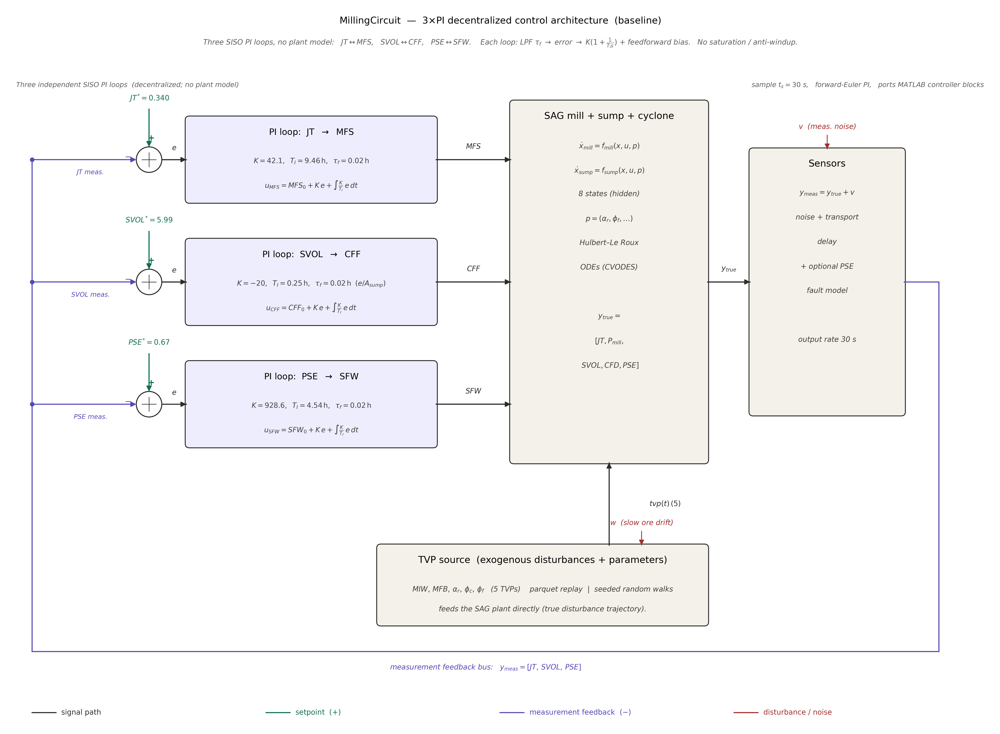

*Figure 1.1a — The 3×PI baseline: three decentralized SISO PI loops (`JT↔MFS`, `SVOL↔CFF`, `PSE↔SFW`) closing on the shared plant through a common sensor/feedback bus. Gains: K = 42.1 / −20 / 928.6 respectively (the sump loop carries a negative gain and divides its error by the sump area). No plant model couples the loops.*

The MPC replaces the three loops with a **single multivariable controller** that uses a nonlinear circuit model to coordinate all MVs at once, subject to box constraints, with an **8‑state EKF** supplying the full state and a **Form‑A disturbance observer (DO)** rejecting unmeasured load. Its architecture is:

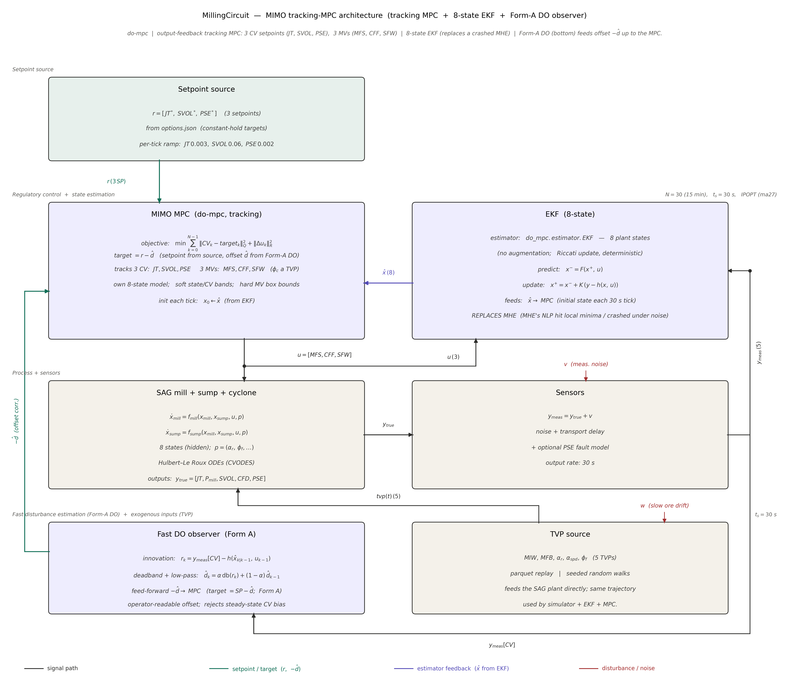

*Figure 1.1b — Architecture of the tracking MPC (`millingcircuit_mpc_do_a_ekf_const`): plant → sensors → EKF/DO state estimate → MPC solving a finite‑horizon tracking QP → MVs back to the plant.*

### 1.2 Set‑point tracking and disturbance rejection

Both controllers hold the three CVs at their set‑points through the realistic disturbance phase and a deliberate `PSE` set‑point step at t = 75 h.

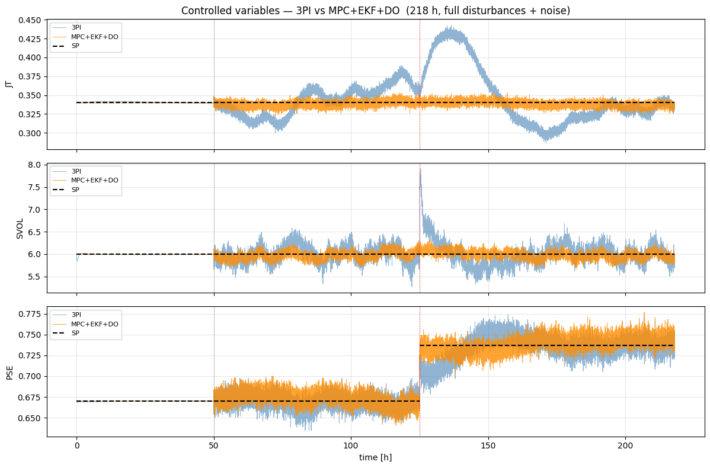

*Figure 1.2 — CVs vs. set‑point. Both keep `JT`/`SVOL`/`PSE` near target, but the MPC absorbs the PSE step with less overshoot and tighter coupling control.*

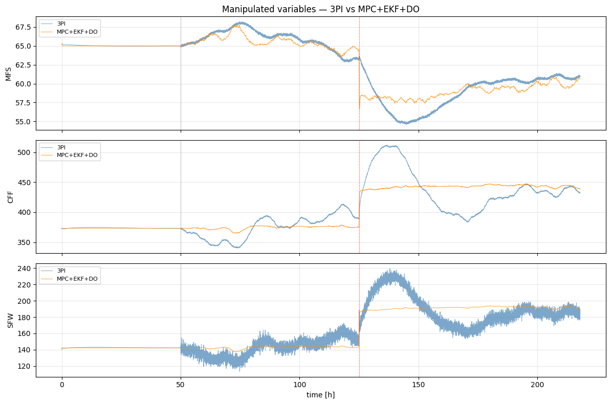

*Figure 1.3 — MV trajectories. The MPC coordinates `MFS`/`CFF`/`SFW` jointly; the 3×PI loops move more reactively because each sees only its own loop error.*

The headline tracking metric is the **integrated absolute error of PSE after the step**:

| Controller | Post‑step PSE IAE | Relative |
|------------|-------------------|----------|
| 3×PI | 1.0286 | 1.00× |
| MPC + EKF + DO | 0.7195 | **0.70× (1.43× better)** |

Steady‑state tracking bias stays small for both (≲ 0.5 % of set‑point pre‑step for the MPC), but the 3×PI bias on `JT` grows to **+2.2 %** after the step while the MPC stays within ±0.4 %.

### 1.3 Comparison of state estimate vs. simulated plant true state

The MPC controls on the EKF's estimate, not raw measurements, so its quality depends on how well the model predicts the plant. The notebook checks this directly:

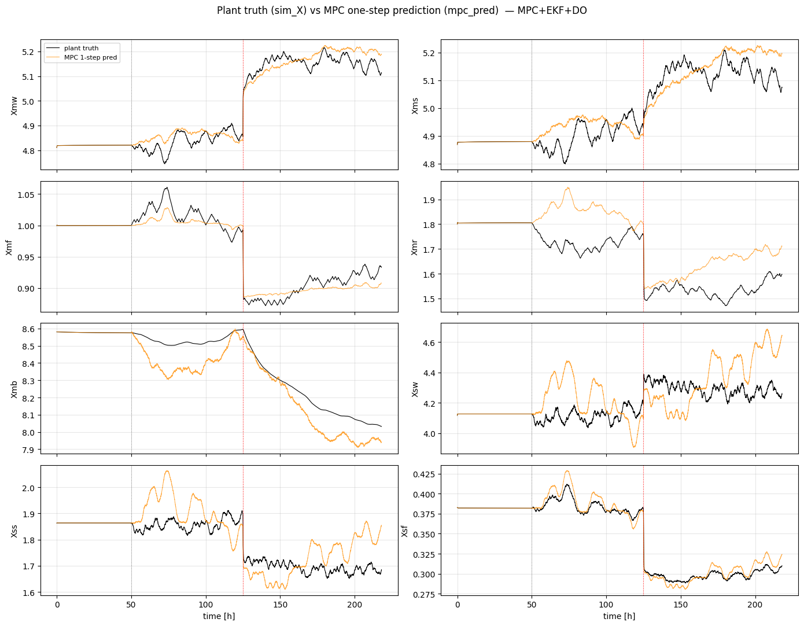

*Figure 1.4 — One‑step prediction (EKF) vs. plant ground truth.*

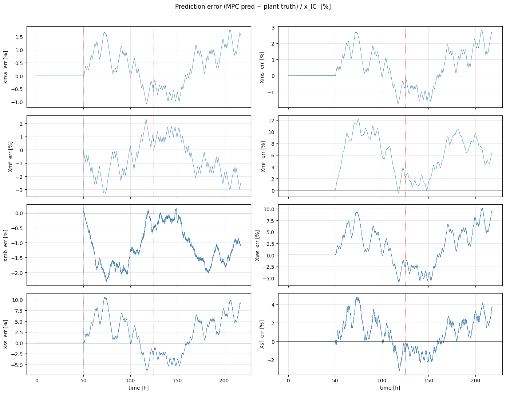

*Figure 1.5 — Per‑state residuals. Mean absolute one‑step error stays ≲ 1.3 % of the initial condition for the directly‑measured holdups; the hardest‑to‑observe states (`Xmr` rocks ≈ 6.1 %, `Xss`/`Xsw` sump ≈ 4 %) carry the most uncertainty — which is exactly what later sections improve on with better estimation/optimization.*

**Takeaway (§1):** moving from three decoupled PI loops to one model‑based MPC buys tighter, better‑coordinated regulation — about **1.4× lower PSE error** after a set‑point change — at the cost of needing a plant model and a state estimator. This MPC is the regulatory foundation every economic controller in the following sections is built on.

---

## 2. Economic MPC (single layer)

**Package:** `src/millingcircuit_empc_do_a_ekf_const`
**Notebooks:** `notebooks/compare_const_mpc_vs_empc_N60_100h.ipynb` (100 h) and `notebooks/compare_mpc_const_vs_empc_const_218h.ipynb` (218 h paper scenario)

### 2.1 From "track a set‑point" to "maximize profit"

The tracking MPC of §1 holds `JT`/`SVOL`/`PSE` at *fixed* set‑points an engineer must supply. But those set‑points are guesses — there is no guarantee they are economically optimal. **Economic MPC (EMPC)** removes the throughput set‑point entirely and instead puts the *plant economics directly into the controller's stage cost*. The controller is free to choose the operating point that maximizes profit, constrained only by the hard MV bounds and a `PSE` quality floor.

The economic stage cost (do‑mpc minimises `lterm`, so the minus sign maximises profit) is

```
lterm = −A_NUM · TP + B_NUM · Pmill          # millingcircuit_empc_do_a_ekf_const/controllers.py:81
        └── revenue ──┘   └─ energy cost ─┘
A_NUM = 71  $/t   (net smelter return per tonne)
B_NUM = 0.06 $/kWh (electricity tariff)
```

i.e. it maximizes the commercial objective `J_comm = A·TP − B·Pmill`. Because revenue (`A`·TP) dominates the energy term (`B`·Pmill) by three orders of magnitude in `$`, the EMPC's incentive is to **push throughput up** until a constraint stops it — here, the `PSE` floor. The architecture keeps an EKF estimator (here **EKF‑only — no DO**, an 8‑state `do_mpc.estimator.EKF`) and simply swaps the tracking QP for the economic objective:

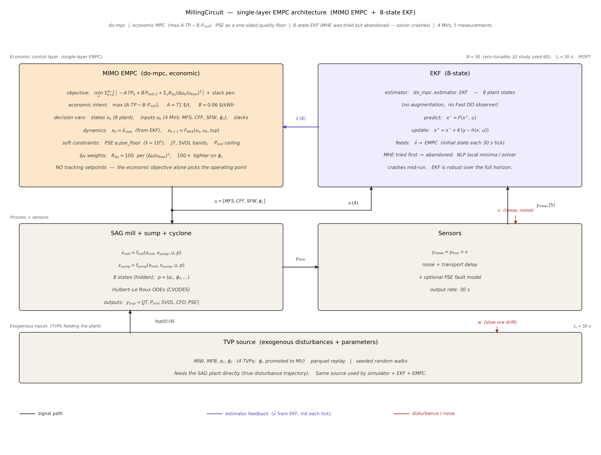

*Figure 2.1 — Architecture of the single‑layer EMPC (`millingcircuit_empc_do_a_ekf_const`). Same plant/EKF/DO stack as §1; the MPC objective is now economic rather than set‑point tracking.*

### 2.2 What the EMPC does differently

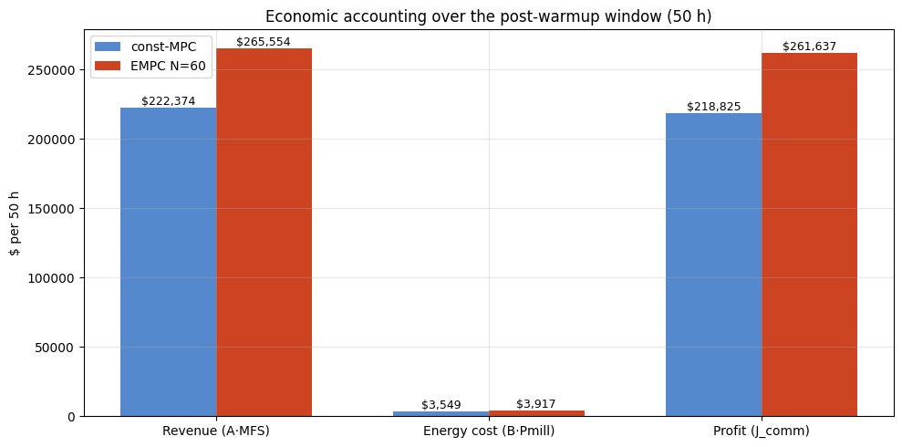

*Figure 2.2 — Economic accounting over 50 h post‑warmup. The EMPC earns substantially more profit than the fixed‑set‑point MPC.*

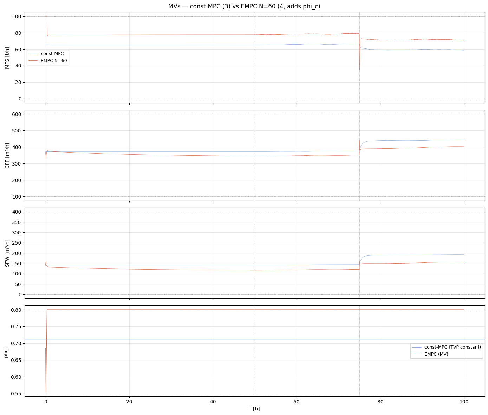

*Figure 2.3 — MV trajectories. The EMPC runs `MFS` (and hence `CFF`/`SFW`) higher to lift throughput.*

The economics over the 50 h economic window:

| Metric | const‑MPC | EMPC (N = 60) | Δ |
|--------|-----------|---------------|----|
| Revenue (`A·MFS`) | \$222,374 | \$265,554 | **+19.4 %** |
| Energy cost (`B·Pmill`) | \$3,549 | \$3,917 | +10.4 % |
| Commercial objective `J_comm` | — | — | **+\$42,812 (+19.6 %)** |
| **SEC** (kWh/t) | 18.94 | **17.51** | **−7.5 %** |
| `MFS` avg (t/h) | 62.6 | 74.8 | +19.4 % |
| `PSE` min | 0.669 | 0.620 | floor binding |

Two facts matter here. First, profit rises **+19.6 %** — almost entirely from revenue (more tonnes), at a modest +10.4 % more energy *spend*. Second, and less obvious, the **specific energy falls 7.5 %** (18.94 → 17.51 kWh/t): the EMPC is not just selling more, it grinds each tonne more efficiently because it operates the mill nearer its productive sweet‑spot rather than at an arbitrary set‑point.

**Takeaway (§2):** putting economics in the objective turns "hold a guessed set‑point" into "find and hold the most profitable feasible operating point." Here that is **+19.6 % profit and −7.5 % specific energy**, with the throughput ceiling set by the `PSE` quality floor rather than the actuator. The natural next question — *which* economic objective should we encode — is the focus of §3.

---

## 3. Focus: profit objective vs. energy‑cost objective, and the PSE region

This is the conceptual heart of the project. The single‑layer EMPC of §2 can be driven by **two very different economic objectives**, and the choice fundamentally changes where the plant operates. This section (a) derives both objectives from the plant‑wide economic framework, (b) states the assumption that makes them tractable, and (c) shows the resulting operating points side‑by‑side.

### 3.1 The economic objective from the plant‑wide framework

Le Roux & Craig (2019), *"A Framework for the Design of a Plant‑Wide Control System"* (`papers/plant-wide-control-framework-2019.pdf`), build the comminution‑circuit objective top‑down. Revenue is net smelter return ($\mathrm{NSR}$) minus operating cost (their Eq. 6):

$$\text{revenue} = \text{NSR} - (\text{comminution cost} + \text{separation cost}) \quad (6)$$

The **net smelter return** depends on throughput $\mathrm{TP}$ and on product quality through $\mathrm{PSE}$ (Eq. 8), because the recovery $\Upsilon(\mathrm{PSE})$ and the concentrate grade $\gamma_C(\mathrm{PSE})$ are themselves functions of the particle‑size estimate:

$$\mathrm{NSR} = \Upsilon(\mathrm{PSE})\gamma_{\mathrm{ROM}}P_v\cdot\mathrm{TP} - (P_t+P_p)\Upsilon(\mathrm{PSE})\gamma_C(\mathrm{PSE})\gamma_{\mathrm{ROM}}\cdot\mathrm{TP} = A(\mathrm{PSE})\cdot\mathrm{TP} \quad (8)$$

where $P_v$ is the metal valuation (USD/t), $P_t, P_p$ the transport and smelter‑processing costs (USD/t), $\gamma_{\mathrm{ROM}}$ the run‑of‑mine head grade, and $\Upsilon$ the recovery. All $\mathrm{PSE}$‑dependent price/recovery terms collapse into a single **net return per tonne** $A(\mathrm{PSE})$ (USD/t) — the compact form $\mathrm{NSR} = A(\mathrm{PSE})\cdot\mathrm{TP}$ shown on the right above.

The **comminution cost** is dominated by mill electricity (steel‑ball and pumping costs are minor and roughly constant), so (Eq. 10):

$$\text{comminution cost} = P_W\cdot P_{mill} + P_s\cdot\kappa_B \approx B\cdot P_{mill} \quad (10)$$

with $P_W$ the electricity tariff (USD/kWh) and $P_s\kappa_B$ the (constant) steel‑media term.

Combining (6), (8) and (10), and dropping the constant separation/steel terms — which carry no steady‑state degree of freedom in our MV set — gives the circuit's economic objective (Eq. 11, reduced):

$$J_{comm} = A(\mathrm{PSE})\cdot\mathrm{TP} - B\cdot P_{mill} \quad (11)$$

This is exactly the stage cost ($\ell$, the `lterm`) of §2, with $\mathrm{TP} \approx \mathrm{MFS}$ at steady state.

### 3.2 The key assumption: **A(PSE) is treated as constant**

In the paper `A` is a function of PSE through ϒ(PSE) and γC(PSE). **In our implementation we hold `A` constant** (`A_NUM = 71 $/t`). The justification is operational: the regulatory MPC keeps `PSE` *on or just above its quality floor* at all times, so PSE varies over a narrow band, and over that band `A(PSE) ≈ const`. This linearises the revenue term in throughput and yields the two objectives we actually compare:

| Objective | `lterm` | Source line | Intent |
|-----------|---------|-------------|--------|
| **Profit‑max** | `−A·TP + B·Pmill` | `empc_do_a_ekf_const/controllers.py:81` | maximize commercial profit `A·TP − B·Pmill` |
| **Energy‑min** | `B·Pmill` | `empc_ekf_cost_pmill/controllers.py:113` | minimize mill electricity only, at the given throughput |

The energy‑min objective is what remains of (11) once the revenue term is removed — appropriate when throughput/quality are fixed by an upstream target and the controller's only job is to grind those tonnes as cheaply as possible.

### 3.3 Two objectives → two operating regions

**Notebook:** `notebooks/compare_profitmax_vs_energymin_100h.ipynb` (profit‑max EMPC vs. energy‑min EMPC vs. const‑MPC, 100 h)

The decisive prediction is geometric. With `A` constant and large relative to `B`:

- **Maximizing profit** `A·TP − B·Pmill` rewards every extra tonne far more than it penalises the energy to grind it → the plant runs at **maximum capacity**: `MFS`, mill speed `φc`, and `Pmill` all ride near their **upper** limits, stopped only by the PSE floor.
- **Minimizing energy** `B·Pmill` at a *given* `MFS`(≈TP) and PSE has no incentive to add tonnes → the plant settles at the **lowest‑power feasible steady state** for that throughput: `MFS` and `Pmill` hover in their **lowest** admissible region.

The simulation confirms exactly this split:

| | `J_cum` [\$] | Revenue [\$] | Energy [\$] | `MFS` avg | `Pmill` avg [kW] | SEC [kWh/t] |
|---|---|---|---|---|---|---|
| **Profit‑max EMPC** | 261,637 | 265,554 | 3,917 | **74.8** (→ high) | **1,306** (→ high) | 17.51 |
| **Energy‑min EMPC** | 209,855 | 213,000 | 3,145 | **60.0** (→ floor) | **1,048** (→ low) | 17.47 |

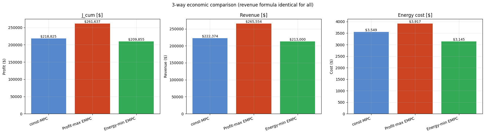

*Figure 3.1 — Economic accounting. Profit‑max accumulates far more `J_comm` by selling more tonnes; energy‑min spends the least on electricity but forgoes the revenue.*

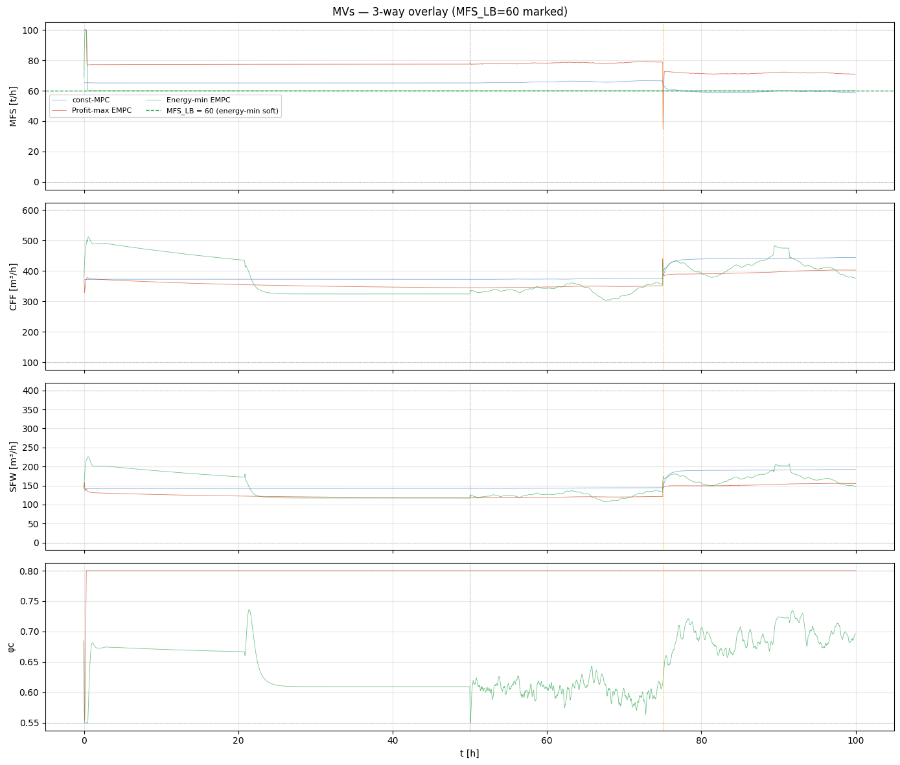

*Figure 3.2 — MV trajectories. Profit‑max holds `MFS` high (≈ 75 t/h); energy‑min drives `MFS` down to its lower bound (≈ 60 t/h) — the "lowest‑limited region."*

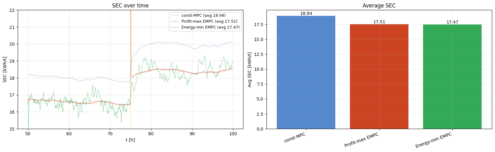

*Figure 3.3 — SEC (kWh/t). Note SEC is nearly identical (17.51 vs 17.47) even though absolute power and revenue differ enormously — because SEC is throughput‑normalised and **both** objectives respect the same PSE floor. The economic difference is in **how many tonnes**, not in kWh per tonne.*

### 3.4 Interpretation — the PSE region ties it together

Both objectives meet the **same** `PSE` floor (PSE min ≈ 0.62 for both), but they sit at opposite ends of the throughput envelope:

- Profit‑max → **upper** corner of the operating region (max `MFS`/`φc`/`Pmill`), because revenue dominates.
- Energy‑min → **lower** corner (min `MFS`/`Pmill`), because nothing rewards extra tonnes, so the controller finds the cheapest stable point that still satisfies PSE.

This is why the `A(PSE) = const` assumption is the right simplification for *this* study: with PSE pinned to its floor by the regulatory layer, the only economically active trade‑off left is throughput vs. power — precisely the axis these two objectives probe. The same two‑corner picture reappears in the operating‑envelope sweep of §6.

### 3.5 Why a single‑layer EMPC tends to chatter (a tuning hazard of the economic objective)

Both economic objectives of §3 share one structural weakness — a *tuning* hazard, not a modelling error — traced through tuning sweeps on the 1‑ and 2‑layer EMPC (`compare_empc_tuning_sweep`, `compare_2layer_R_RTO_sweep`, `compare_2layer_sweep2`) and a long‑horizon diagnostic (`compare_empc_2layer_v2_218h_step75`).

**The likely mechanism.** The economic stage cost — $\ell = -A\cdot\mathrm{TP} + B\cdot P_{mill}$ or $\ell = B\cdot P_{mill}$ — is **(near‑)affine in throughput** `MFS`. An OCP whose stage cost is linear in the input (subject only to bounds and path constraints) has **no interior optimum**: the minimum sits on the feasible boundary (the LP‑like / Pontryagin "bang‑bang" property), so the EMPC always *wants* an MV against a constraint. That is the interpretation; the behaviour below is what we observed.

**What the tests show — the chatter is constraint‑state‑dependent** (sharpest in the 218 h diagnostic, a 2‑layer energy‑min run, but the same mechanism governs the 1‑layer):
- **`PSE` floor firmly active** → `MFS` pinned to a clean edge, smooth (`σ(ΔMFS) ≈ 0.0002`).
- **Slack window** (`PSE` above its floor, nothing binding) → the surface is **flat in `MFS`**; accumulated disturbance widens the model–plant gap until tiny changes flip which bound is optimal and the MV jumps between bounds tick‑to‑tick (`σ(ΔMFS) ≈ 1.3`, `MFS` swinging `[32.6, 97.8]` — ~6,700× louder).

**What we tuned:**
- **`Δu` penalty (`R_DELTA_U_NORM` 2 → 100 → 1000):** *damps* it (R = 1000 cut `PSE` violations ≈ 40× on the 2‑layer) but doesn't cure it, and pushed further trades against `PSE` responsiveness (compliance −30–45×; on the 1‑layer, R 100 → 500 even nudged MFS‑at‑bound *up*). A damper, not a fix.
- **Horizon `N` — the dominant lever:** `compare_empc_tuning_sweep` found *"longer horizon (N = 60) is the real lever"* — it lets the OCP see the constraint/turnpike instead of the flat local gradient.
- **Making the constraint bind:** raising the controller's *internal* `PSE` floor is the root‑cause fix for the slack‑window case.

**Summary.** A near‑affine economic objective with an *inactive* constraint set leaves the optimizer indifferent over a range of MVs and breaks the tie at a noise‑sensitive boundary. `Δu` regularization only damps it; the real levers are **a longer horizon** and **keeping the quality constraint bound**. The two‑layer design of §4 packages these — yet even its v2 tuning **relapsed into a ~50 h bang‑bang window** at 218 h until retuned, so there is no single‑knob cure.

**Takeaway (§3):** the objective is a *policy choice*, not a tuning detail. `A·TP − B·Pmill` says "make money → run flat‑out to the quality limit"; `B·Pmill` says "spend the least power for the tonnes you're told to make → idle at the floor." Same plant, same constraints, opposite corners of the operating region. And as §3.5 shows, *whichever* objective you pick, its near‑affine economic surface makes the controller prone to bang‑bang once the `PSE` constraint goes slack — a tuning hazard the two‑layer design and horizon/floor tuning of §4 are built to address.

---

## 4. Two‑layer EMPC: fixing bang‑bang by separating economics from tracking

**Package:** `src/millingcircuit_empc_2layer`
**Notebooks:** `notebooks/compare_empc_2layer_vs_v2_100h.ipynb` (100 h) and `notebooks/compare_4way_218h_step75.ipynb` (218 h, PSE step)

### 4.1 The bang‑bang problem with single‑layer EMPC

The single‑layer EMPC of §2–§3 puts the economic cost *directly* on the manipulated variables. That is efficient when a constraint is firmly binding, but inside the **slack window** — when `PSE` is comfortably above its floor and no constraint is active — the economic gradient on `MFS` is nearly flat. With an almost‑flat economic surface and no penalty on actuator movement, the optimiser has no reason to prefer a smooth input, and `MFS` **chatters between bounds (bang‑bang)**: large step‑to‑step swings that are economically near‑neutral but physically undesirable (actuator wear, load swings, hard‑to‑certify operation). We quantified this with a `σ(ΔMFS)` (standard deviation of step‑to‑step `MFS` change) detector.

### 4.2 The fix: split the objective across two layers

The cure is to stop asking one controller to do two jobs. The **two‑layer EMPC** separates them:

```
            ┌─────────────────────────────────────────┐
   plant ──▶│  augmented EKF  (no Fast DO in v1)      │──▶ x̂, φ̂_f
            └─────────────────────────────────────────┘
                              │ x̂
            ┌─────────────────▼───────────────────────┐
   UPPER:   │  Economic layer (slow)                  │   minimize  B·Pmill (economic)
            │  computes steady‑state targets xe_ref,  │   → "where should we operate?"
            │  ue_ref  from the economic objective    │
            └─────────────────┬───────────────────────┘
                              │ xe_ref, ue_ref        ue_ref = [MFS, CFF, SFW, φc]  (4 MVs)
                              │                       xe_ref = 8 plant states
            ┌─────────────────▼───────────────────────┐
   LOWER:   │  Tracking MPC (fast)                    │   minimize ‖x−xe_ref‖ + ‖u−ue_ref‖
            │  tracks the targets with Δu             │   + r·‖Δu‖   ← regularization
            │  regularization                         │   → "get there smoothly"
            └─────────────────┬───────────────────────┘
                              │ MVs
                            plant
```

- The **upper (economic) layer** answers *where to operate* — it solves the economic problem and emits steady‑state targets `xe_ref` (the 8 plant states) and `ue_ref` (the 4 MV references sent to the lower MPC: `MFS`, `CFF`, `SFW`, `φc`).
- The **lower (tracking) layer** answers *how to get there smoothly* — it tracks those targets with a quadratic objective **and a `Δu` regularization term (`set_rterm`)** that explicitly penalises actuator movement.

Because the economic incentive now lives in the *target*, not in the per‑step input cost, the lower layer is free to move smoothly. The bang‑bang chatter disappears without sacrificing the economic operating point.

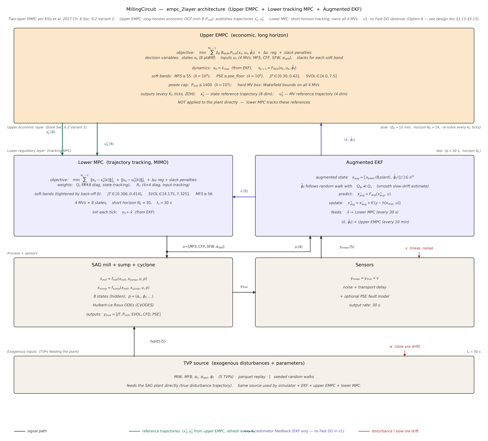

*Figure 4.1 — Two‑layer EMPC architecture: shared EKF/DO estimator → upper economic layer (steady‑state targets) → lower tracking MPC with Δu regularization → plant.*

### 4.3 Evidence: smoother actuation, less bang-bang chatter

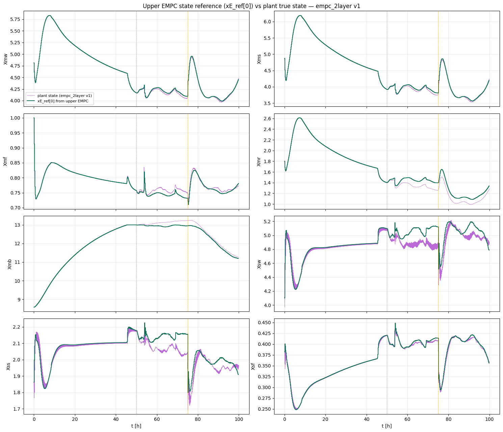

*Figure 4.2 — The steady‑state targets `xe_ref` / `ue_ref` the upper layer hands to the lower layer. The lower MPC tracks these, so the economic decision is decoupled from the moment‑to‑moment input.*

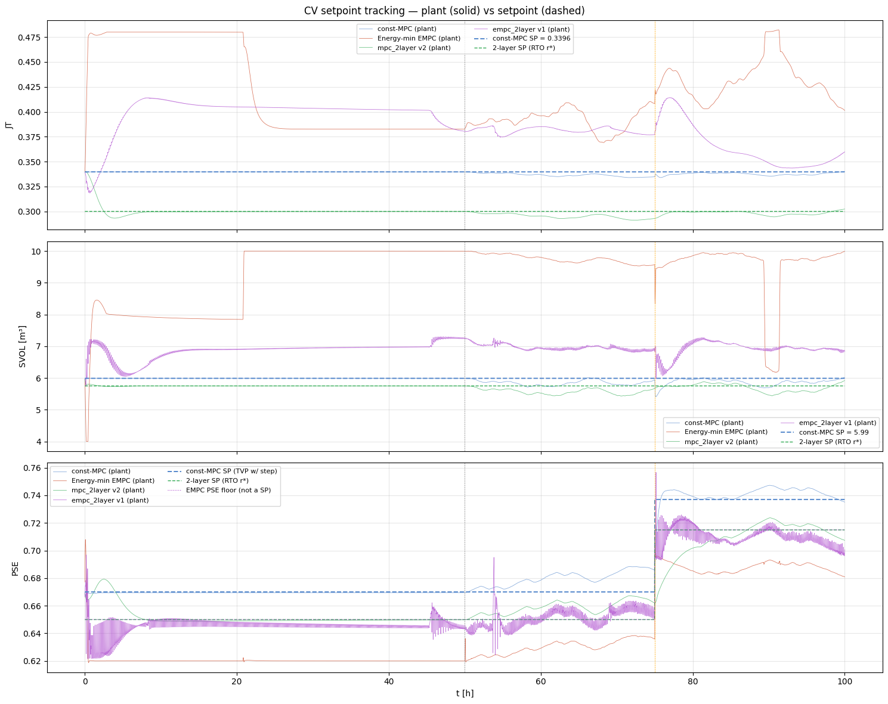

*Figure 4.3 — CV tracking. `PSE` is held at its floor and `JT`/`SVOL` within bounds while the upper layer optimises economics.*

The 218 h four‑way notebook stress‑tests the same controllers across a `PSE` set‑point step at t = 75 h and inspects the MVs specifically for bang‑bang:

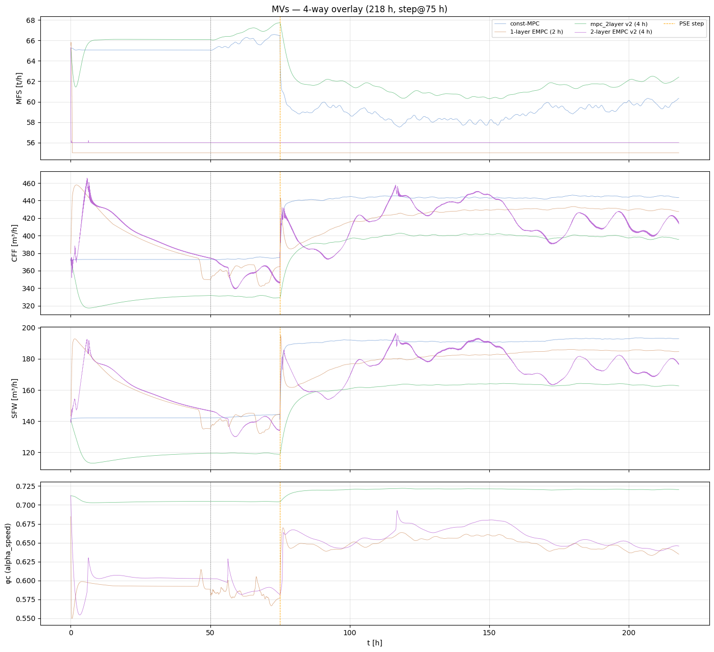

*Figure 4.4 — MV time series across the step (218 h, **step@75 h**). The two‑layer EMPC's inputs stay smooth through the transient; the σ(ΔMFS) detector confirms the chatter is suppressed here — because the post‑step `PSE` floor (0.715) binds almost throughout.*

**Takeaway (§4):** single‑layer EMPC chatters (`bang‑bang`) wherever the economic surface goes flat (§3.5). Splitting the controller into an **economic target‑setting layer** and a **tracking layer with `Δu` regularization** preserves the economic operating point (same profit, smoother actuation) and **significantly reduces the frequency of bang‑bang incidents** — though it does not make them 100 % avoidable, as a long slack‑constraint window can still trigger an episode. **Further tuning will be explored**; the most promising levers are a longer prediction horizon, a tighter *internal* `PSE` floor (so the quality constraint stays active even when the operator floor is slack), and a stronger state‑tracking weight `Q_c`.

---

## 5. Real‑time optimization: SSRTO, ROPA, and the five‑way comparison

**Packages:** `src/millingcircuit_ssrto_2layer` (SSRTO) and `src/millingcircuit_ropa_2layer` (ROPA)
**Notebook:** `notebooks/compare_5way_pinMFS_100h.ipynb` (100 h, all five controllers at matched throughput)

The two‑layer EMPC of §4 optimises economics *inside* the dynamic controller. A different tradition keeps a **conventional tracking MPC** at the regulatory level and adds a separate **real‑time optimization (RTO)** layer on top that periodically recomputes the optimal steady‑state set‑points. We implemented the two main variants from Matias et al. (2022).

### 5.1 SSRTO — steady‑state RTO, gated by a steady‑state detector

**SSRTO** (steady‑state RTO) runs the classic two‑step RTO cycle, but only fires when the plant is *actually* at steady state:

1. A **steady‑state detector (SSD)** (`ssd_passes`) watches the key channels (`JT`, `SVOL`, `PSE`, `Pmill`) and only lets the cycle run when their trends have flattened. For each channel it takes the last 30 min of data, fits a straight line, and tests whether the slope is real (a t‑test; `p < 0.10` ⇒ "still trending"); the plant counts as steady **only when all channels are flat**. If any one is still moving, the cycle is skipped and the lower MPC just **holds the previous set‑points `r*`**.

2. A **steady‑state estimation NLP** (`_ss_estimate`) reconciles the model to the current measurements. It averages the recent measurements and inputs, then finds the steady state `x_ss` and the unknown grinding parameter `φ_f` (**the power needed per tonne of fines**) that make the model best reproduce them — a small nonlinear least‑squares fit with the model pinned at steady state (`dx/dt = 0`). This **re‑calibrates the model to the current operating point** (supplying `φ̂_f`, in place of the EKF), so the economic step runs on an up‑to‑date model.

3. A **steady‑state economic NLP** (`_ss_optimize`) re‑optimises the set‑points for the lower MPC. **In short:** it warm‑starts the solver from a known steady state, freezes the calibrated `φ̂_f`, re‑optimises the MVs and their steady state for **minimum mill power** subject to the quality and safety constraints, and reads `JT*/SVOL*/PSE*` off that optimal point. Concretely: with `φ̂_f` fixed, it first solves for the **cheapest feasible steady state** — minimising mill power `B·P_mill` over `x_ss` and the MVs `u_ss`, subject to `0 = dx/dt`, `PSE ≥ floor`, and the MV/CV bounds — then **reads the set‑points off that optimum**: `r* = [JT*, SVOL*, PSE*] = h(x_ss*, u_ss*)`. Two are simple linear combinations of the holdups (`JT = (Xmw + Xms + Xmr + Xmb) / v_mill`, `SVOL = Xsw + Xss`); the third, `PSE = Vcfo / (Vcco + Vcfo)`, is nonlinear — the cyclone overflows `Vcfo`, `Vcco` come from a chain of complex hydrocyclone equations in `(x_ss*, u_ss*)`. The lower MPC tracks `r*` until the next SSRTO cycle.

This avoids the classic RTO failure mode — optimising on transient data, which yields wrong set‑points.

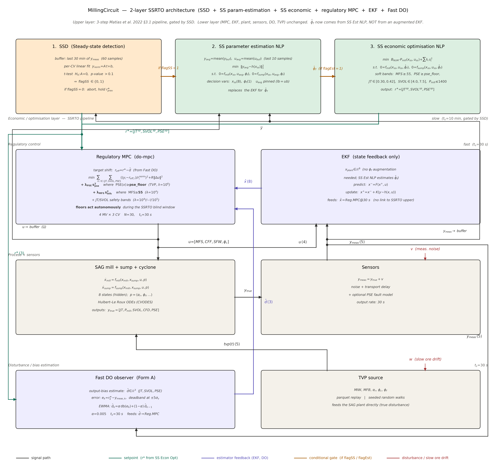

*Figure 5.1 — SSRTO architecture (`millingcircuit_ssrto_2layer`): regulatory MPC + EKF/DO, with an SSD‑gated steady‑state estimation + economic optimization layer (Step 5 estimates the steady state before re‑optimising).*

### 5.2 ROPA — RTO with persistent parameter adaptation

**ROPA** (RTO with persistent adaptation) drops the SSD gate. Instead of waiting for steady state, it runs a **continuous EKF that persistently adapts the slow model parameter `φ̂_f`** every cycle — the same fines‑grinding parameter, updated every tick rather than only when a steady state is detected — so the economic optimisation always uses a freshly‑corrected model. This trades the SSD's robustness for faster tracking of a drifting plant; the goal here is to test the ROPA approach itself, not the adaptation of any particular parameter.

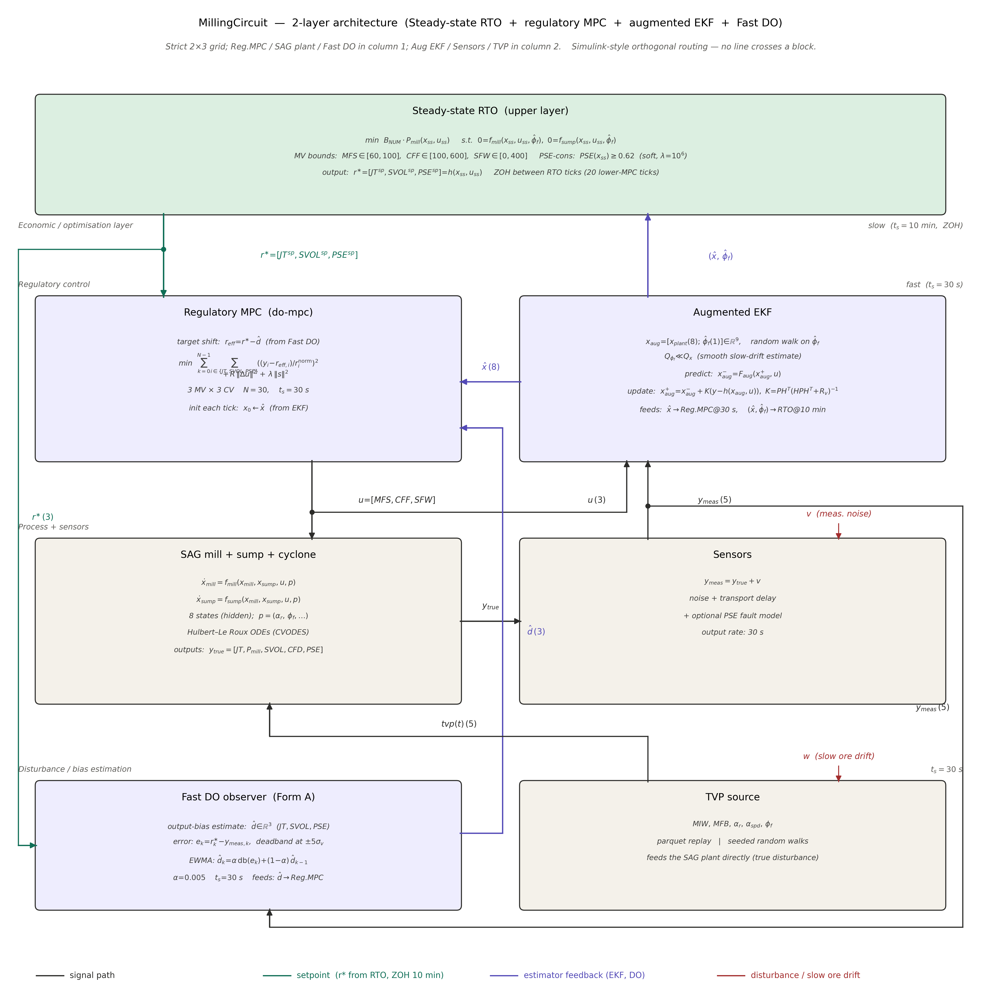

*Figure 5.2 — ROPA architecture (`millingcircuit_ropa_2layer`): the same two‑layer skeleton, but the upper layer is driven by a continuously‑adapting parameter estimate rather than an SSD‑gated steady‑state reconciliation.*

### 5.3 Five‑way comparison at matched throughput

To compare *control strategy* rather than *operating point*, all five controllers are run with **`MFS` pinned to 65.2 t/h** and a **constant `PSE` floor** — so every controller grinds the same tonnage and the only question is how much power each spends to do it (SEC). The const‑MPC's `PSE` set‑point is fixed at 0.65.

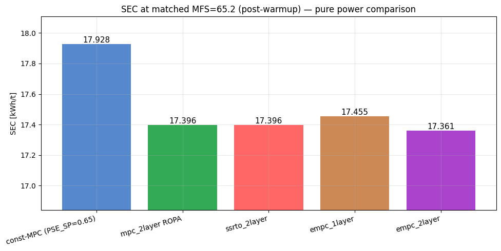

*Figure 5.3 — SEC at matched throughput. The four economic/RTO controllers cluster ~3 % below the conventional const‑MPC.*

| Controller | SEC [kWh/t] | vs const‑MPC | Realised `PSE` |
|------------|-------------|--------------|----------------|
| const‑MPC (`PSE_SP = 0.65`) | 17.928 | — | 0.676 (over‑grinds) |
| ROPA (`ropa_2layer`) | 17.396 | **−2.97 %** | floor |
| SSRTO (`ssrto_2layer`) | 17.396 | **−2.97 %** | floor |
| EMPC 1‑layer | 17.455 | −2.64 % | floor |
| EMPC 2‑layer | 17.361 | **−3.17 %** | floor |

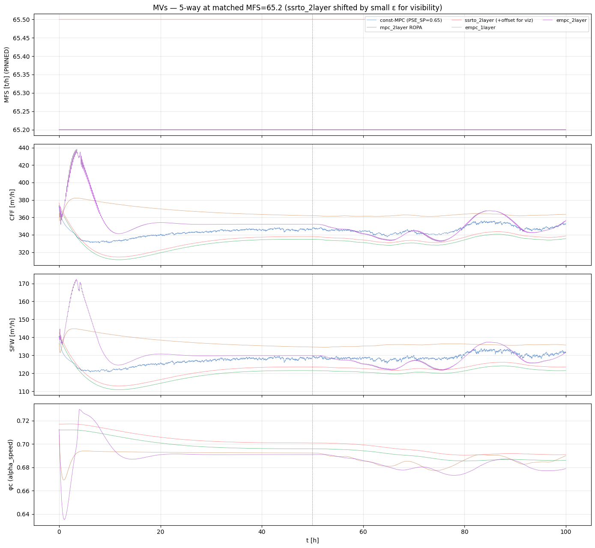

*Figure 5.4 — MV time series. `MFS` is flat at 65.2 t/h for all five (the pin); the controllers differ in how they set `CFF`/`SFW`/speed.*

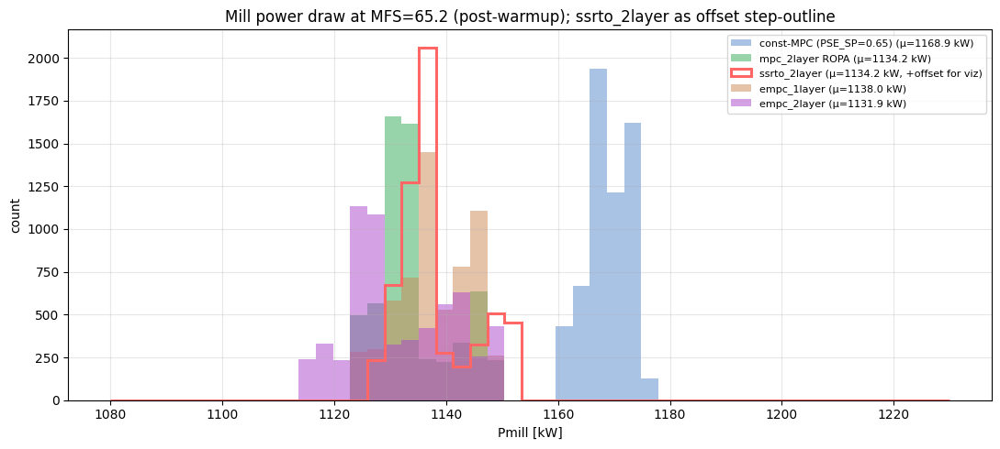

*Figure 5.5 — `Pmill` distribution at fixed throughput. The economic/RTO controllers draw consistently less power than the const‑MPC for the same tonnes.*

The central result: **at matched throughput, the economic layer (ROPA / SSRTO / EMPC) saves ≈ 3 % specific energy versus a conventional tracking MPC, and SSRTO ≈ ROPA ≈ EMPC to within ~1 %.** The energy advantage comes almost entirely from *not over‑grinding*: the const‑MPC, told to hold three CV set‑points at once, realises `PSE = 0.676` instead of 0.65 — it grinds finer than required and pays for it in power. The economic controllers instead ride the `PSE` floor exactly.

**Why SSRTO, ROPA and the EMPCs land so close.** This 100 h test deliberately holds the plant at **a single operating point** — `MFS` is pinned at 65.2 and the `PSE` floor is constant at 0.65, with no set‑point step and only slow disturbance drift. So all four economic controllers are solving essentially the **same steady‑state problem**: at fixed throughput, find the lowest‑power way to keep `PSE` on its floor. That problem has one optimum, and they all converge to it — hence near‑identical SEC. What actually *distinguishes* the architectures — how fast they adapt, how they ride a slack constraint, how they handle an operating‑point change — only shows up when the plant has to **move** between steady states (e.g. the 218 h step scenarios of §4, where the differences became large). In other words, their near‑equivalence here is partly a property of this benign matched‑throughput test, not a general claim that the architectures are interchangeable.

### 5.4 State estimation underpins all of it

Every controller acts on an **EKF‑based state estimate**, not raw measurements, so the economic/RTO behaviour above is only as good as the estimator beneath it. Each controller logs its estimate against the plant ground truth for all eight holdups; below is one 4×2 panel **per controller**, all at the **pinned MFS = 65.2** matched‑throughput condition (solid colour = plant truth, dashed black = EKF estimate; each sub‑title reports mean / max absolute error as % of that state's mean). The exact estimator differs by controller — which is itself part of the comparison:

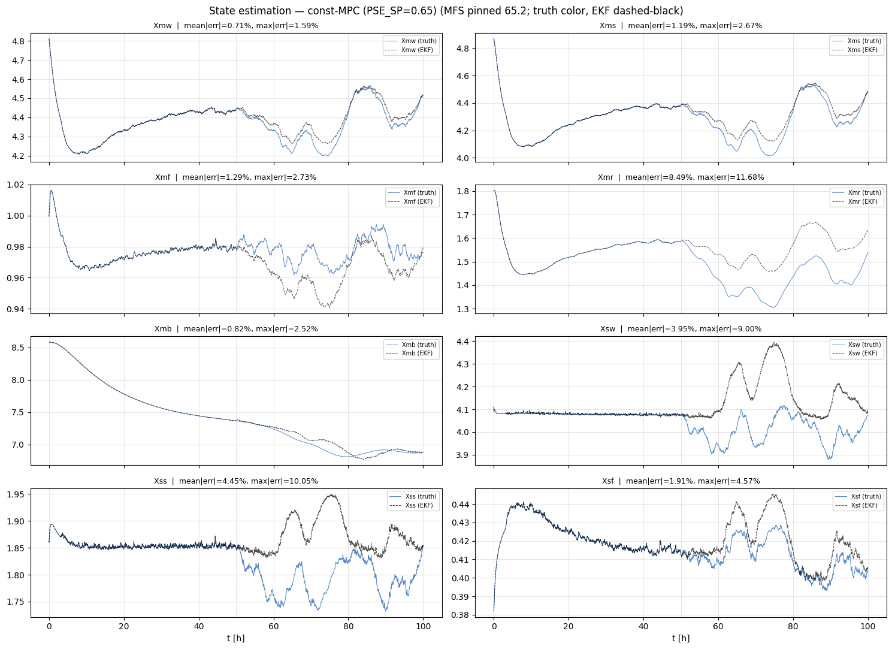

*Figure 5.6a — **const‑MPC**: 8‑state EKF + Form‑A disturbance observer.*

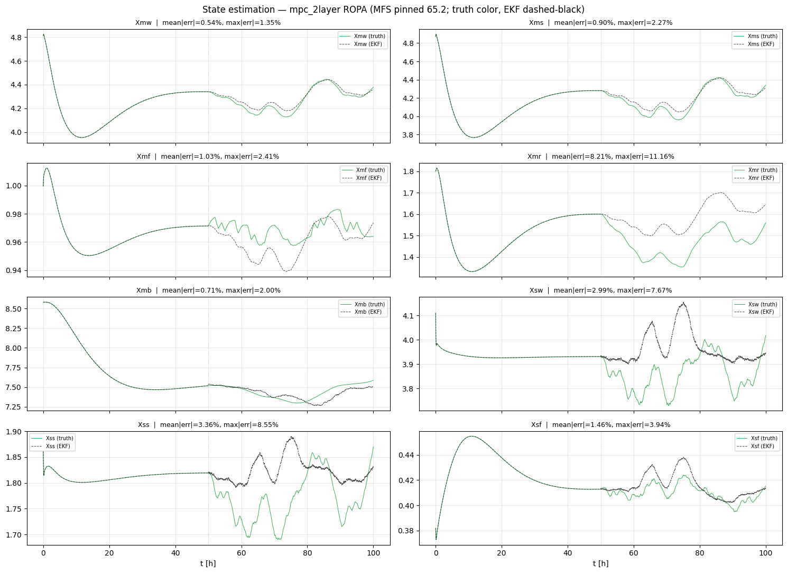

*Figure 5.6b — **mpc_2layer (ROPA)**: augmented EKF that adapts the slow parameter `φ̂_f` online (its persistent parameter adaptation).*

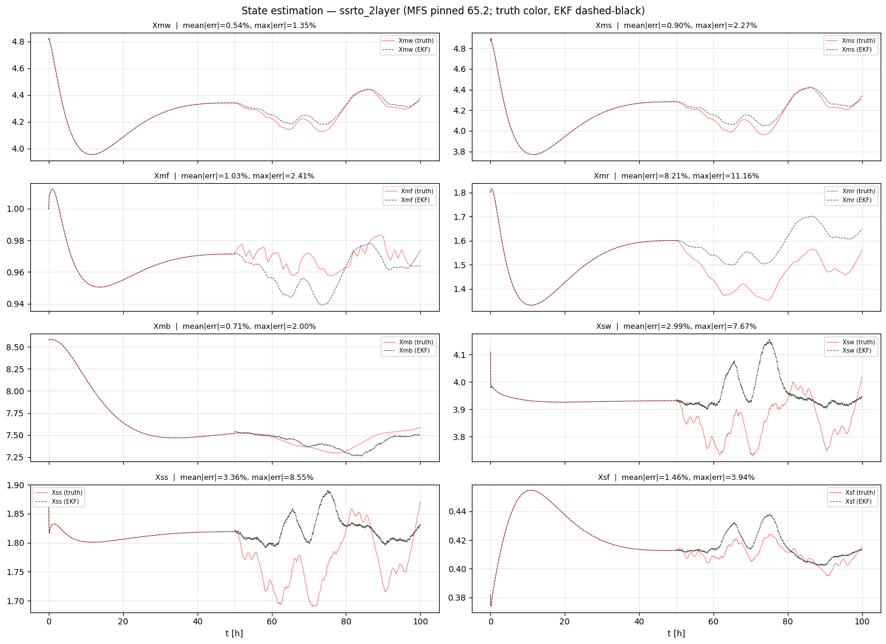

*Figure 5.6c — **ssrto_2layer**: EKF for state feedback only; the slow parameter `φ̂_f` comes from the SS‑estimation NLP (Step 2 of the SSRTO pipeline), not from the EKF.*

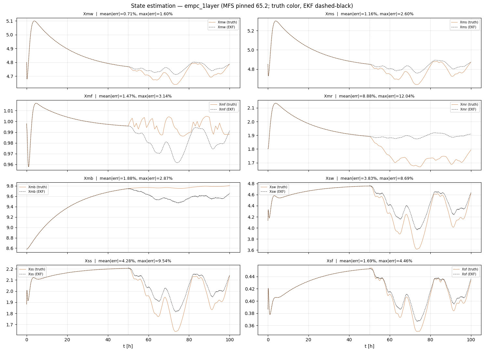

*Figure 5.6d — **empc_1layer**: 8‑state EKF (no augmentation).*

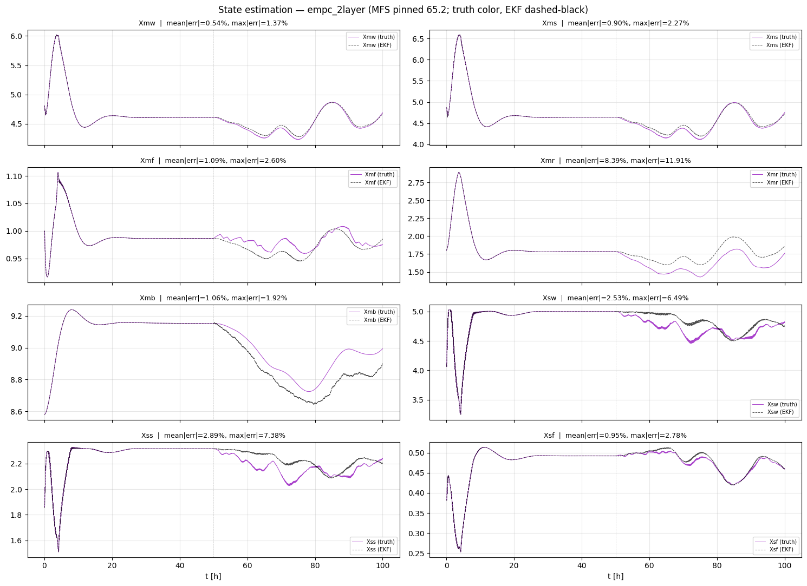

*Figure 5.6e — **empc_2layer**: augmented EKF (8 plant states + `φ̂_f`).*

Across all five, the directly‑measured holdups track to ≈ 1–2 % and the harder‑to‑observe sump/rock states (`Xmr`, `Xss`, `Xsw`) carry the most error, but **every estimator stays locked to the truth through the 100 h run** — which is exactly what lets the economic layers ride the `PSE` floor without violating it.

Comparing the panels, the **two‑layer EMPC's augmented EKF gives the tightest estimate overall** (mean |error| ≈ 2.3 % across the eight states — the lowest of the five, edging SSRTO/ROPA at ≈ 2.4 %). Its advantage is concentrated in the **hard‑to‑observe sump states** (`Xsw`, `Xss`, `Xsf`), where it tracks the truth noticeably closer than the RTO controllers; on the mill states the five are comparable (the RTO EKFs marginally tighter). The single‑layer EMPC, by contrast, is the loosest estimator — so the benefit tracks the **augmented EKF** (which also estimates `φ̂f`), not the economic objective itself.

**Takeaway (§5):** an explicit RTO layer (SSRTO or ROPA) on top of a conventional MPC recovers almost the same ≈ 3 % energy saving as a fully economic MPC, and the three economic strategies are within ~1 % of each other at matched throughput. The recurring lesson is that **most of the saving is simply not over‑grinding** — riding the `PSE` floor instead of tracking a fixed, finer set‑point.

---

## 6. Operating‑envelope study: MFS × PSE, three controllers

**Notebook:** `notebooks/compare_sweep_MFSxPSE_100h.ipynb`
**Driver:** `scripts/sweep/run_MFSxPSE_sweep.sh` · **method:** `knowledge/wiki/processes/mfs_pse_sweep_sec_study.md`

The matched‑throughput comparison of §5 is a single point in the operating space. To see whether the ≈ 3 % advantage holds *across the envelope the plant actually runs in*, we swept a **3 × 3 grid** and re‑ran three representative controllers in every cell:

- **Throughput:** `MFS ∈ {55, 60, 65.2}` t/h
- **Quality floor:** `PSE ∈ {0.65, 0.69, 0.715}`
- **Controllers:** const‑MPC (conventional), `ssrto_2layer` (RTO), `empc_2layer` (economic)
- 9 cells × 3 controllers = 27 runs, each 100 h, `MFS` pinned, constant `PSE` floor.

(The fourth and fifth controllers from §5 were dropped because ROPA ≈ SSRTO and EMPC‑1‑layer ≈ EMPC‑2‑layer, halving the run count without losing a distinct behaviour.)

### 6.1 SEC surface

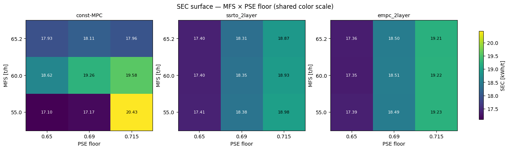

*Figure 6.1 — SEC heatmaps (kWh/t), one per controller, over the MFS × PSE grid. The const‑MPC surface is bumpy and runs hot in the high‑PSE / low‑MFS corner; the SSRTO and EMPC surfaces are smoother and uniformly cooler.*

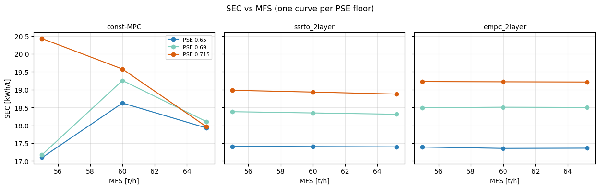

*Figure 6.2 — SEC vs `MFS`. The economic controllers' SEC is essentially **flat in MFS** — they find the same efficient operating policy regardless of the pinned throughput. The const‑MPC's SEC swings with MFS.*

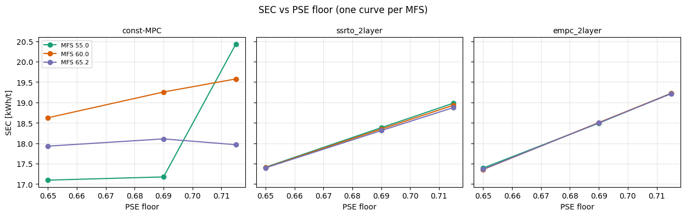

*Figure 6.3 — SEC vs `PSE` floor. SEC rises with the quality floor for every controller (finer product costs more energy), but the const‑MPC rises fastest because it over‑grinds past the floor.*

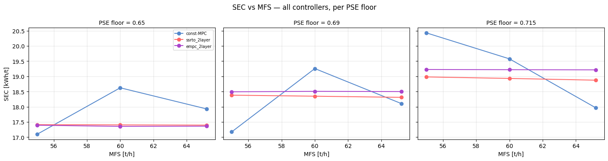

*Figure 6.4 — Cross‑controller overlay. `ssrto_2layer` and `empc_2layer` lie on top of each other and below const‑MPC across the whole envelope.*

### 6.2 Results

Because every cell pins `MFS` and holds the `PSE` floor constant, the plant sits at essentially **one steady operating point** for the whole 100 h run. So `ssrto_2layer` and `empc_2layer` solve the same steady‑state problem and converge to the same optimum — they cluster to within ~1 %. For a **given `MFS` and `PSE`**, that optimum is simply the **lowest‑SEC (energy‑per‑tonne) way to make that product**: the economic layer tunes the remaining MVs (`CFF`, `SFW`, `φc`) to minimise mill power at the required throughput and quality. The conventional const‑MPC, lacking this, over‑grinds (realised `PSE` sits above the floor) and its SEC swings across the grid — peaking ≈ 20.4 kWh/t in the high‑quality / low‑throughput corner.

**Takeaway (§6):** sweeping the whole MFS × PSE envelope confirms the central thesis of the project — **an economic or RTO layer delivers a consistent specific‑energy saving over a conventional tracking MPC across the plant's full operating range**, primarily by holding product quality exactly at its floor instead of over‑grinding. The saving is largest precisely where it matters: the high‑quality, low‑throughput corners where over‑grinding is most expensive.

---

## Summary

**Headline results (by section):**
- **§1** — Replaced the three decoupled PI loops with a single **MIMO model‑based tracking MPC**, built on a fast disturbance observer (DO) and an EKF state estimator.
- **§2** — Implemented the **economic MPC (EMPC)** — the controller finds and holds the most profitable feasible operating point, with throughput capped by the `PSE` quality floor — and studied its tuning behaviour.
- **§3** — Explored two EMPC cost functions — profit‑maximisation and energy‑minimisation — to understand how each shapes the optimum; for the SAG mill this showed that **minimising energy for a given throughput (`MFS` ≈ TP) and quality (`PSE`)** is the natural objective, with **SEC (energy per tonne)** the metric to compare controllers on.
- **§4** — Implemented the **two‑layer EMPC**, separating the economic cost function from a tracking‑MPC layer (with `Δu` regularisation): this removes the bang‑bang chatter while preserving the economic operating point. Moving the economic optimisation from the fast lower layer up to the slow upper layer also lets the long‑horizon EMPC solve far less often.
- **§5** — Adding an explicit RTO layer (SSRTO or ROPA) recovers essentially the same energy benefit as a fully economic MPC; tested under the **same constraints and conditions**, SSRTO, ROPA and the EMPCs deliver comparable **SEC (energy per tonne)** at matched throughput.
- **§6** — The MFS × PSE operating‑envelope study covered three controllers but on limited, synthetic runs, so realistic plant‑calibrated data is still needed before firm conclusions — even so, it shows that the SAG mill's operating behaviour can be summarised as an **SEC map over the PSE × MFS grid**.

**Overall.** We implemented initial versions of all the control‑system structures — tracking MPC and economic MPC in both single‑ and two‑layer forms, plus the two classical RTO layers (SSRTO and ROPA). Working through them we learned the practical pros and cons of EMPC and tuned it efficiently, overcoming the **bang‑bang** failure mode through a combination of levers — chiefly a **longer prediction horizon** and **keeping the `PSE` quality constraint bound**, supported by the **two‑layer economic/tracking split**, stronger **`Δu` move‑suppression**, a slower RTO clock and a stronger state‑tracking weight (the `Δu` penalty helps but cannot fix it alone). We also experimented with **cost‑function variants** (profit‑max vs energy‑min) and showed that, at the SAG‑mill level, the EMPC optimisation reduces to **minimising energy alone for a given throughput (`MFS` ≈ TP) and product quality (`PSE`)**. Throughout, **SEC (specific energy — energy per tonne)** is the key metric for comparing the controllers on an equal footing.

## Next steps (remaining work)

The results above were obtained on **synthetic, mostly steady‑state scenarios**; the priorities before drawing plant‑level conclusions are:

1. **Validate against real SAG‑plant data.** Once historical operating data is available, build a simulation calibrated to resemble it and re‑run all the control systems on that scenario. The matched‑throughput tests here deliberately hold the plant near a *single* steady state — which is why the economic controllers cluster so closely; real operation moves through **significant transients between steady states**, and that is where the architectures (SSRTO vs ROPA, single‑ vs two‑layer EMPC) should separate and reveal their true **SEC (energy‑per‑tonne)** differences.

2. **Add more realistic noise and drifting disturbances.** Extend the disturbance/sensor model with richer, more realistic sensor noise and a broader set of drifting disturbances, and calibrate it against the historical data. This is what will let us quote **credible, real‑world energy‑saving coefficients** rather than figures from a benign synthetic scenario.

3. **Calibrate the Hulbert–Le Roux model to the plant.** Tuning and validating the mill model itself against real‑plant data is essential — getting the plant model right underpins every controller comparison that follows.
