# Control of a Single‑Stage Grinding Mill Circuit: From Decentralized PI to Economic MPC  *(v2)*

*A step‑by‑step walkthrough of the controllers implemented in this repository, with simulation evidence.*

> **v2 note:** §1 is reworked as a **three‑way** baseline study — 3×PI vs. an *unconstrained* tracking MPC vs. the *constrained* tracking MPC — to show how the constrained MPC variant produces **smooth manipulated‑variable trajectories** where the unconstrained baseline MPC moves in near‑discontinuous, step‑like jumps. Sections 2–6 are unchanged from v1.

---

## 0. Scope and plant

All controllers act on the same simulated plant: a **single‑stage closed grinding‑mill circuit** (SAG mill → sump → hydrocyclone), modelled in `do-mpc` with eight nonlinear state holdups

| Group | States |
|-------|--------|
| Mill | `Xmw` (water), `Xms` (solids), `Xmf` (fines), `Xmr` (rocks), `Xmb` (balls) |
| Sump | `Xsw` (water), `Xss` (solids), `Xsf` (fines) |

The **manipulated variables (MV)** and **controlled variables (CV)** used throughout are

| MV | Meaning | CV | Meaning |
|----|---------|----|---------|
| `MFS` | mill feed solids (ore feed rate, t/h) | `JT` | total mill charge filling |
| `CFF` | cyclone feed flow | `SVOL` | sump slurry volume |
| `SFW` | sump feed water | `PSE` | product particle‑size estimate (fraction < 75 µm) |
| `αspeed` (`φc`) | mill speed (2‑layer / RTO controllers only) | `Pmill` | mill power draw (economic objective) |

Two derived quantities drive the economics:

- **TP** — throughput (product tonnes/h). At steady state TP ≈ `MFS` (mass conservation), so we use `MFS` as the throughput handle.
- **SEC = `Pmill` / `MFS`** — specific energy consumption (kWh/t). This is the throughput‑normalised efficiency metric used to compare controllers fairly.

Every controller uses an **Extended Kalman Filter (EKF)**‑based estimator and the same disturbance scenario (bounded random‑walk ore hardness `αr` and feed fines `φf`, white Gaussian sensor noise), so the comparisons stay apples‑to‑apples — only the *control law* changes between sections. (An earlier **Moving‑Horizon Estimator (MHE)** was tried first and abandoned: its NLP fell into spurious local minima and the solver crashed mid‑run, so all packages use the EKF instead.) The *exact* estimator differs slightly by controller — a plain 8‑state EKF, an EKF plus a Form‑A **disturbance observer (DO)**, or an **augmented EKF** that additionally tracks a slow parameter (ore hardness `α̂r` / feed fines `φ̂f`) — and each section states which it uses.

The six sections below build up from the simplest baseline to the full economic two‑layer and real‑time‑optimization (RTO) controllers, ending with a parametric study over the operating envelope.

| § | Controller / study | Package | Diagram |
|---|--------------------|---------|---------|
| 1 | 3×PI **vs** baseline MPC **vs** constrained MPC | `…_3pi` / `…_mpc_do_a_ekf` / `…_mpc_do_a_ekf_const` | `3pi_…` / `mpc_milling_circuit.png` |
| 2 | Economic MPC (single layer) | `millingcircuit_empc_do_a_ekf_const` | `empc_milling_circuit.png` |
| 3 | Profit vs energy‑cost objective + PSE region | `…_empc_do_a_ekf_const` / `…_empc_ekf_cost_pmill` | — |
| 4 | Two‑layer EMPC (economic + tracking) | `millingcircuit_empc_2layer` | `empc_2layer_milling_circuit.png` |
| 5 | SSRTO and ROPA + 5‑way comparison | `…_ssrto_2layer` / `…_ropa_2layer` | `mpc_2layer_ssrto…` / `mpc_2layer…` |
| 6 | MFS × PSE operating‑envelope study | sweep notebook | — |

---

## 1. Baseline: 3×PI vs. tracking MPC — and how constraints smooth the MPC

**Packages:** `millingcircuit_3pi` (decentralized PI) · `millingcircuit_mpc_do_a_ekf` (**baseline** MPC, no safety constraints) · `millingcircuit_mpc_do_a_ekf_const` (**constrained** MPC)
**Notebook:** `notebooks/compare_3pi_vs_mpc_baseline_vs_const_218h.ipynb` (218 h: 50 h warm‑up + 168 h realistic; PSE set‑point step of +10 % at t = 125 h)

This v2 baseline runs **three** controllers against the *identical* plant, disturbance and sensor‑noise scenario, to separate two questions: (i) is a model‑based MPC better than decentralized PI, and (ii) within MPC, what does the **constraint + move‑suppression layer** buy us? The answer to (ii) is the headline of this section: the unconstrained MPC tracks well but moves its actuators in **abrupt, step‑like jumps**, while the constrained variant delivers the same tracking with **smooth, plant‑friendly** trajectories.

### 1.1 The three control structures

The classical baseline is **three independent SISO PI loops** — one per controlled variable: `MFS`→`JT` (mill charge), `CFF`→`SVOL` (sump level), and `SFW`→`PSE` (product size). Each loop low‑pass filters its measurement (τf = 0.02 h), forms an error against a fixed set‑point, and drives a PI law `u = bias + K·e + ∫(K/TI)·e dt` — **no saturation, no anti‑windup**, porting the original MATLAB controllers. It is simple and model‑free, but ignores the strong cross‑coupling of the circuit: a move that corrects `PSE` disturbs `JT` and `SVOL`, and each loop only sees its own error.


*Figure 1.1a — The 3×PI baseline: three decentralized SISO PI loops (`JT↔MFS`, `SVOL↔CFF`, `PSE↔SFW`) closing on the shared plant through a common sensor/feedback bus. Gains: K = 42.1 / −20 / 928.6 respectively (the sump loop carries a negative gain and divides its error by the sump area). No plant model couples the loops.*

Both MPC variants replace the three loops with a **single multivariable controller** — a nonlinear circuit model coordinating all MVs at once, an **8‑state EKF** for the state and a **Form‑A disturbance observer (DO)** for unmeasured load. They share the architecture below; the only difference is the constraint layer:

- **Baseline MPC** (`mpc_do_a_ekf`): tracking objective only, light move penalty (`R_Δu = 2`), short horizon (N = 20), no CV/state safety bounds. Tracks aggressively.
- **Constrained MPC** (`mpc_do_a_ekf_const`): adds soft CV bounds (`JT`, `SVOL`, `PSE`, `Pmill`), hard bounds on all 8 states, a **50× stronger move penalty** (`R_Δu = 100`), in‑controller set‑point ramping, a longer horizon (N = 30) and a slower DO. This is the move‑suppression / safety layer.


*Figure 1.1b — Shared tracking‑MPC architecture (shown for the constrained variant `millingcircuit_mpc_do_a_ekf_const`): plant → sensors → EKF/DO state estimate → MPC solving a finite‑horizon tracking QP → MVs back to the plant. The baseline MPC is the same diagram with the soft‑constraint / Δu‑suppression layer removed.*

### 1.2 Set‑point tracking and disturbance rejection

All three hold the CVs at set‑point through the realistic phase and absorb the +10 % `PSE` step at t = 125 h.

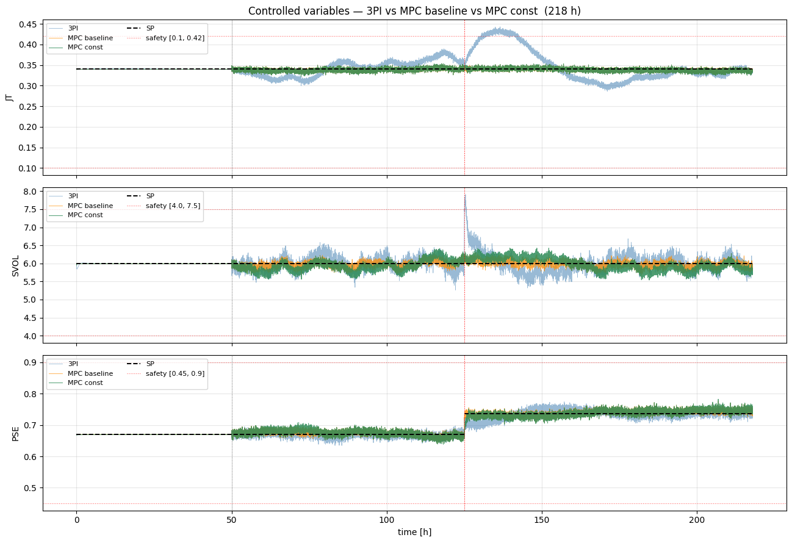

*Figure 1.2 — CVs vs. set‑point. Both MPCs track tighter than 3×PI; the constrained MPC's `JT`/`SVOL` traces are the calmest, and its PSE step response is gentler (ramped) than the baseline's.*

The headline tracking metric is the **integrated absolute error of PSE after the step**:

| Controller | Post‑step PSE IAE | Post‑step `JT` bias |
|------------|-------------------|---------------------|
| 3×PI | 1.0286 (1.00×) | **+2.22 %** |
| MPC baseline | **0.7195 (0.70×)** | −0.40 % |
| MPC constrained | 0.8345 (0.81×) | −0.45 % |

Both MPCs beat 3×PI by ≈ 1.2–1.4× on PSE error and hold `JT` bias within ±0.5 % where 3×PI drifts to +2.2 %. The constrained MPC's PSE IAE is *marginally* worse than the baseline's (0.83 vs 0.72) — the price of move suppression — but as §1.3 shows, that price buys a large smoothness gain.

### 1.3 The point of the constrained variant: smooth MVs vs. a step‑like baseline

This is the focus of v2. With **no penalty on actuator movement**, the baseline MPC is free to make large, near‑discontinuous corrections — its MV trace looks like a **step function**. The constrained MPC's 50× move penalty plus set‑point ramping turns those steps into gentle ramps.

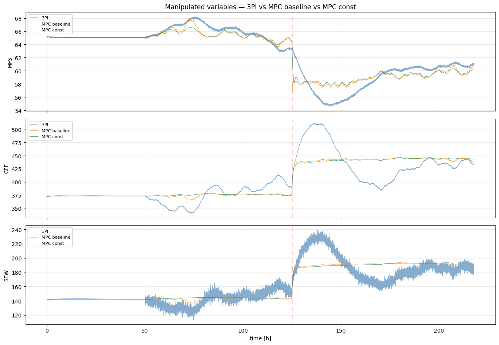

*Figure 1.3 — MV trajectories. The baseline MPC (orange) makes abrupt step‑like jumps in `CFF`/`SFW`; the constrained MPC (green) tracks the same operating point with visibly smoother, ramped moves.*

The smoothness is quantified by the per‑tick move size `|Δu|` over the realistic phase (lower = smoother):

| Controller | `MFS` |Δu| max / rms | `CFF` |Δu| max / rms | `SFW` |Δu| max / rms |
|------------|-----------------------|-----------------------|-----------------------|
| 3×PI | 0.258 / 0.067 | 1.729 / 0.217 | 14.742 / 3.187 |
| MPC baseline | 0.796 / 0.016 | **6.007** / 0.113 | **6.146** / 0.082 |
| MPC constrained | 0.499 / **0.006** | **0.896** / **0.040** | **1.088** / **0.030** |

The baseline's peak moves are the giveaway of step‑like behaviour: it slams `CFF` by up to **6.0** and `SFW` by up to **6.1** units in a single 30 s tick. The constrained variant cuts those peaks **≈ 6–7×** (`CFF` max 6.01 → 0.90, `SFW` max 6.15 → 1.09) and the RMS move **≈ 3–4×** — a smooth distribution of small corrections instead of occasional large jumps. The zoom around the step makes this visible:

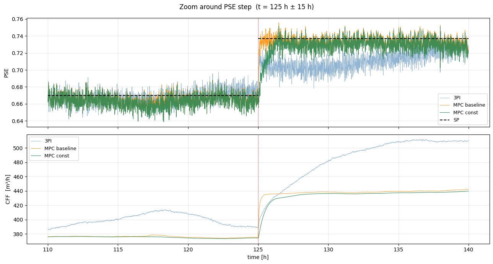

*Figure 1.4 — ±15 h around the +10 % `PSE` step at t = 125 h. The baseline MPC steps `CFF` abruptly to chase the new set‑point; the constrained MPC ramps the set‑point internally and eases `CFF` over, reaching the same target without the jump.*

### 1.4 Safety bounds and plant states

The constraint layer also keeps the plant inside its physical envelope. Over the realistic phase, **3×PI violates the `JT` overload bound on 1307 ticks and the `SVOL` bound on 65 ticks**; both MPC variants record **zero** violations (the constrained MPC by explicit soft bounds, the baseline incidentally here).

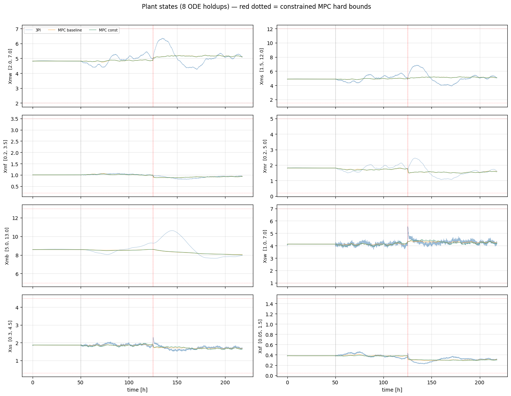

*Figure 1.5 — The eight plant ODE holdups. The constrained MPC keeps every state inside its hard bounds (red‑dotted); the baseline MPC, with no state bounds, can drift toward them under coupled disturbances.*

### 1.5 Why the MPC needs a state estimator

Both MPC variants control on the EKF's estimate, not raw measurements — so tracking quality rests on prediction quality. Because both share the same EKF and model, their one‑step prediction errors are essentially identical:

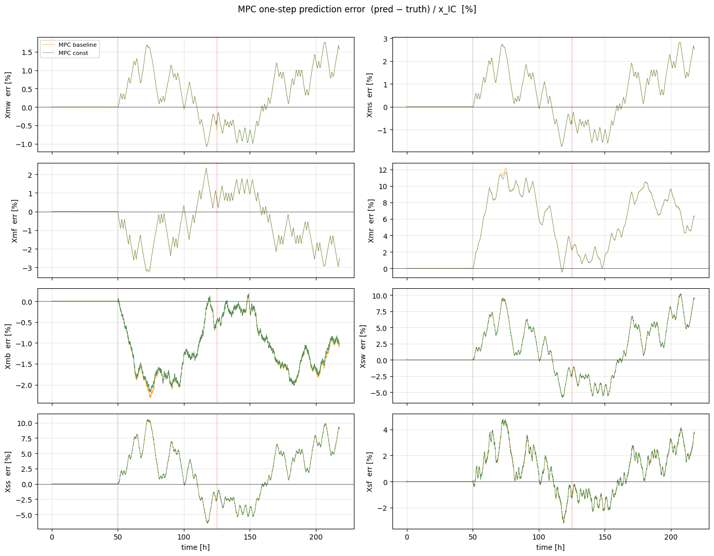

*Figure 1.6 — One‑step state‑prediction error, baseline vs. constrained MPC. The two curves overlap (same EKF, same model): the smoothness difference of §1.3 comes purely from the control‑law constraint layer, not from estimation.*

**Takeaway (§1, v2):** a model‑based MPC beats decentralized 3×PI on both coupled tracking (≈ 1.2–1.4× lower PSE error, no overload violations). Within MPC, the **constraint + move‑suppression layer is what makes the controller deployable**: it converts the baseline's step‑like actuator jumps (|Δu| peaks of 6+ per tick) into smooth ramps (peaks under ~1, RMS 3–4× lower), for a negligible ~0.1 cost in PSE IAE. Every economic controller in the following sections is built on this constrained regulatory MPC.

**Takeaway (§1):** moving from three decoupled PI loops to one model‑based MPC buys tighter, better‑coordinated regulation — about **1.4× lower PSE error** after a set‑point change — at the cost of needing a plant model and a state estimator. This MPC is the regulatory foundation every economic controller in the following sections is built on.

---

## 2. Economic MPC (single layer)

**Package:** `src/millingcircuit_empc_do_a_ekf_const`
**Notebooks:** `notebooks/compare_const_mpc_vs_empc_N60_100h.ipynb` (100 h) and `notebooks/compare_mpc_const_vs_empc_const_218h.ipynb` (218 h paper scenario)

### 2.1 From "track a set‑point" to "maximize profit"

The tracking MPC of §1 holds `JT`/`SVOL`/`PSE` at *fixed* set‑points an engineer must supply. But those set‑points are guesses — there is no guarantee they are economically optimal. **Economic MPC (EMPC)** removes the throughput set‑point entirely and instead puts the *plant economics directly into the controller's stage cost*. The controller is free to choose the operating point that maximizes profit, constrained only by the hard MV bounds and a `PSE` quality floor.

The economic stage cost (do‑mpc minimises `lterm`, so the minus sign maximises profit) is

```
lterm = −A_NUM · TP + B_NUM · Pmill          # millingcircuit_empc_do_a_ekf_const/controllers.py:81
        └── revenue ──┘   └─ energy cost ─┘
A_NUM = 71  $/t   (net smelter return per tonne)
B_NUM = 0.06 $/kWh (electricity tariff)
```

i.e. it maximizes the commercial objective `J_comm = A·TP − B·Pmill`. Because revenue (`A`·TP) dominates the energy term (`B`·Pmill) by three orders of magnitude in `$`, the EMPC's incentive is to **push throughput up** until a constraint stops it — here, the `PSE` floor. The architecture keeps an EKF estimator (here **EKF‑only — no DO**, an 8‑state `do_mpc.estimator.EKF`) and simply swaps the tracking QP for the economic objective:


*Figure 2.1 — Architecture of the single‑layer EMPC (`millingcircuit_empc_do_a_ekf_const`). Same plant/EKF/DO stack as §1; the MPC objective is now economic rather than set‑point tracking.*

### 2.2 What the EMPC does differently


*Figure 2.2 — Economic accounting over 50 h post‑warmup. The EMPC earns substantially more profit than the fixed‑set‑point MPC.*


*Figure 2.3 — MV trajectories. The EMPC runs `MFS` (and hence `CFF`/`SFW`) higher to lift throughput.*

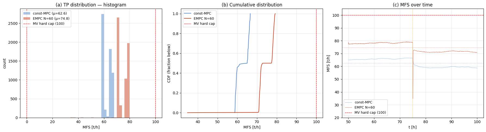

*Figure 2.4 — `MFS` distribution. The EMPC's throughput re‑centres from ≈ 62.6 t/h (const‑MPC) to ≈ 74.8 t/h, driven up until the PSE floor binds — not the MV cap.*

The economics over the 50 h economic window:

| Metric | const‑MPC | EMPC (N = 60) | Δ |
|--------|-----------|---------------|----|
| Revenue (`A·MFS`) | \$222,374 | \$265,554 | **+19.4 %** |
| Energy cost (`B·Pmill`) | \$3,549 | \$3,917 | +10.4 % |
| Commercial objective `J_comm` | — | — | **+\$42,812 (+19.6 %)** |
| **SEC** (kWh/t) | 18.94 | **17.51** | **−7.5 %** |
| `MFS` avg (t/h) | 62.6 | 74.8 | +19.4 % |
| `PSE` min | 0.669 | 0.620 | floor binding |

Two facts matter here. First, profit rises **+19.6 %** — almost entirely from revenue (more tonnes), at a modest +10.4 % more energy *spend*. Second, and less obvious, the **specific energy falls 7.5 %** (18.94 → 17.51 kWh/t): the EMPC is not just selling more, it grinds each tonne more efficiently because it operates the mill nearer its productive sweet‑spot rather than at an arbitrary set‑point.

### 2.3 What stops the EMPC — the PSE floor

The notebook confirms the EMPC's throughput is limited by the **product‑quality (`PSE ≥ 0.62`) floor**, not the `MFS` MV cap (max realised `MFS` = 79.2 t/h, well below the 100 t/h hard cap). The internal‑MPC and turnpike diagnostics show the controller parking at the constraint:

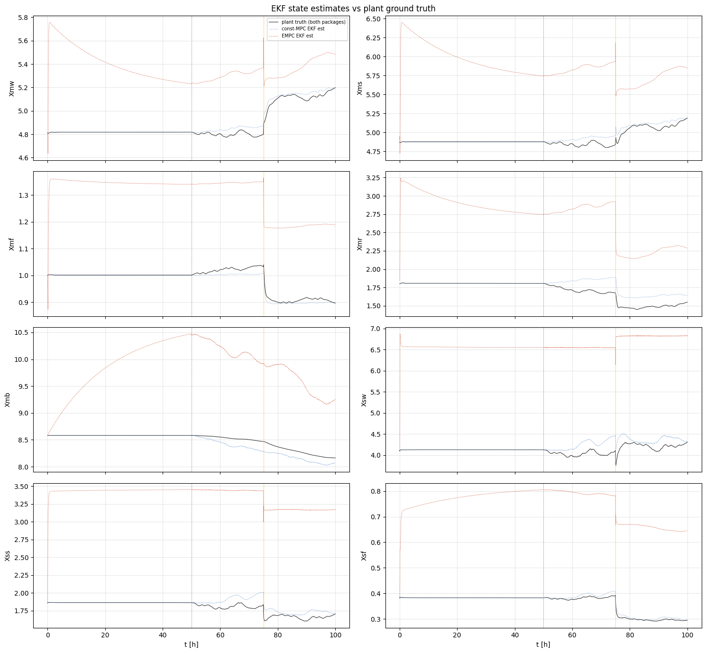

*Figure 2.5 — Internal EMPC variables with EKF ±1σ bands. The economic optimum sits on the PSE‑floor constraint surface.*

The 218 h "paper scenario" notebook reproduces the same behaviour over a longer horizon and adds a **turnpike diagnostic** (the EMPC spends most of the horizon on an economic "turnpike" arc, leaving it only near the terminal):

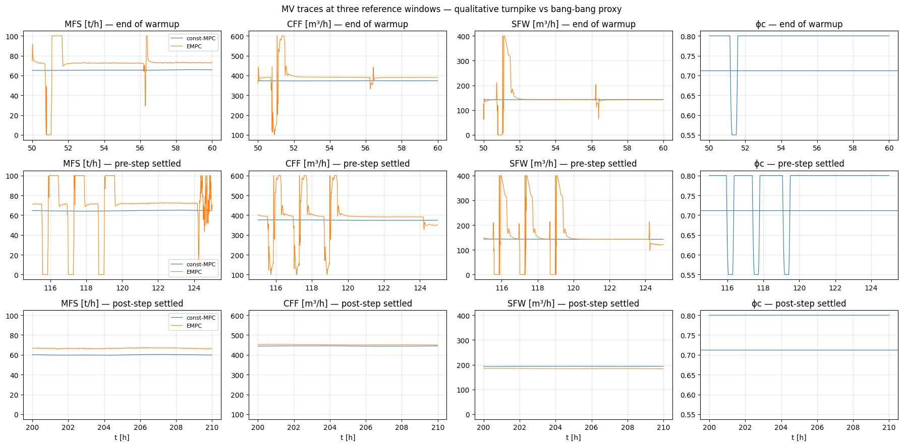

*Figure 2.6 — Turnpike behaviour over 218 h: the single‑layer EMPC holds the economically optimal arc through the bulk of the horizon.*

**Takeaway (§2):** putting economics in the objective turns "hold a guessed set‑point" into "find and hold the most profitable feasible operating point." Here that is **+19.6 % profit and −7.5 % specific energy**, with the throughput ceiling set by the `PSE` quality floor rather than the actuator. The natural next question — *which* economic objective should we encode — is the focus of §3.

---

## 3. Focus: profit objective vs. energy‑cost objective, and the PSE region

This is the conceptual heart of the project. The single‑layer EMPC of §2 can be driven by **two very different economic objectives**, and the choice fundamentally changes where the plant operates. This section (a) derives both objectives from the plant‑wide economic framework, (b) states the assumption that makes them tractable, and (c) shows the resulting operating points side‑by‑side.

### 3.1 The economic objective from the plant‑wide framework

Le Roux & Craig (2019), *"A Framework for the Design of a Plant‑Wide Control System"* (`papers/plant-wide-control-framework-2019.pdf`), build the comminution‑circuit objective top‑down. Revenue is net smelter return ($\mathrm{NSR}$) minus operating cost (their Eq. 6):

$$
\text{revenue} \;=\; \mathrm{NSR} \;-\; \big(\,\text{comminution cost} + \text{separation cost}\,\big) \tag{6}
$$

The **net smelter return** depends on throughput $\mathrm{TP}$ and on product quality through $\mathrm{PSE}$ (Eq. 8), because the recovery $\Upsilon(\mathrm{PSE})$ and the concentrate grade $\gamma_C(\mathrm{PSE})$ are themselves functions of the particle‑size estimate:

$$
\begin{aligned}
\mathrm{NSR}
&= \Upsilon(\mathrm{PSE})\,\gamma_{\mathrm{ROM}}\,P_{v}\,\mathrm{TP}
\;-\; \big(P_{t}+P_{p}\big)\,\Upsilon(\mathrm{PSE})\,\gamma_{C}(\mathrm{PSE})\,\gamma_{\mathrm{ROM}}\,\mathrm{TP} \\
&= \underbrace{A(\mathrm{PSE})}_{\text{net return per tonne}}\;\cdot\;\mathrm{TP}
\end{aligned} \tag{8}
$$

where $P_{v}$ is the metal valuation (\$/t), $P_{t},\,P_{p}$ the transport and smelter‑processing costs (\$/t), $\gamma_{\mathrm{ROM}}$ the run‑of‑mine head grade, and $\Upsilon$ the recovery — all $\mathrm{PSE}$‑dependent price/recovery terms collapsing into a single net price per tonne $A(\mathrm{PSE})$ (\$/t).

The **comminution cost** is dominated by mill electricity (steel‑ball and pumping costs are minor and roughly constant), so (Eq. 10):

$$
\text{comminution cost} \;=\; P_{W}\,P_{\mathrm{mill}} \;+\; P_{s}\,\kappa_{B}
\;\;\approx\;\; B\,P_{\mathrm{mill}} \tag{10}
$$

with $P_{W}$ the electricity tariff (\$/kWh) and $P_{s}\,\kappa_{B}$ the (constant) steel‑media term.

Combining (6), (8) and (10), and dropping the constant separation/steel terms — which carry no steady‑state degree of freedom in our MV set — gives the circuit's economic objective (Eq. 11, reduced):

$$
\boxed{\,J_{\mathrm{comm}} \;=\; A(\mathrm{PSE})\,\cdot\,\mathrm{TP} \;-\; B\,P_{\mathrm{mill}}\,} \tag{11}
$$

This is exactly the stage cost ($\ell$, the `lterm`) of §2, with $\mathrm{TP} \approx \mathrm{MFS}$ at steady state.

### 3.2 The key assumption: **A(PSE) is treated as constant**

In the paper `A` is a function of PSE through ϒ(PSE) and γC(PSE). **In our implementation we hold `A` constant** (`A_NUM = 71 $/t`). The justification is operational: the regulatory MPC keeps `PSE` *on or just above its quality floor* at all times, so PSE varies over a narrow band, and over that band `A(PSE) ≈ const`. This linearises the revenue term in throughput and yields the two objectives we actually compare:

| Objective | `lterm` | Source line | Intent |
|-----------|---------|-------------|--------|
| **Profit‑max** | `−A·TP + B·Pmill` | `empc_do_a_ekf_const/controllers.py:81` | maximize commercial profit `A·TP − B·Pmill` |
| **Energy‑min** | `B·Pmill` | `empc_ekf_cost_pmill/controllers.py:113` | minimize mill electricity only, at the given throughput |

The energy‑min objective is what remains of (11) once the revenue term is removed — appropriate when throughput/quality are fixed by an upstream target and the controller's only job is to grind those tonnes as cheaply as possible.

### 3.3 Two objectives → two operating regions

**Notebook:** `notebooks/compare_profitmax_vs_energymin_100h.ipynb` (profit‑max EMPC vs. energy‑min EMPC vs. const‑MPC, 100 h)

The decisive prediction is geometric. With `A` constant and large relative to `B`:

- **Maximizing profit** `A·TP − B·Pmill` rewards every extra tonne far more than it penalises the energy to grind it → the plant runs at **maximum capacity**: `MFS`, mill speed `αspeed`, and `Pmill` all ride near their **upper** limits, stopped only by the PSE floor.
- **Minimizing energy** `B·Pmill` at a *given* `MFS`(≈TP) and PSE has no incentive to add tonnes → the plant settles at the **lowest‑power feasible steady state** for that throughput: `MFS` and `Pmill` hover in their **lowest** admissible region.

The simulation confirms exactly this split:

| | `J_cum` [\$] | Revenue [\$] | Energy [\$] | `MFS` avg | `Pmill` avg [kW] | SEC [kWh/t] |
|---|---|---|---|---|---|---|
| **Profit‑max EMPC** | 261,637 | 265,554 | 3,917 | **74.8** (→ high) | **1,306** (→ high) | 17.51 |
| **Energy‑min EMPC** | 209,855 | 213,000 | 3,145 | **60.0** (→ floor) | **1,048** (→ low) | 17.47 |


*Figure 3.1 — Economic accounting. Profit‑max accumulates far more `J_comm` by selling more tonnes; energy‑min spends the least on electricity but forgoes the revenue.*


*Figure 3.2 — MV trajectories. Profit‑max holds `MFS` high (≈ 75 t/h); energy‑min drives `MFS` down to its lower bound (≈ 60 t/h) — the "lowest‑limited region."*

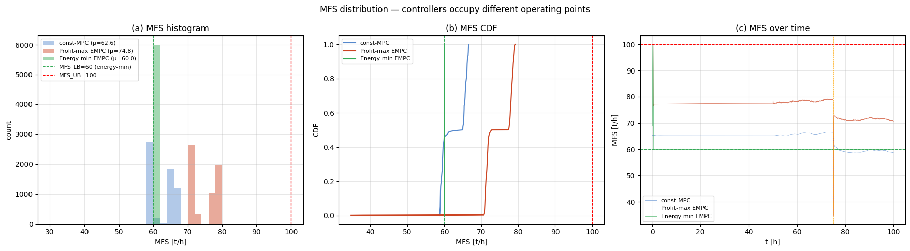

*Figure 3.3 — `MFS` distribution. The two objectives separate cleanly: profit‑max clusters near the upper feasible region, energy‑min pins against the lower bound.*


*Figure 3.4 — SEC (kWh/t). Note SEC is nearly identical (17.51 vs 17.47) even though absolute power and revenue differ enormously — because SEC is throughput‑normalised and **both** objectives respect the same PSE floor. The economic difference is in **how many tonnes**, not in kWh per tonne.*

### 3.4 Interpretation — the PSE region ties it together

Both objectives meet the **same** `PSE` floor (PSE min ≈ 0.62 for both), but they sit at opposite ends of the throughput envelope:

- Profit‑max → **upper** corner of the operating region (max `MFS`/`αspeed`/`Pmill`), because revenue dominates.
- Energy‑min → **lower** corner (min `MFS`/`Pmill`), because nothing rewards extra tonnes, so the controller finds the cheapest stable point that still satisfies PSE.

This is why the `A(PSE) = const` assumption is the right simplification for *this* study: with PSE pinned to its floor by the regulatory layer, the only economically active trade‑off left is throughput vs. power — precisely the axis these two objectives probe. The same two‑corner picture reappears in the operating‑envelope sweep of §6.

**Takeaway (§3):** the objective is a *policy choice*, not a tuning detail. `A·TP − B·Pmill` says "make money → run flat‑out to the quality limit"; `B·Pmill` says "spend the least power for the tonnes you're told to make → idle at the floor." Same plant, same constraints, opposite corners of the operating region.

---

## 4. Two‑layer EMPC: fixing bang‑bang by separating economics from tracking

**Package:** `src/millingcircuit_empc_2layer`
**Notebooks:** `notebooks/compare_empc_2layer_vs_v2_100h.ipynb` (100 h) and `notebooks/compare_4way_218h_step75.ipynb` (218 h, PSE step)

### 4.1 The bang‑bang problem with single‑layer EMPC

The single‑layer EMPC of §2–§3 puts the economic cost *directly* on the manipulated variables. That is efficient when a constraint is firmly binding, but inside the **slack window** — when `PSE` is comfortably above its floor and no constraint is active — the economic gradient on `MFS` is nearly flat. With an almost‑flat economic surface and no penalty on actuator movement, the optimiser has no reason to prefer a smooth input, and `MFS` **chatters between bounds (bang‑bang)**: large step‑to‑step swings that are economically near‑neutral but physically undesirable (actuator wear, load swings, hard‑to‑certify operation). We quantified this with a `σ(ΔMFS)` (standard deviation of step‑to‑step `MFS` change) detector.

### 4.2 The fix: split the objective across two layers

The cure is to stop asking one controller to do two jobs. The **two‑layer EMPC** separates them:

```
            ┌─────────────────────────────────────────┐
   plant ──▶│  augmented EKF  (no Fast DO in v1)      │──▶ x̂, α̂_r
            └─────────────────────────────────────────┘
                              │ x̂
            ┌─────────────────▼───────────────────────┐
   UPPER:   │  Economic layer (slow)                  │   minimize  B·Pmill (economic)
            │  computes steady‑state targets xe_ref,  │   → "where should we operate?"
            │  ue_ref  from the economic objective    │
            └─────────────────┬───────────────────────┘
                              │ xe_ref, ue_ref
            ┌─────────────────▼───────────────────────┐
   LOWER:   │  Tracking MPC (fast)                    │   minimize ‖x−xe_ref‖ + ‖u−ue_ref‖
            │  tracks the targets with Δu             │   + r·‖Δu‖   ← regularization
            │  regularization                         │   → "get there smoothly"
            └─────────────────┬───────────────────────┘
                              │ MVs
                            plant
```

- The **upper (economic) layer** answers *where to operate* — it solves the economic problem and emits steady‑state targets `xe_ref`, `ue_ref`.
- The **lower (tracking) layer** answers *how to get there smoothly* — it tracks those targets with a quadratic objective **and a `Δu` regularization term (`set_rterm`)** that explicitly penalises actuator movement.

Because the economic incentive now lives in the *target*, not in the per‑step input cost, the lower layer is free to move smoothly. The bang‑bang chatter disappears without sacrificing the economic operating point.


*Figure 4.1 — Two‑layer EMPC architecture: shared EKF/DO estimator → upper economic layer (steady‑state targets) → lower tracking MPC with Δu regularization → plant.*

### 4.3 Evidence: smooth MVs, same economics

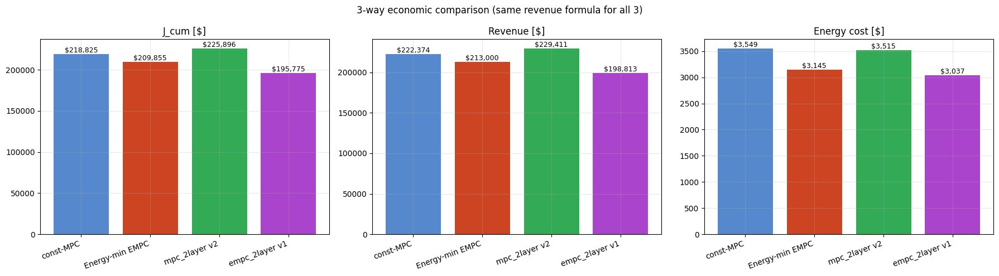

*Figure 4.2 — Economic accounting. The two‑layer EMPC matches the single‑layer economics — separating the objective costs nothing in profit.*

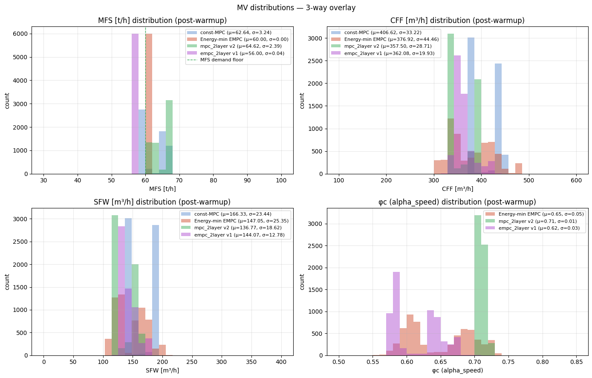

*Figure 4.3 — MV distributions. The two‑layer controller's `MFS` distribution is tight and unimodal — no bang‑bang spread between bounds.*


*Figure 4.4 — The steady‑state targets `xe_ref` / `ue_ref` the upper layer hands to the lower layer. The lower MPC tracks these, so the economic decision is decoupled from the moment‑to‑moment input.*


*Figure 4.5 — CV tracking. `PSE` is held at its floor and `JT`/`SVOL` within bounds while the upper layer optimises economics.*

The 218 h four‑way notebook stress‑tests the same controllers across a `PSE` set‑point step at t = 75 h and inspects the MVs specifically for bang‑bang:


*Figure 4.6 — MV time series across the step (218 h). The two‑layer EMPC's inputs stay smooth through the transient; the σ(ΔMFS) detector confirms the chatter is removed.*

**Takeaway (§4):** single‑layer EMPC chatters (`bang‑bang`) wherever the economic surface is flat. Splitting the controller into an **economic target‑setting layer** and a **tracking layer with `Δu` regularization** removes the chatter while preserving the economic operating point — the same profit, but with smooth, plant‑friendly actuation.

---

## 5. Real‑time optimization: SSRTO, ROPA, and the five‑way comparison

**Packages:** `src/millingcircuit_ssrto_2layer` (SSRTO) and `src/millingcircuit_ropa_2layer` (ROPA)
**Notebook:** `notebooks/compare_5way_pinMFS_100h.ipynb` (100 h, all five controllers at matched throughput)

The two‑layer EMPC of §4 optimises economics *inside* the dynamic controller. A different tradition keeps a **conventional tracking MPC** at the regulatory level and adds a separate **real‑time optimization (RTO)** layer on top that periodically recomputes the optimal steady‑state set‑points. We implemented the two main variants from Matias et al. (2022).

### 5.1 SSRTO — steady‑state RTO, gated by a steady‑state detector

**SSRTO** (steady‑state RTO) runs the classic two‑step RTO cycle, but only fires when the plant is *actually* at steady state:

1. A **steady‑state detector (SSD)** watches the key channels (`JT`, `SVOL`, `PSE`, `Pmill`); when their trends flatten, the cycle is allowed to run.
2. A **steady‑state estimation NLP** reconciles the model parameters to the current measurements (`_ss_estimate`).
3. A **steady‑state economic NLP** re‑optimises the set‑points for the lower MPC (`_ss_optimize`).

This avoids the classic RTO failure mode — optimising on transient data, which yields wrong set‑points.


*Figure 5.1 — SSRTO architecture (`millingcircuit_ssrto_2layer`): regulatory MPC + EKF/DO, with an SSD‑gated steady‑state estimation + economic optimization layer (Step 5 estimates the steady state before re‑optimising).*

### 5.2 ROPA — RTO with persistent parameter adaptation

**ROPA** (RTO with persistent adaptation) drops the SSD gate. Instead of waiting for steady state, it runs a **continuous EKF that persistently adapts the model parameter** (ore hardness `α̂_r`) every cycle, so the economic optimisation always uses a freshly‑corrected model. This trades the SSD's robustness for faster tracking of a drifting plant.


*Figure 5.2 — ROPA architecture (`millingcircuit_ropa_2layer`): the same two‑layer skeleton, but the upper layer is driven by a continuously‑adapting parameter estimate rather than an SSD‑gated steady‑state reconciliation.*

### 5.3 Five‑way comparison at matched throughput

To compare *control strategy* rather than *operating point*, all five controllers are run with **`MFS` pinned to 65.2 t/h** and a **constant `PSE` floor** — so every controller grinds the same tonnage and the only question is how much power each spends to do it (SEC). The const‑MPC's `PSE` set‑point is fixed at 0.65.


*Figure 5.3 — SEC at matched throughput. The four economic/RTO controllers cluster ~3 % below the conventional const‑MPC.*

| Controller | SEC [kWh/t] | vs const‑MPC | Realised `PSE` |
|------------|-------------|--------------|----------------|
| const‑MPC (`PSE_SP = 0.65`) | 17.928 | — | 0.676 (over‑grinds) |
| ROPA (`ropa_2layer`) | 17.396 | **−2.97 %** | floor |
| SSRTO (`ssrto_2layer`) | 17.396 | **−2.97 %** | floor |
| EMPC 1‑layer | 17.455 | −2.64 % | floor |
| EMPC 2‑layer | 17.361 | **−3.17 %** | floor |


*Figure 5.4 — MV time series. `MFS` is flat at 65.2 t/h for all five (the pin); the controllers differ in how they set `CFF`/`SFW`/speed.*


*Figure 5.5 — `Pmill` distribution at fixed throughput. The economic/RTO controllers draw consistently less power than the const‑MPC for the same tonnes.*

The central result: **at matched throughput, the economic layer (ROPA / SSRTO / EMPC) saves ≈ 3 % specific energy versus a conventional tracking MPC, and SSRTO ≈ ROPA ≈ EMPC to within ~1 %.** The energy advantage comes almost entirely from *not over‑grinding*: the const‑MPC, told to hold three CV set‑points at once, realises `PSE = 0.676` instead of 0.65 — it grinds finer than required and pays for it in power. The economic controllers instead ride the `PSE` floor exactly.

### 5.4 State estimation underpins all of it

Every controller acts on an **EKF‑based state estimate**, not raw measurements, so the economic/RTO behaviour above is only as good as the estimator beneath it. Each controller logs its estimate against the plant ground truth for all eight holdups; below is one 4×2 panel **per controller**, all at the **pinned MFS = 65.2** matched‑throughput condition (solid colour = plant truth, dashed black = EKF estimate; each sub‑title reports mean / max absolute error as % of that state's mean). The exact estimator differs by controller — which is itself part of the comparison:


*Figure 5.6a — **const‑MPC**: 8‑state EKF + Form‑A disturbance observer.*


*Figure 5.6b — **mpc_2layer (ROPA)**: augmented EKF that adapts ore hardness `α̂_r` online (its persistent parameter adaptation).*


*Figure 5.6c — **ssrto_2layer**: EKF for state feedback only; the slow parameter `φ̂_f` comes from the SS‑estimation NLP (Step 2 of the SSRTO pipeline), not from the EKF.*


*Figure 5.6d — **empc_1layer**: 8‑state EKF (no augmentation).*


*Figure 5.6e — **empc_2layer**: augmented EKF (8 plant states + `φ̂_f`).*

Across all five, the directly‑measured holdups track to ≈ 1–2 % and the harder‑to‑observe sump/rock states (`Xmr`, `Xss`, `Xsw`) carry the most error, but **every estimator stays locked to the truth through the 100 h run** — which is exactly what lets the economic layers ride the `PSE` floor without violating it.

### 5.5 Issues we faced (and how they were resolved)

This comparison was not clean on the first try. The notable problems:

- **MHE abandoned for EKF.** The original plan used Moving‑Horizon Estimation. It produced spurious local minima and crashed mid‑run (≈ 57–75 h). All packages were switched to `do_mpc.estimator.EKF`, which is robust over the full horizon.
- **const‑MPC over‑grinds structurally.** It tracks three CV set‑points (`JT`/`SVOL`/`PSE`) simultaneously — an over‑determined request — and realises `PSE = 0.676`, not the commanded 0.65. We added a `PSE_SP_OVERRIDE` env‑gate and re‑ran at 0.65; it *still* lands at 0.676. So the ~3 % gap is **genuine architecture, not a tuning artefact**: a fixed‑set‑point controller cannot ride a floor the way an economic one can.
- **A dropped MV column.** Early SSRTO parquet dumps silently omitted the `αspeed`/`φc` channel because `ssrto_2layer` was missing from the 4‑MV branch of the run script — caught in code review and fixed before any numbers were trusted.
- **A spurious t = 75 h transient on const‑MPC.** The runner unconditionally rebuilt the const‑MPC controller at the (disabled) step tick, resetting the DO/EKF and injecting a visible bump. Fixed with a `step_frac != 0` guard; the tick‑jump dropped from 0.034 to 0.0017.
- **SSD false positive from a seed.** One steady‑state‑detector test seed produced a false trend trip; switching seeds resolved it.

**Takeaway (§5):** an explicit RTO layer (SSRTO or ROPA) on top of a conventional MPC recovers almost the same ≈ 3 % energy saving as a fully economic MPC, and the three economic strategies are within ~1 % of each other at matched throughput. The recurring lesson across all the issues above is that **most of the saving is simply not over‑grinding** — riding the `PSE` floor instead of tracking a fixed, finer set‑point.

---

## 6. Operating‑envelope study: MFS × PSE, three controllers

**Notebook:** `notebooks/compare_sweep_MFSxPSE_100h.ipynb`
**Driver:** `scripts/sweep/run_MFSxPSE_sweep.sh` · **method:** `knowledge/wiki/processes/mfs_pse_sweep_sec_study.md`

The matched‑throughput comparison of §5 is a single point in the operating space. To see whether the ≈ 3 % advantage holds *across the envelope the plant actually runs in*, we swept a **3 × 3 grid** and re‑ran three representative controllers in every cell:

- **Throughput:** `MFS ∈ {55, 60, 65.2}` t/h
- **Quality floor:** `PSE ∈ {0.65, 0.69, 0.715}`
- **Controllers:** const‑MPC (conventional), `ssrto_2layer` (RTO), `empc_2layer` (economic)
- 9 cells × 3 controllers = 27 runs, each 100 h, `MFS` pinned, constant `PSE` floor.

(The fourth and fifth controllers from §5 were dropped because ROPA ≈ SSRTO and EMPC‑1‑layer ≈ EMPC‑2‑layer, halving the run count without losing a distinct behaviour.)

### 6.1 SEC surface


*Figure 6.1 — SEC heatmaps (kWh/t), one per controller, over the MFS × PSE grid. The const‑MPC surface is bumpy and runs hot in the high‑PSE / low‑MFS corner; the SSRTO and EMPC surfaces are smoother and uniformly cooler.*


*Figure 6.2 — SEC vs `MFS`. The economic controllers' SEC is essentially **flat in MFS** — they find the same efficient operating policy regardless of the pinned throughput. The const‑MPC's SEC swings with MFS.*


*Figure 6.3 — SEC vs `PSE` floor. SEC rises with the quality floor for every controller (finer product costs more energy), but the const‑MPC rises fastest because it over‑grinds past the floor.*


*Figure 6.4 — Cross‑controller overlay. `ssrto_2layer` and `empc_2layer` lie on top of each other and below const‑MPC across the whole envelope.*

### 6.2 Results

Two robust findings across all nine cells:

1. **The economic/RTO advantage is structural, not a single lucky point.** `ssrto_2layer` and `empc_2layer` produce **lower, smoother, MFS‑independent SEC** everywhere on the grid, and they cluster tightly together — confirming the §5 result generalises across the operating envelope.

2. **The conventional const‑MPC over‑grinds, and worse near the corners.** Its SEC peaks at **≈ 20.4 kWh/t at `MFS = 55 / PSE = 0.715`**, and the realised‑PSE audit shows it **misses its commanded floor in several cells** — e.g. at `MFS = 55 / PSE = 0.715` it drops to `PSE_min = 0.391`, and at `MFS = 65.2 / PSE = 0.715` to 0.651. A fixed‑set‑point controller chasing three CVs cannot consistently sit *on* a quality floor; it overshoots into finer (more expensive) product or, in tight corners, transiently violates it. The economic controllers hold `PSE` at the floor (≈ 0.650–0.651) in every cell.

| Behaviour | const‑MPC | `ssrto_2layer` / `empc_2layer` |
|-----------|-----------|--------------------------------|
| SEC vs MFS | swings (bumpy) | flat (MFS‑independent) |
| Peak SEC on grid | ≈ 20.4 (MFS 55 / PSE 0.715) | uniformly lower |
| Realised PSE vs floor | overshoots / occasionally violates | rides the floor (≈ 0.65) |
| Cross‑controller spread | — | overlap to ~1 % |

**Takeaway (§6):** sweeping the whole MFS × PSE envelope confirms the central thesis of the project — **an economic or RTO layer delivers a consistent specific‑energy saving over a conventional tracking MPC across the plant's full operating range**, primarily by holding product quality exactly at its floor instead of over‑grinding. The saving is largest precisely where it matters: the high‑quality, low‑throughput corners where over‑grinding is most expensive.

---

## Summary

| § | What changed | Headline result |
|---|--------------|-----------------|
| 1 | 3×PI → tracking MPC | 1.43× lower post‑step PSE error; coordinated multivariable control |
| 2 | Tracking → economic objective (single‑layer EMPC) | +19.6 % profit, −7.5 % SEC; throughput capped by PSE floor |
| 3 | Profit‑max vs energy‑min objective | same plant → opposite corners (max‑capacity vs min‑power); `A(PSE)=const` assumption justified by riding the floor |
| 4 | Single‑ → two‑layer EMPC | bang‑bang removed via economic‑target + tracking‑with‑Δu split, at no economic cost |
| 5 | RTO layer: SSRTO & ROPA + 5‑way | ≈ 3 % SEC saving at matched throughput; SSRTO ≈ ROPA ≈ EMPC within ~1 % |
| 6 | MFS × PSE envelope sweep | the ≈ 3 % advantage is structural and largest in high‑quality / low‑throughput corners |

**Overall:** across every comparison, the economic and RTO controllers beat the conventional tracking MPC on specific energy by holding product quality exactly at its floor instead of over‑grinding — and the three economic strategies (single‑layer EMPC, two‑layer EMPC, SSRTO/ROPA) land within ~1 % of each other, so the choice between them is driven by secondary concerns (actuator smoothness, robustness to transients, computational cost) rather than steady‑state economics.

---

### Reproducibility

All figures are extracted from the executed notebooks by `scripts/extract_notebook_images.py` into `docs/images/<notebook>/`. Every run is parameterised by environment variables (throughput pins, PSE floors, cost coefficients) so the studies reproduce without code edits — see the per‑study notes under `knowledge/wiki/processes/`. The plant model, the EKF‑based estimation family (the exact stack — plain EKF, EKF + Form‑A DO, or augmented EKF — is noted per section), and the disturbance scenario are shared across all controllers; only the control law differs between sections.
